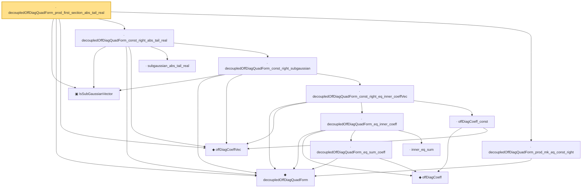

# Proof narrative — decoupledOffDiagQuadForm_prod_first_section_abs_tail_real

Root: **decoupledOffDiagQuadForm_prod_first_section_abs_tail_real** (lemma) `Statlib/HighDim/Concentration/HansonWright.lean:190` · topic `HighDim`
Closure: 14 declarations across 4 files. Generated from `proof_graph.json` — no files were moved.

Reading order (foundations first, headline last):

  ▣ `IsSubGaussianVector` — structure · `Statlib/HighDim/Vocabulary/RandomVector.lean:52`  _(also used by 74: subgaussian_projection_second_moment_le, subgaussian_projection_sq_integrable, offDiagCoeffVec_norm_sq_integral_le_frobenius, …)_
  ◆ `decoupledOffDiagQuadForm` — noncomputable def · `Statlib/HighDim/Vocabulary/QuadraticForms.lean:33`  _(also used by 44: decoupledOffDiagQuadForm_measurable, decoupledOffDiagQuadForm_prod_measurable, decoupledOffDiagQuadForm_prod_tail_measurableSet, …)_
  ◆ `offDiagCoeffVec` — noncomputable def · `Statlib/HighDim/Vocabulary/QuadraticForms.lean:46`  _(also used by 18: offDiagCoeffVec_eq_zeroDiagMatrix_mulVec, offDiagCoeffVec_norm_le_zeroDiag, offDiagCoeffVec_apply_eq_inner_row_zeroDiag, …)_
    · `subgaussian_abs_tail_real` — lemma · `Statlib/HighDim/Concentration/HansonWright.lean:122`  _(also used by 3: decoupledOffDiagQuadForm_const_right_abs_tail_real_spectral, decoupledOffDiagQuadForm_const_right_abs_tail_real_frobenius, decoupledOffDiagQuadForm_const_right_abs_tail_real_of_coeff_norm_sq_le)_
          ◆ `offDiagCoeff` — noncomputable def · `Statlib/HighDim/Vocabulary/QuadraticForms.lean:39`  _(also used by 4: offDiagCoeff_eq_zeroDiagMatrix_mulVec, offDiagCoeff_norm_le_zeroDiag, offDiagCoeff_norm_le, …)_
          · `decoupledOffDiagQuadForm_eq_sum_coeff` — lemma · `Statlib/HighDim/Concentration/HansonWright.lean:42`
          · `inner_eq_sum` — lemma · `Statlib/HighDim/Vocabulary/Norms.lean:32`  _(also used by 13: offDiagCoeffVec_apply_eq_inner_row_zeroDiag, subgaussian_vector_coord, subgaussian_norm_sq_mean_le_dim, …)_
        · `decoupledOffDiagQuadForm_eq_inner_coeff` — lemma · `Statlib/HighDim/Concentration/HansonWright.lean:61`
        · `offDiagCoeff_const` — lemma · `Statlib/HighDim/Concentration/HansonWright.lean:35`
      · `decoupledOffDiagQuadForm_const_right_eq_inner_coeffVec` — lemma · `Statlib/HighDim/Concentration/HansonWright.lean:69`
    · `decoupledOffDiagQuadForm_const_right_subgaussian` — lemma · `Statlib/HighDim/Concentration/HansonWright.lean:76`  _(also used by 3: decoupledOffDiagQuadForm_const_right_abs_tail_real_spectral, decoupledOffDiagQuadForm_const_right_abs_tail_real_frobenius, decoupledOffDiagQuadForm_const_right_abs_tail_real_of_coeff_norm_sq_le)_
  · `decoupledOffDiagQuadForm_const_right_abs_tail_real` — lemma · `Statlib/HighDim/Concentration/HansonWright.lean:166`
  · `decoupledOffDiagQuadForm_prod_mk_eq_const_right` — lemma · `Statlib/HighDim/Concentration/HansonWright.lean:179`  _(also used by 2: decoupledOffDiagQuadForm_prod_first_section_abs_tail_real_spectral, decoupledOffDiagQuadForm_prod_first_section_abs_tail_real_frobenius)_
· `decoupledOffDiagQuadForm_prod_first_section_abs_tail_real` — lemma · `Statlib/HighDim/Concentration/HansonWright.lean:190` **← headline**

## Dependency diagram

