# Proof narrative — decoupledOffDiagQuadForm_prod_tail_le_lintegral_frobenius

Root: **decoupledOffDiagQuadForm_prod_tail_le_lintegral_frobenius** (lemma) `Statlib/HighDim/Concentration/HansonWright.lean:929` · topic `HighDim`
Closure: 32 declarations across 7 files. Generated from `proof_graph.json` — no files were moved.

Reading order (foundations first, headline last):

  ▣ `IsSubGaussianVector` — structure · `Statlib/HighDim/Vocabulary/RandomVector.lean:52`  _(also used by 75: decoupledOffDiagQuadForm_const_right_abs_tail_real, decoupledOffDiagQuadForm_prod_first_section_abs_tail_real, subgaussian_projection_second_moment_le, …)_
  ◆ `decoupledOffDiagQuadForm` — noncomputable def · `Statlib/HighDim/Vocabulary/QuadraticForms.lean:33`  _(also used by 38: decoupledOffDiagQuadForm_const_right_abs_tail_real, decoupledOffDiagQuadForm_prod_first_section_abs_tail_real, decoupledOffDiagQuadForm_const_right_abs_tail_real_spectral, …)_
  ◆ `frobeniusNormSq` — noncomputable def · `Statlib/HighDim/Vocabulary/Norms.lean:37`  _(also used by 37: diag_sq_sum_le_frobeniusNormSq, offDiagCoeffVec_norm_sq_integral_le_frobenius, offDiagCoeffVec_norm_sq_tail_le_frobenius, …)_
      · `decoupledOffDiagQuadForm_measurable` — lemma · `Statlib/HighDim/Concentration/HansonWright.lean:90`
    · `decoupledOffDiagQuadForm_prod_measurable` — lemma · `Statlib/HighDim/Concentration/HansonWright.lean:99`
  · `decoupledOffDiagQuadForm_prod_tail_measurableSet` — lemma · `Statlib/HighDim/Concentration/HansonWright.lean:109`  _(also used by 2: decoupledOffDiagQuadForm_prod_tail_le_lintegral_spectral, decoupledOffDiagQuadForm_prod_tail_le_bad_plus_good)_
      · `frobeniusNormSq_nonneg` — lemma · `Statlib/HighDim/Concentration/HansonWright.lean:402`  _(also used by 2: decoupledOffDiagQuadForm_prod_tail_le_markov_plus_good_ofReal, hanson_high_frobenius_pos)_
      ◆ `offDiagCoeffVec` — noncomputable def · `Statlib/HighDim/Vocabulary/QuadraticForms.lean:46`  _(also used by 15: decoupledOffDiagQuadForm_const_right_abs_tail_real, decoupledOffDiagQuadForm_prod_first_section_abs_tail_real, offDiagCoeffVec_norm_le_zeroDiag, …)_
          ◆ `zeroDiagMatrix` — def · `Statlib/HighDim/Vocabulary/QuadraticForms.lean:52`  _(also used by 37: offDiagCoeff_eq_zeroDiagMatrix_mulVec, offDiagCoeff_norm_le_zeroDiag, offDiagCoeffVec_norm_le_zeroDiag, …)_
          ◆ `matrixRowVec` — noncomputable def · `Statlib/HighDim/Vocabulary/QuadraticForms.lean:62`  _(also used by 3: matrixRowVec_apply, offDiagCoeffVec_norm_sq_integral_le_frobenius, offDiagCoeffVec_norm_sq_integrable)_
          ◆ `l2NormSq` — noncomputable def · `Statlib/HighDim/Vocabulary/Norms.lean:13`  _(also used by 54: offDiagCoeffVec_norm_sq_integral_le_frobenius, offDiagCoeffVec_norm_sq_integrable, subgaussian_norm_sq_integrable, …)_
          · `euclidean_norm_sq` — lemma · `Statlib/HighDim/Vocabulary/Norms.lean:21`  _(also used by 13: offDiagCoeffVec_norm_sq_integral_le_frobenius, offDiagCoeffVec_norm_sq_integrable, subgaussian_norm_sq_integrable, …)_
          · `matrixRowVec_norm_sq` — lemma · `Statlib/HighDim/Concentration/HansonWright.lean:417`  _(also used by 1: offDiagCoeffVec_norm_sq_integral_le_frobenius)_
            · `offDiagCoeffVec_eq_zeroDiagMatrix_mulVec` — lemma · `Statlib/HighDim/Concentration/HansonWright.lean:203`  _(also used by 1: offDiagCoeffVec_norm_le_zeroDiag)_
            · `inner_eq_sum` — lemma · `Statlib/HighDim/Vocabulary/Norms.lean:32`  _(also used by 14: subgaussian_vector_coord, subgaussian_norm_sq_mean_le_dim, cov_quadratic_deviation, …)_
          · `offDiagCoeffVec_apply_eq_inner_row_zeroDiag` — lemma · `Statlib/HighDim/Concentration/HansonWright.lean:424`  _(also used by 2: offDiagCoeffVec_norm_sq_integral_le_frobenius, offDiagCoeffVec_norm_sq_integrable)_
          · `frobeniusNormSq_zeroDiagMatrix_le` — lemma · `Statlib/HighDim/Concentration/HansonWright.lean:388`  _(also used by 2: offDiagCoeffVec_norm_sq_integral_le_frobenius, zeroDiag_hanson_scale_half_le)_
        · `offDiagCoeffVec_norm_sq_le_frobenius` — lemma · `Statlib/HighDim/Concentration/HansonWright.lean:431`
      · `decoupled_const_right_subgaussian_parameter_le_frobenius` — lemma · `Statlib/HighDim/Concentration/HansonWright.lean:725`
      · `subgaussian_mgf_mono_param` — lemma · `Statlib/StatFoundation/RandomVariable/SubGaussian/subgaussian_mgf_mono_param.lean:10`  _(also used by 5: decoupledOffDiagQuadForm_const_right_abs_tail_real_spectral, decoupledOffDiagQuadForm_const_right_abs_tail_real_of_coeff_norm_sq_le, dudley_exists_subgaussian_max_bound, …)_
            ◆ `offDiagCoeff` — noncomputable def · `Statlib/HighDim/Vocabulary/QuadraticForms.lean:39`  _(also used by 4: offDiagCoeff_eq_zeroDiagMatrix_mulVec, offDiagCoeff_norm_le_zeroDiag, offDiagCoeff_norm_le, …)_
            · `decoupledOffDiagQuadForm_eq_sum_coeff` — lemma · `Statlib/HighDim/Concentration/HansonWright.lean:46`
          · `decoupledOffDiagQuadForm_eq_inner_coeff` — lemma · `Statlib/HighDim/Concentration/HansonWright.lean:65`
          · `offDiagCoeff_const` — lemma · `Statlib/HighDim/Concentration/HansonWright.lean:39`
        · `decoupledOffDiagQuadForm_const_right_eq_inner_coeffVec` — lemma · `Statlib/HighDim/Concentration/HansonWright.lean:73`
      · `decoupledOffDiagQuadForm_const_right_subgaussian` — lemma · `Statlib/HighDim/Concentration/HansonWright.lean:80`  _(also used by 3: decoupledOffDiagQuadForm_const_right_abs_tail_real, decoupledOffDiagQuadForm_const_right_abs_tail_real_spectral, decoupledOffDiagQuadForm_const_right_abs_tail_real_of_coeff_norm_sq_le)_
      · `subgaussian_abs_tail_real` — lemma · `Statlib/StatFoundation/Concentration/ExponentialType/subgaussian_abs_tail_real.lean:11`  _(also used by 3: decoupledOffDiagQuadForm_const_right_abs_tail_real, decoupledOffDiagQuadForm_const_right_abs_tail_real_spectral, decoupledOffDiagQuadForm_const_right_abs_tail_real_of_coeff_norm_sq_le)_
    · `decoupledOffDiagQuadForm_const_right_abs_tail_real_frobenius` — lemma · `Statlib/HighDim/Concentration/HansonWright.lean:767`
    · `decoupledOffDiagQuadForm_prod_mk_eq_const_right` — lemma · `Statlib/HighDim/Concentration/HansonWright.lean:131`  _(also used by 2: decoupledOffDiagQuadForm_prod_first_section_abs_tail_real, decoupledOffDiagQuadForm_prod_first_section_abs_tail_real_spectral)_
  · `decoupledOffDiagQuadForm_prod_first_section_abs_tail_real_frobenius` — lemma · `Statlib/HighDim/Concentration/HansonWright.lean:858`
  · `measure_le_ofReal_of_measureReal_le` — lemma · `Statlib/StatFoundation/BasicAnalysis/measure_le_ofReal_of_measureReal_le.lean:10`  _(also used by 3: offDiagCoeffVec_norm_sq_tail_le_frobenius, decoupledOffDiagQuadForm_prod_tail_le_lintegral_spectral, decoupledOffDiagQuadForm_prod_tail_le_bad_plus_good)_
· `decoupledOffDiagQuadForm_prod_tail_le_lintegral_frobenius` — lemma · `Statlib/HighDim/Concentration/HansonWright.lean:929` **← headline**

## Dependency diagram

```mermaid
flowchart TD
  n0["▣ IsSubGaussianVector"]
  n1["◆ decoupledOffDiagQuadForm"]
  n2["◆ frobeniusNormSq"]
  n3["· decoupledOffDiagQuadForm_measurable"]
  n4["· decoupledOffDiagQuadForm_prod_measurable"]
  n5["· decoupledOffDiagQuadForm_prod_tail_measurableSet"]
  n6["· frobeniusNormSq_nonneg"]
  n7["◆ offDiagCoeffVec"]
  n8["◆ zeroDiagMatrix"]
  n9["◆ matrixRowVec"]
  n10["◆ l2NormSq"]
  n11["· euclidean_norm_sq"]
  n12["· matrixRowVec_norm_sq"]
  n13["· offDiagCoeffVec_eq_zeroDiagMatrix_mulVec"]
  n14["· inner_eq_sum"]
  n15["· offDiagCoeffVec_apply_eq_inner_row_zeroDiag"]
  n16["· frobeniusNormSq_zeroDiagMatrix_le"]
  n17["· offDiagCoeffVec_norm_sq_le_frobenius"]
  n18["· decoupled_const_right_subgaussian_parameter_le_frobenius"]
  n19["· subgaussian_mgf_mono_param"]
  n20["◆ offDiagCoeff"]
  n21["· decoupledOffDiagQuadForm_eq_sum_coeff"]
  n22["· decoupledOffDiagQuadForm_eq_inner_coeff"]
  n23["· offDiagCoeff_const"]
  n24["· decoupledOffDiagQuadForm_const_right_eq_inner_coeffVec"]
  n25["· decoupledOffDiagQuadForm_const_right_subgaussian"]
  n26["· subgaussian_abs_tail_real"]
  n27["· decoupledOffDiagQuadForm_const_right_abs_tail_real_frobenius"]
  n28["· decoupledOffDiagQuadForm_prod_mk_eq_const_right"]
  n29["· decoupledOffDiagQuadForm_prod_first_section_abs_tail_real_frobenius"]
  n30["· measure_le_ofReal_of_measureReal_le"]
  n31["· decoupledOffDiagQuadForm_prod_tail_le_lintegral_frobenius"]
  n3 --> n1
  n4 --> n1
  n4 --> n3
  n5 --> n1
  n5 --> n4
  n6 --> n2
  n11 --> n10
  n12 --> n9
  n12 --> n11
  n12 --> n10
  n13 --> n7
  n13 --> n8
  n15 --> n7
  n15 --> n9
  n15 --> n8
  n15 --> n13
  n15 --> n14
  n16 --> n2
  n16 --> n8
  n17 --> n7
  n17 --> n2
  n17 --> n8
  n17 --> n9
  n17 --> n12
  n17 --> n15
  n17 --> n11
  n17 --> n10
  n17 --> n16
  n18 --> n7
  n18 --> n2
  n18 --> n17
  n21 --> n1
  n21 --> n20
  n22 --> n1
  n22 --> n20
  n22 --> n21
  n22 --> n14
  n23 --> n20
  n23 --> n7
  n24 --> n1
  n24 --> n7
  n24 --> n22
  n24 --> n23
  n25 --> n0
  n25 --> n1
  n25 --> n7
  n25 --> n24
  n27 --> n0
  n27 --> n1
  n27 --> n2
  n27 --> n6
  n27 --> n7
  n27 --> n18
  n27 --> n19
  n27 --> n25
  n27 --> n26
  n28 --> n1
  n29 --> n0
  n29 --> n1
  n29 --> n2
  n29 --> n27
  n29 --> n28
  n31 --> n0
  n31 --> n1
  n31 --> n2
  n31 --> n5
  n31 --> n29
  n31 --> n30
  class n31 headline;
  classDef headline fill:#ffe08a,stroke:#d4a017,stroke-width:2px;
  classDef axiomNode fill:#ffd0d0,stroke:#c0392b,stroke-dasharray:4 2;
```

