# Proof narrative — decoupledOffDiagQuadForm_prod_tail_le_lintegral_spectral

Root: **decoupledOffDiagQuadForm_prod_tail_le_lintegral_spectral** (lemma) `Statlib/HighDim/Concentration/HansonWright.lean:888` · topic `HighDim`
Closure: 30 declarations across 7 files. Generated from `proof_graph.json` — no files were moved.

Reading order (foundations first, headline last):

  ▣ `IsSubGaussianVector` — structure · `Statlib/HighDim/Vocabulary/RandomVector.lean:52`  _(also used by 75: decoupledOffDiagQuadForm_const_right_abs_tail_real, decoupledOffDiagQuadForm_prod_first_section_abs_tail_real, subgaussian_projection_second_moment_le, …)_
  ◆ `decoupledOffDiagQuadForm` — noncomputable def · `Statlib/HighDim/Vocabulary/QuadraticForms.lean:33`  _(also used by 38: decoupledOffDiagQuadForm_const_right_abs_tail_real, decoupledOffDiagQuadForm_prod_first_section_abs_tail_real, decoupledOffDiagQuadForm_const_right_abs_tail_real_frobenius, …)_
      · `decoupledOffDiagQuadForm_measurable` — lemma · `Statlib/HighDim/Concentration/HansonWright.lean:90`
    · `decoupledOffDiagQuadForm_prod_measurable` — lemma · `Statlib/HighDim/Concentration/HansonWright.lean:99`
  · `decoupledOffDiagQuadForm_prod_tail_measurableSet` — lemma · `Statlib/HighDim/Concentration/HansonWright.lean:109`  _(also used by 2: decoupledOffDiagQuadForm_prod_tail_le_lintegral_frobenius, decoupledOffDiagQuadForm_prod_tail_le_bad_plus_good)_
      ◆ `offDiagCoeffVec` — noncomputable def · `Statlib/HighDim/Vocabulary/QuadraticForms.lean:46`  _(also used by 14: decoupledOffDiagQuadForm_const_right_abs_tail_real, decoupledOffDiagQuadForm_prod_first_section_abs_tail_real, offDiagCoeffVec_apply_eq_inner_row_zeroDiag, …)_
            ◆ `zeroDiagMatrix` — def · `Statlib/HighDim/Vocabulary/QuadraticForms.lean:52`  _(also used by 37: offDiagCoeff_eq_zeroDiagMatrix_mulVec, offDiagCoeff_norm_le_zeroDiag, diagQuadForm_zeroDiagMatrix, …)_
            · `offDiagCoeffVec_eq_zeroDiagMatrix_mulVec` — lemma · `Statlib/HighDim/Concentration/HansonWright.lean:203`  _(also used by 1: offDiagCoeffVec_apply_eq_inner_row_zeroDiag)_
            · `offDiagCoeffVec_norm_le_zeroDiag` — lemma · `Statlib/HighDim/Concentration/HansonWright.lean:228`
            ◆ `diagPartMatrix` — def · `Statlib/HighDim/Vocabulary/QuadraticForms.lean:57`  _(also used by 1: zeroDiagMatrix_add_diagPartMatrix)_
            · `matrix_entry_abs_le_l2_opNorm` — lemma · `Statlib/HighDim/Concentration/HansonWright.lean:350`  _(also used by 1: diag_hanson_wright_tail_high)_
            · `diagPartMatrix_norm_le` — lemma · `Statlib/HighDim/Concentration/HansonWright.lean:637`
            · `zeroDiagMatrix_norm_le_two` — lemma · `Statlib/HighDim/Concentration/HansonWright.lean:656`  _(also used by 2: offDiagCoeff_norm_le, zeroDiag_hanson_scale_half_le)_
          · `offDiagCoeffVec_norm_le` — lemma · `Statlib/HighDim/Concentration/HansonWright.lean:685`
        · `offDiagCoeffVec_norm_sq_le` — lemma · `Statlib/HighDim/Concentration/HansonWright.lean:704`  _(also used by 1: offDiagCoeffVec_norm_sq_tail_le_norm_sq)_
      · `decoupled_const_right_subgaussian_parameter_le_spectral` — lemma · `Statlib/HighDim/Concentration/HansonWright.lean:711`
      · `subgaussian_mgf_mono_param` — lemma · `Statlib/StatFoundation/RandomVariable/SubGaussian/subgaussian_mgf_mono_param.lean:10`  _(also used by 5: decoupledOffDiagQuadForm_const_right_abs_tail_real_frobenius, decoupledOffDiagQuadForm_const_right_abs_tail_real_of_coeff_norm_sq_le, dudley_exists_subgaussian_max_bound, …)_
            ◆ `offDiagCoeff` — noncomputable def · `Statlib/HighDim/Vocabulary/QuadraticForms.lean:39`  _(also used by 4: offDiagCoeff_eq_zeroDiagMatrix_mulVec, offDiagCoeff_norm_le_zeroDiag, offDiagCoeff_norm_le, …)_
            · `decoupledOffDiagQuadForm_eq_sum_coeff` — lemma · `Statlib/HighDim/Concentration/HansonWright.lean:46`
            · `inner_eq_sum` — lemma · `Statlib/HighDim/Vocabulary/Norms.lean:32`  _(also used by 15: offDiagCoeffVec_apply_eq_inner_row_zeroDiag, subgaussian_vector_coord, subgaussian_norm_sq_mean_le_dim, …)_
          · `decoupledOffDiagQuadForm_eq_inner_coeff` — lemma · `Statlib/HighDim/Concentration/HansonWright.lean:65`
          · `offDiagCoeff_const` — lemma · `Statlib/HighDim/Concentration/HansonWright.lean:39`
        · `decoupledOffDiagQuadForm_const_right_eq_inner_coeffVec` — lemma · `Statlib/HighDim/Concentration/HansonWright.lean:73`
      · `decoupledOffDiagQuadForm_const_right_subgaussian` — lemma · `Statlib/HighDim/Concentration/HansonWright.lean:80`  _(also used by 3: decoupledOffDiagQuadForm_const_right_abs_tail_real, decoupledOffDiagQuadForm_const_right_abs_tail_real_frobenius, decoupledOffDiagQuadForm_const_right_abs_tail_real_of_coeff_norm_sq_le)_
      · `subgaussian_abs_tail_real` — lemma · `Statlib/StatFoundation/Concentration/ExponentialType/subgaussian_abs_tail_real.lean:11`  _(also used by 3: decoupledOffDiagQuadForm_const_right_abs_tail_real, decoupledOffDiagQuadForm_const_right_abs_tail_real_frobenius, decoupledOffDiagQuadForm_const_right_abs_tail_real_of_coeff_norm_sq_le)_
    · `decoupledOffDiagQuadForm_const_right_abs_tail_real_spectral` — lemma · `Statlib/HighDim/Concentration/HansonWright.lean:739`
    · `decoupledOffDiagQuadForm_prod_mk_eq_const_right` — lemma · `Statlib/HighDim/Concentration/HansonWright.lean:131`  _(also used by 2: decoupledOffDiagQuadForm_prod_first_section_abs_tail_real, decoupledOffDiagQuadForm_prod_first_section_abs_tail_real_frobenius)_
  · `decoupledOffDiagQuadForm_prod_first_section_abs_tail_real_spectral` — lemma · `Statlib/HighDim/Concentration/HansonWright.lean:832`
  · `measure_le_ofReal_of_measureReal_le` — lemma · `Statlib/StatFoundation/BasicAnalysis/measure_le_ofReal_of_measureReal_le.lean:10`  _(also used by 3: offDiagCoeffVec_norm_sq_tail_le_frobenius, decoupledOffDiagQuadForm_prod_tail_le_lintegral_frobenius, decoupledOffDiagQuadForm_prod_tail_le_bad_plus_good)_
· `decoupledOffDiagQuadForm_prod_tail_le_lintegral_spectral` — lemma · `Statlib/HighDim/Concentration/HansonWright.lean:888` **← headline**

## Dependency diagram

```mermaid
flowchart TD
  n0["▣ IsSubGaussianVector"]
  n1["◆ decoupledOffDiagQuadForm"]
  n2["· decoupledOffDiagQuadForm_measurable"]
  n3["· decoupledOffDiagQuadForm_prod_measurable"]
  n4["· decoupledOffDiagQuadForm_prod_tail_measurableSet"]
  n5["◆ offDiagCoeffVec"]
  n6["◆ zeroDiagMatrix"]
  n7["· offDiagCoeffVec_eq_zeroDiagMatrix_mulVec"]
  n8["· offDiagCoeffVec_norm_le_zeroDiag"]
  n9["◆ diagPartMatrix"]
  n10["· matrix_entry_abs_le_l2_opNorm"]
  n11["· diagPartMatrix_norm_le"]
  n12["· zeroDiagMatrix_norm_le_two"]
  n13["· offDiagCoeffVec_norm_le"]
  n14["· offDiagCoeffVec_norm_sq_le"]
  n15["· decoupled_const_right_subgaussian_parameter_le_spectral"]
  n16["· subgaussian_mgf_mono_param"]
  n17["◆ offDiagCoeff"]
  n18["· decoupledOffDiagQuadForm_eq_sum_coeff"]
  n19["· inner_eq_sum"]
  n20["· decoupledOffDiagQuadForm_eq_inner_coeff"]
  n21["· offDiagCoeff_const"]
  n22["· decoupledOffDiagQuadForm_const_right_eq_inner_coeffVec"]
  n23["· decoupledOffDiagQuadForm_const_right_subgaussian"]
  n24["· subgaussian_abs_tail_real"]
  n25["· decoupledOffDiagQuadForm_const_right_abs_tail_real_spectral"]
  n26["· decoupledOffDiagQuadForm_prod_mk_eq_const_right"]
  n27["· decoupledOffDiagQuadForm_prod_first_section_abs_tail_real_spectral"]
  n28["· measure_le_ofReal_of_measureReal_le"]
  n29["· decoupledOffDiagQuadForm_prod_tail_le_lintegral_spectral"]
  n2 --> n1
  n3 --> n1
  n3 --> n2
  n4 --> n1
  n4 --> n3
  n7 --> n5
  n7 --> n6
  n8 --> n5
  n8 --> n6
  n8 --> n7
  n11 --> n9
  n11 --> n10
  n12 --> n6
  n12 --> n9
  n12 --> n11
  n13 --> n5
  n13 --> n6
  n13 --> n8
  n13 --> n12
  n14 --> n5
  n14 --> n13
  n15 --> n5
  n15 --> n14
  n18 --> n1
  n18 --> n17
  n20 --> n1
  n20 --> n17
  n20 --> n18
  n20 --> n19
  n21 --> n17
  n21 --> n5
  n22 --> n1
  n22 --> n5
  n22 --> n20
  n22 --> n21
  n23 --> n0
  n23 --> n1
  n23 --> n5
  n23 --> n22
  n25 --> n0
  n25 --> n1
  n25 --> n5
  n25 --> n15
  n25 --> n16
  n25 --> n23
  n25 --> n24
  n26 --> n1
  n27 --> n0
  n27 --> n1
  n27 --> n25
  n27 --> n26
  n29 --> n0
  n29 --> n1
  n29 --> n4
  n29 --> n27
  n29 --> n28
  class n29 headline;
  classDef headline fill:#ffe08a,stroke:#d4a017,stroke-width:2px;
  classDef axiomNode fill:#ffd0d0,stroke:#c0392b,stroke-dasharray:4 2;
```

