# Proof narrative — decoupledOffDiagQuadForm_prod_tail_le_markov_plus_good_ofReal

Root: **decoupledOffDiagQuadForm_prod_tail_le_markov_plus_good_ofReal** (lemma) `Statlib/HighDim/Concentration/HansonWright.lean:1134` · topic `HighDim`
Closure: 38 declarations across 5 files. Generated from `proof_graph.json` — no files were moved.

Reading order (foundations first, headline last):

  ▣ `IsSubGaussianVector` — structure · `Statlib/HighDim/Vocabulary/RandomVector.lean:52`  _(also used by 67: decoupledOffDiagQuadForm_const_right_abs_tail_real, decoupledOffDiagQuadForm_prod_first_section_abs_tail_real, decoupledOffDiagQuadForm_const_right_abs_tail_real_spectral, …)_
  ◆ `decoupledOffDiagQuadForm` — noncomputable def · `Statlib/HighDim/Vocabulary/QuadraticForms.lean:33`  _(also used by 40: decoupledOffDiagQuadForm_const_right_abs_tail_real, decoupledOffDiagQuadForm_prod_mk_eq_const_right, decoupledOffDiagQuadForm_prod_first_section_abs_tail_real, …)_
  ◆ `frobeniusNormSq` — noncomputable def · `Statlib/HighDim/Vocabulary/Norms.lean:37`  _(also used by 40: diag_sq_sum_le_frobeniusNormSq, offDiagCoeffVec_norm_sq_le_frobenius, decoupled_const_right_subgaussian_parameter_le_frobenius, …)_
  · `frobeniusNormSq_nonneg` — lemma · `Statlib/HighDim/Concentration/HansonWright.lean:450`  _(also used by 2: decoupledOffDiagQuadForm_const_right_abs_tail_real_frobenius, hanson_high_frobenius_pos)_
      ◆ `offDiagCoeffVec` — noncomputable def · `Statlib/HighDim/Vocabulary/QuadraticForms.lean:46`  _(also used by 11: decoupledOffDiagQuadForm_const_right_abs_tail_real, decoupledOffDiagQuadForm_prod_first_section_abs_tail_real, offDiagCoeffVec_norm_le_zeroDiag, …)_
          · `decoupledOffDiagQuadForm_measurable` — lemma · `Statlib/HighDim/Concentration/HansonWright.lean:86`
        · `decoupledOffDiagQuadForm_prod_measurable` — lemma · `Statlib/HighDim/Concentration/HansonWright.lean:95`
      · `decoupledOffDiagQuadForm_prod_tail_measurableSet` — lemma · `Statlib/HighDim/Concentration/HansonWright.lean:105`  _(also used by 2: decoupledOffDiagQuadForm_prod_tail_le_lintegral_spectral, decoupledOffDiagQuadForm_prod_tail_le_lintegral_frobenius)_
        · `offDiagCoeffVec_comp_measurable` — lemma · `Statlib/HighDim/Concentration/HansonWright.lean:670`
      · `offDiagCoeffVec_norm_sq_measurable` — lemma · `Statlib/HighDim/Concentration/HansonWright.lean:678`
        · `subgaussian_mgf_mono_param` — lemma · `Statlib/HighDim/Concentration/HansonWright.lean:156`  _(also used by 2: decoupledOffDiagQuadForm_const_right_abs_tail_real_spectral, decoupledOffDiagQuadForm_const_right_abs_tail_real_frobenius)_
            ◆ `offDiagCoeff` — noncomputable def · `Statlib/HighDim/Vocabulary/QuadraticForms.lean:39`  _(also used by 4: offDiagCoeff_eq_zeroDiagMatrix_mulVec, offDiagCoeff_norm_le_zeroDiag, offDiagCoeff_norm_le, …)_
            · `decoupledOffDiagQuadForm_eq_sum_coeff` — lemma · `Statlib/HighDim/Concentration/HansonWright.lean:42`
          · `inner_eq_sum` — lemma · `Statlib/HighDim/Vocabulary/Norms.lean:32`  _(also used by 12: subgaussian_vector_coord, subgaussian_norm_sq_mean_le_dim, cov_quadratic_deviation, …)_
            · `decoupledOffDiagQuadForm_eq_inner_coeff` — lemma · `Statlib/HighDim/Concentration/HansonWright.lean:61`
            · `offDiagCoeff_const` — lemma · `Statlib/HighDim/Concentration/HansonWright.lean:35`
          · `decoupledOffDiagQuadForm_const_right_eq_inner_coeffVec` — lemma · `Statlib/HighDim/Concentration/HansonWright.lean:69`
        · `decoupledOffDiagQuadForm_const_right_subgaussian` — lemma · `Statlib/HighDim/Concentration/HansonWright.lean:76`  _(also used by 3: decoupledOffDiagQuadForm_const_right_abs_tail_real, decoupledOffDiagQuadForm_const_right_abs_tail_real_spectral, decoupledOffDiagQuadForm_const_right_abs_tail_real_frobenius)_
        · `subgaussian_abs_tail_real` — lemma · `Statlib/HighDim/Concentration/HansonWright.lean:122`  _(also used by 3: decoupledOffDiagQuadForm_const_right_abs_tail_real, decoupledOffDiagQuadForm_const_right_abs_tail_real_spectral, decoupledOffDiagQuadForm_const_right_abs_tail_real_frobenius)_
      · `decoupledOffDiagQuadForm_const_right_abs_tail_real_of_coeff_norm_sq_le` — lemma · `Statlib/HighDim/Concentration/HansonWright.lean:846`
      · `measure_le_ofReal_of_measureReal_le` — lemma · `Statlib/HighDim/Concentration/HansonWright.lean:114`  _(also used by 2: decoupledOffDiagQuadForm_prod_tail_le_lintegral_spectral, decoupledOffDiagQuadForm_prod_tail_le_lintegral_frobenius)_
    · `decoupledOffDiagQuadForm_prod_tail_le_bad_plus_good` — lemma · `Statlib/HighDim/Concentration/HansonWright.lean:1021`  _(also used by 1: decoupledOffDiagQuadForm_prod_tail_le_norm_bad_plus_good)_
        ◆ `matrixRowVec` — noncomputable def · `Statlib/HighDim/Vocabulary/QuadraticForms.lean:62`  _(also used by 2: matrixRowVec_apply, offDiagCoeffVec_norm_sq_le_frobenius)_
        ◆ `zeroDiagMatrix` — def · `Statlib/HighDim/Vocabulary/QuadraticForms.lean:52`  _(also used by 38: offDiagCoeff_eq_zeroDiagMatrix_mulVec, offDiagCoeff_norm_le_zeroDiag, offDiagCoeffVec_norm_le_zeroDiag, …)_
        · `subgaussian_projection_sq_integrable` — lemma · `Statlib/HighDim/Concentration/HansonWright.lean:541`
        ◆ `l2NormSq` — noncomputable def · `Statlib/HighDim/Vocabulary/Norms.lean:13`  _(also used by 29: offDiagCoeffVec_norm_sq_le_frobenius, subgaussian_norm_sq_integrable, subgaussian_norm_sq_mean_le_dim, …)_
        · `euclidean_norm_sq` — lemma · `Statlib/HighDim/Vocabulary/Norms.lean:21`  _(also used by 9: offDiagCoeffVec_norm_sq_le_frobenius, subgaussian_norm_sq_integrable, subgaussian_norm_sq_mean_le_dim, …)_
          · `offDiagCoeffVec_eq_zeroDiagMatrix_mulVec` — lemma · `Statlib/HighDim/Concentration/HansonWright.lean:251`  _(also used by 1: offDiagCoeffVec_norm_le_zeroDiag)_
        · `offDiagCoeffVec_apply_eq_inner_row_zeroDiag` — lemma · `Statlib/HighDim/Concentration/HansonWright.lean:472`  _(also used by 1: offDiagCoeffVec_norm_sq_le_frobenius)_
      · `offDiagCoeffVec_norm_sq_integrable` — lemma · `Statlib/HighDim/Concentration/HansonWright.lean:602`
          ★ `subgaussian_variance_le` — theorem · `Statlib/StatFoundation/RandomVariable/SubGaussian/subgaussian_variance_le.lean:8`  _(also used by 1: subgaussian_rip_tail)_
        · `subgaussian_projection_second_moment_le` — lemma · `Statlib/HighDim/Concentration/HansonWright.lean:519`  _(also used by 1: subgaussian_norm_sq_mean_le_dim)_
        · `matrixRowVec_norm_sq` — lemma · `Statlib/HighDim/Concentration/HansonWright.lean:465`  _(also used by 1: offDiagCoeffVec_norm_sq_le_frobenius)_
        · `frobeniusNormSq_zeroDiagMatrix_le` — lemma · `Statlib/HighDim/Concentration/HansonWright.lean:436`  _(also used by 2: offDiagCoeffVec_norm_sq_le_frobenius, zeroDiag_hanson_scale_half_le)_
      · `offDiagCoeffVec_norm_sq_integral_le_frobenius` — lemma · `Statlib/HighDim/Concentration/HansonWright.lean:551`
    · `offDiagCoeffVec_norm_sq_tail_le_frobenius` — lemma · `Statlib/HighDim/Concentration/HansonWright.lean:634`
  · `decoupledOffDiagQuadForm_prod_tail_le_markov_plus_good` — lemma · `Statlib/HighDim/Concentration/HansonWright.lean:1111`
· `decoupledOffDiagQuadForm_prod_tail_le_markov_plus_good_ofReal` — lemma · `Statlib/HighDim/Concentration/HansonWright.lean:1134` **← headline**

## Dependency diagram

```mermaid
flowchart TD
  n0["▣ IsSubGaussianVector"]
  n1["◆ decoupledOffDiagQuadForm"]
  n2["◆ frobeniusNormSq"]
  n3["· frobeniusNormSq_nonneg"]
  n4["◆ offDiagCoeffVec"]
  n5["· decoupledOffDiagQuadForm_measurable"]
  n6["· decoupledOffDiagQuadForm_prod_measurable"]
  n7["· decoupledOffDiagQuadForm_prod_tail_measurableSet"]
  n8["· offDiagCoeffVec_comp_measurable"]
  n9["· offDiagCoeffVec_norm_sq_measurable"]
  n10["· subgaussian_mgf_mono_param"]
  n11["◆ offDiagCoeff"]
  n12["· decoupledOffDiagQuadForm_eq_sum_coeff"]
  n13["· inner_eq_sum"]
  n14["· decoupledOffDiagQuadForm_eq_inner_coeff"]
  n15["· offDiagCoeff_const"]
  n16["· decoupledOffDiagQuadForm_const_right_eq_inner_coeffVec"]
  n17["· decoupledOffDiagQuadForm_const_right_subgaussian"]
  n18["· subgaussian_abs_tail_real"]
  n19["· decoupledOffDiagQuadForm_const_right_abs_tail_real_of_coeff_norm_sq_le"]
  n20["· measure_le_ofReal_of_measureReal_le"]
  n21["· decoupledOffDiagQuadForm_prod_tail_le_bad_plus_good"]
  n22["◆ matrixRowVec"]
  n23["◆ zeroDiagMatrix"]
  n24["· subgaussian_projection_sq_integrable"]
  n25["◆ l2NormSq"]
  n26["· euclidean_norm_sq"]
  n27["· offDiagCoeffVec_eq_zeroDiagMatrix_mulVec"]
  n28["· offDiagCoeffVec_apply_eq_inner_row_zeroDiag"]
  n29["· offDiagCoeffVec_norm_sq_integrable"]
  n30["★ subgaussian_variance_le"]
  n31["· subgaussian_projection_second_moment_le"]
  n32["· matrixRowVec_norm_sq"]
  n33["· frobeniusNormSq_zeroDiagMatrix_le"]
  n34["· offDiagCoeffVec_norm_sq_integral_le_frobenius"]
  n35["· offDiagCoeffVec_norm_sq_tail_le_frobenius"]
  n36["· decoupledOffDiagQuadForm_prod_tail_le_markov_plus_good"]
  n37["· decoupledOffDiagQuadForm_prod_tail_le_markov_plus_good_ofReal"]
  n3 --> n2
  n5 --> n1
  n6 --> n1
  n6 --> n5
  n7 --> n1
  n7 --> n6
  n8 --> n4
  n9 --> n4
  n9 --> n8
  n12 --> n1
  n12 --> n11
  n14 --> n1
  n14 --> n11
  n14 --> n12
  n14 --> n13
  n15 --> n11
  n15 --> n4
  n16 --> n1
  n16 --> n4
  n16 --> n14
  n16 --> n15
  n17 --> n0
  n17 --> n1
  n17 --> n4
  n17 --> n16
  n19 --> n0
  n19 --> n4
  n19 --> n1
  n19 --> n10
  n19 --> n17
  n19 --> n18
  n21 --> n0
  n21 --> n1
  n21 --> n4
  n21 --> n7
  n21 --> n9
  n21 --> n19
  n21 --> n20
  n24 --> n0
  n26 --> n25
  n27 --> n4
  n27 --> n23
  n28 --> n4
  n28 --> n22
  n28 --> n23
  n28 --> n27
  n28 --> n13
  n29 --> n0
  n29 --> n4
  n29 --> n22
  n29 --> n23
  n29 --> n24
  n29 --> n26
  n29 --> n25
  n29 --> n28
  n31 --> n0
  n31 --> n30
  n32 --> n22
  n32 --> n26
  n32 --> n25
  n33 --> n2
  n33 --> n23
  n34 --> n0
  n34 --> n4
  n34 --> n2
  n34 --> n22
  n34 --> n23
  n34 --> n24
  n34 --> n26
  n34 --> n25
  n34 --> n28
  n34 --> n31
  n34 --> n32
  n34 --> n33
  n35 --> n0
  n35 --> n4
  n35 --> n2
  n35 --> n29
  n35 --> n34
  n35 --> n20
  n36 --> n0
  n36 --> n1
  n36 --> n2
  n36 --> n21
  n36 --> n35
  n37 --> n0
  n37 --> n1
  n37 --> n2
  n37 --> n3
  n37 --> n36
  class n37 headline;
  classDef headline fill:#ffe08a,stroke:#d4a017,stroke-width:2px;
  classDef axiomNode fill:#ffd0d0,stroke:#c0392b,stroke-dasharray:4 2;
```

