# Proof narrative — decoupled_zeroDiag_quadratic_form_tail_high_norm_bernstein_absorb_of_exponents'

Root: **decoupled_zeroDiag_quadratic_form_tail_high_norm_bernstein_absorb_of_exponents'** (lemma) `Statlib/HighDim/Concentration/HansonWright.lean:2695` · topic `HighDim`
Closure: 59 declarations across 14 files. Generated from `proof_graph.json` — no files were moved.

Reading order (foundations first, headline last):

  ▣ `IsSubGaussianVector` — structure · `Statlib/HighDim/Vocabulary/RandomVector.lean:52`  _(also used by 62: decoupledOffDiagQuadForm_const_right_abs_tail_real, decoupledOffDiagQuadForm_prod_first_section_abs_tail_real, subgaussian_projection_sq_integrable, …)_
  ◆ `frobeniusNormSq` — noncomputable def · `Statlib/HighDim/Vocabulary/Norms.lean:37`  _(also used by 42: diag_sq_sum_le_frobeniusNormSq, frobeniusNormSq_zeroDiagMatrix_le, frobeniusNormSq_nonneg, …)_
  ◆ `decoupledOffDiagQuadForm` — noncomputable def · `Statlib/HighDim/Vocabulary/QuadraticForms.lean:33`  _(also used by 35: decoupledOffDiagQuadForm_const_right_abs_tail_real, decoupledOffDiagQuadForm_prod_mk_eq_const_right, decoupledOffDiagQuadForm_prod_first_section_abs_tail_real, …)_
            ◆ `l2NormSq` — noncomputable def · `Statlib/HighDim/Vocabulary/Norms.lean:13`  _(also used by 32: matrixRowVec_norm_sq, offDiagCoeffVec_norm_sq_le_frobenius, offDiagCoeffVec_norm_sq_integral_le_frobenius, …)_
            · `euclidean_norm_sq` — lemma · `Statlib/HighDim/Vocabulary/Norms.lean:21`  _(also used by 11: matrixRowVec_norm_sq, offDiagCoeffVec_norm_sq_le_frobenius, offDiagCoeffVec_norm_sq_integral_le_frobenius, …)_
            · `inner_eq_sum` — lemma · `Statlib/HighDim/Vocabulary/Norms.lean:32`  _(also used by 11: offDiagCoeffVec_apply_eq_inner_row_zeroDiag, cov_quadratic_deviation, projection_mean_zero, …)_
            · `subgaussian_vector_coord` — lemma · `Statlib/HighDim/Concentration/HansonWright.lean:1340`  _(also used by 14: coord_mul_subexponential_exists_of_indep, coord_sq_centered_mgf_bound, diagQuadForm_centered_tail_bernstein_explicit, …)_
            ★ `subgaussian_variance_le` — theorem · `Statlib/StatFoundation/RandomVariable/SubGaussian/subgaussian_variance_le.lean:8`  _(also used by 1: subgaussian_rip_tail)_
            · `subgaussian_projection_second_moment_le` — lemma · `Statlib/HighDim/Concentration/HansonWright.lean:470`  _(also used by 1: offDiagCoeffVec_norm_sq_integral_le_frobenius)_
            · `subgaussian_norm_sq_mean_le_dim` — lemma · `Statlib/HighDim/Concentration/HansonWright.lean:2309`
            ▣ `HasSubexponentialMGF` — structure · `Statlib/StatFoundation/Vocabulary/RandomVariable.lean:74`  _(also used by 28: coord_mul_subexponential_exists_of_indep, subexponential_mgf_const_mul_relaxed, coord_mul_scaled_subexponential_exists_of_indep, …)_
            ★ `subgaussian_meas_abs_ge_le_two_exp` — theorem · `Statlib/StatFoundation/RandomVariable/SubGaussian/subgaussian_meas_abs_ge_le_two_exp.lean:9`  _(also used by 3: subgaussian_linf_tail, lasso_noise_condition, subgaussian_even_moment_le)_
            ★ `subgaussian_integrable_exp_sq_at_one_third` — theorem · `Statlib/StatFoundation/RandomVariable/SubGaussian/subgaussian_exp_sq_le_at_one_third.lean:165`  _(also used by 4: coord_mul_subexponential_exists_of_indep, coord_sq_centered_subexponential_exists, design_noise_inner_subexponential, …)_
            · `coord_sq_centered_scaled_exp_integrable` — lemma · `Statlib/HighDim/Concentration/HansonWright.lean:2014`  _(also used by 1: cov_trace_concentration)_
            · `sub_gauss_tail_abs` — lemma · `Statlib/StatFoundation/RandomVariable/SubExponential/subexp_mgf_le_of_sq_subgaussian.lean:13`  _(also used by 1: sub_gauss_tail_sq)_
            · `sq_le_two_mul_exp` — lemma · `Statlib/StatFoundation/RandomVariable/SubGaussian/sq_le_two_mul_exp.lean:10`
            ★ `subgaussian_exp_sq_le_at_one_third` — theorem · `Statlib/StatFoundation/RandomVariable/SubGaussian/subgaussian_exp_sq_le_at_one_third.lean:14`
            ★ `subexp_mgf_le_of_sq_subgaussian_explicit` — theorem · `Statlib/StatFoundation/RandomVariable/SubExponential/subexp_mgf_le_of_sq_subgaussian.lean:72`  _(also used by 2: scalar_sq_centered_subexponential_explicit, subexp_mgf_le_of_sq_subgaussian)_
            · `coord_sq_centered_mgf_bound_explicit` — lemma · `Statlib/HighDim/Concentration/HansonWright.lean:1951`  _(also used by 2: coord_sq_centered_scaled_mgf_bound_explicit, cov_trace_concentration)_
            · `coord_sq_centered_scaled_subexponential_explicit_of_range` — lemma · `Statlib/HighDim/Concentration/HansonWright.lean:2095`  _(also used by 2: diag_hanson_wright_tail_high, subgaussian_norm_sq_subexponential)_
            ★ `bernstein_sum_meas_abs_ge_le_two_exp` — theorem · `Statlib/StatFoundation/Concentration/ExponentialType/bernstein_sum_meas_abs_ge_le_two_exp.lean:13`  _(also used by 5: diag_hanson_wright_tail_high, cov_trace_concentration, sampleCovariance_concentration, …)_
            · `weighted_coord_sq_centered_sum_tail_explicit` — lemma · `Statlib/HighDim/Concentration/HansonWright.lean:2151`  _(also used by 1: diagQuadForm_centered_tail_bernstein_explicit)_
            · `subgaussian_norm_sq_tail_bernstein_explicit` — lemma · `Statlib/HighDim/Concentration/HansonWright.lean:2349`
            ◆ `offDiagCoeffVec` — noncomputable def · `Statlib/HighDim/Vocabulary/QuadraticForms.lean:46`  _(also used by 11: decoupledOffDiagQuadForm_const_right_abs_tail_real, decoupledOffDiagQuadForm_prod_first_section_abs_tail_real, offDiagCoeffVec_apply_eq_inner_row_zeroDiag, …)_
            · `decoupledOffDiagQuadForm_measurable` — lemma · `Statlib/HighDim/Concentration/HansonWright.lean:89`
            · `decoupledOffDiagQuadForm_prod_measurable` — lemma · `Statlib/HighDim/Concentration/HansonWright.lean:98`
            · `decoupledOffDiagQuadForm_prod_tail_measurableSet` — lemma · `Statlib/HighDim/Concentration/HansonWright.lean:108`  _(also used by 2: decoupledOffDiagQuadForm_prod_tail_le_lintegral_spectral, decoupledOffDiagQuadForm_prod_tail_le_lintegral_frobenius)_
            · `offDiagCoeffVec_comp_measurable` — lemma · `Statlib/HighDim/Concentration/HansonWright.lean:621`
            · `offDiagCoeffVec_norm_sq_measurable` — lemma · `Statlib/HighDim/Concentration/HansonWright.lean:629`
            · `subgaussian_mgf_mono_param` — lemma · `Statlib/StatFoundation/RandomVariable/SubGaussian/subgaussian_mgf_mono_param.lean:10`  _(also used by 2: decoupledOffDiagQuadForm_const_right_abs_tail_real_spectral, decoupledOffDiagQuadForm_const_right_abs_tail_real_frobenius)_
            ◆ `offDiagCoeff` — noncomputable def · `Statlib/HighDim/Vocabulary/QuadraticForms.lean:39`  _(also used by 4: offDiagCoeff_eq_zeroDiagMatrix_mulVec, offDiagCoeff_norm_le_zeroDiag, offDiagCoeff_norm_le, …)_
            · `decoupledOffDiagQuadForm_eq_sum_coeff` — lemma · `Statlib/HighDim/Concentration/HansonWright.lean:45`
            · `decoupledOffDiagQuadForm_eq_inner_coeff` — lemma · `Statlib/HighDim/Concentration/HansonWright.lean:64`
            · `offDiagCoeff_const` — lemma · `Statlib/HighDim/Concentration/HansonWright.lean:38`
            · `decoupledOffDiagQuadForm_const_right_eq_inner_coeffVec` — lemma · `Statlib/HighDim/Concentration/HansonWright.lean:72`
            · `decoupledOffDiagQuadForm_const_right_subgaussian` — lemma · `Statlib/HighDim/Concentration/HansonWright.lean:79`  _(also used by 3: decoupledOffDiagQuadForm_const_right_abs_tail_real, decoupledOffDiagQuadForm_const_right_abs_tail_real_spectral, decoupledOffDiagQuadForm_const_right_abs_tail_real_frobenius)_
            · `subgaussian_abs_tail_real` — lemma · `Statlib/StatFoundation/Concentration/ExponentialType/subgaussian_abs_tail_real.lean:11`  _(also used by 3: decoupledOffDiagQuadForm_const_right_abs_tail_real, decoupledOffDiagQuadForm_const_right_abs_tail_real_spectral, decoupledOffDiagQuadForm_const_right_abs_tail_real_frobenius)_
            · `decoupledOffDiagQuadForm_const_right_abs_tail_real_of_coeff_norm_sq_le` — lemma · `Statlib/HighDim/Concentration/HansonWright.lean:797`
            · `measure_le_ofReal_of_measureReal_le` — lemma · `Statlib/StatFoundation/BasicAnalysis/measure_le_ofReal_of_measureReal_le.lean:10`  _(also used by 3: offDiagCoeffVec_norm_sq_tail_le_frobenius, decoupledOffDiagQuadForm_prod_tail_le_lintegral_spectral, decoupledOffDiagQuadForm_prod_tail_le_lintegral_frobenius)_
            · `decoupledOffDiagQuadForm_prod_tail_le_bad_plus_good` — lemma · `Statlib/HighDim/Concentration/HansonWright.lean:972`  _(also used by 1: decoupledOffDiagQuadForm_prod_tail_le_markov_plus_good)_
            ◆ `zeroDiagMatrix` — def · `Statlib/HighDim/Vocabulary/QuadraticForms.lean:52`  _(also used by 39: offDiagCoeff_eq_zeroDiagMatrix_mulVec, offDiagCoeff_norm_le_zeroDiag, diagQuadForm_zeroDiagMatrix, …)_
            · `offDiagCoeffVec_eq_zeroDiagMatrix_mulVec` — lemma · `Statlib/HighDim/Concentration/HansonWright.lean:202`  _(also used by 1: offDiagCoeffVec_apply_eq_inner_row_zeroDiag)_
            · `offDiagCoeffVec_norm_le_zeroDiag` — lemma · `Statlib/HighDim/Concentration/HansonWright.lean:227`
            ◆ `diagPartMatrix` — def · `Statlib/HighDim/Vocabulary/QuadraticForms.lean:57`  _(also used by 1: zeroDiagMatrix_add_diagPartMatrix)_
            · `matrix_entry_abs_le_l2_opNorm` — lemma · `Statlib/HighDim/Concentration/HansonWright.lean:349`  _(also used by 1: diag_hanson_wright_tail_high)_
            · `diagPartMatrix_norm_le` — lemma · `Statlib/HighDim/Concentration/HansonWright.lean:636`
            · `zeroDiagMatrix_norm_le_two` — lemma · `Statlib/HighDim/Concentration/HansonWright.lean:655`  _(also used by 2: offDiagCoeff_norm_le, zeroDiag_hanson_scale_half_le)_
            · `offDiagCoeffVec_norm_le` — lemma · `Statlib/HighDim/Concentration/HansonWright.lean:684`
            · `offDiagCoeffVec_norm_sq_le` — lemma · `Statlib/HighDim/Concentration/HansonWright.lean:703`  _(also used by 1: decoupled_const_right_subgaussian_parameter_le_spectral)_
            · `offDiagCoeffVec_norm_sq_tail_le_norm_sq` — lemma · `Statlib/HighDim/Concentration/HansonWright.lean:1121`
            · `decoupledOffDiagQuadForm_prod_tail_le_norm_bad_plus_good` — lemma · `Statlib/HighDim/Concentration/HansonWright.lean:1153`
          · `decoupledOffDiagQuadForm_prod_tail_le_norm_bernstein_plus_good_ofReal` — lemma · `Statlib/HighDim/Concentration/HansonWright.lean:2430`
        · `decoupled_zeroDiag_quadratic_form_tail_high_norm_bernstein` — lemma · `Statlib/HighDim/Concentration/HansonWright.lean:2505`  _(also used by 2: zeroDiag_centered_quadratic_form_tail_high_norm_bernstein_of_decoupling, zeroDiag_centered_quadratic_form_tail_high_norm_bernstein_of_const_decoupling)_
      · `decoupled_zeroDiag_quadratic_form_tail_high_norm_bernstein_absorb` — lemma · `Statlib/HighDim/Concentration/HansonWright.lean:2539`
      · `add_le_of_le_half_of_le_half` — lemma · `Statlib/HighDim/Concentration/HansonWright.lean:1506`
    · `decoupled_zeroDiag_quadratic_form_tail_high_norm_bernstein_absorb_split` — lemma · `Statlib/HighDim/Concentration/HansonWright.lean:2580`
    · `two_mul_exp_neg_le_half_exp_neg_hanson_high` — lemma · `Statlib/HighDim/Concentration/HansonWright.lean:1598`
  · `decoupled_zeroDiag_quadratic_form_tail_high_norm_bernstein_absorb_of_exponents` — lemma · `Statlib/HighDim/Concentration/HansonWright.lean:2624`  _(also used by 1: zeroDiag_centered_quadratic_form_tail_high_of_const_decoupling_norm_bernstein_absorb_of_exponents)_
· `decoupled_zeroDiag_quadratic_form_tail_high_norm_bernstein_absorb_of_exponents'` — lemma · `Statlib/HighDim/Concentration/HansonWright.lean:2695` **← headline**

## Dependency diagram

```mermaid
flowchart TD
  n0["▣ IsSubGaussianVector"]
  n1["◆ frobeniusNormSq"]
  n2["◆ decoupledOffDiagQuadForm"]
  n3["◆ l2NormSq"]
  n4["· euclidean_norm_sq"]
  n5["· inner_eq_sum"]
  n6["· subgaussian_vector_coord"]
  n7["★ subgaussian_variance_le"]
  n8["· subgaussian_projection_second_moment_le"]
  n9["· subgaussian_norm_sq_mean_le_dim"]
  n10["▣ HasSubexponentialMGF"]
  n11["★ subgaussian_meas_abs_ge_le_two_exp"]
  n12["★ subgaussian_integrable_exp_sq_at_one_third"]
  n13["· coord_sq_centered_scaled_exp_integrable"]
  n14["· sub_gauss_tail_abs"]
  n15["· sq_le_two_mul_exp"]
  n16["★ subgaussian_exp_sq_le_at_one_third"]
  n17["★ subexp_mgf_le_of_sq_subgaussian_explicit"]
  n18["· coord_sq_centered_mgf_bound_explicit"]
  n19["· coord_sq_centered_scaled_subexponential_explicit_of_range"]
  n20["★ bernstein_sum_meas_abs_ge_le_two_exp"]
  n21["· weighted_coord_sq_centered_sum_tail_explicit"]
  n22["· subgaussian_norm_sq_tail_bernstein_explicit"]
  n23["◆ offDiagCoeffVec"]
  n24["· decoupledOffDiagQuadForm_measurable"]
  n25["· decoupledOffDiagQuadForm_prod_measurable"]
  n26["· decoupledOffDiagQuadForm_prod_tail_measurableSet"]
  n27["· offDiagCoeffVec_comp_measurable"]
  n28["· offDiagCoeffVec_norm_sq_measurable"]
  n29["· subgaussian_mgf_mono_param"]
  n30["◆ offDiagCoeff"]
  n31["· decoupledOffDiagQuadForm_eq_sum_coeff"]
  n32["· decoupledOffDiagQuadForm_eq_inner_coeff"]
  n33["· offDiagCoeff_const"]
  n34["· decoupledOffDiagQuadForm_const_right_eq_inner_coeffVec"]
  n35["· decoupledOffDiagQuadForm_const_right_subgaussian"]
  n36["· subgaussian_abs_tail_real"]
  n37["· decoupledOffDiagQuadForm_const_right_abs_tail_real_of_coeff_norm_sq_le"]
  n38["· measure_le_ofReal_of_measureReal_le"]
  n39["· decoupledOffDiagQuadForm_prod_tail_le_bad_plus_good"]
  n40["◆ zeroDiagMatrix"]
  n41["· offDiagCoeffVec_eq_zeroDiagMatrix_mulVec"]
  n42["· offDiagCoeffVec_norm_le_zeroDiag"]
  n43["◆ diagPartMatrix"]
  n44["· matrix_entry_abs_le_l2_opNorm"]
  n45["· diagPartMatrix_norm_le"]
  n46["· zeroDiagMatrix_norm_le_two"]
  n47["· offDiagCoeffVec_norm_le"]
  n48["· offDiagCoeffVec_norm_sq_le"]
  n49["· offDiagCoeffVec_norm_sq_tail_le_norm_sq"]
  n50["· decoupledOffDiagQuadForm_prod_tail_le_norm_bad_plus_good"]
  n51["· decoupledOffDiagQuadForm_prod_tail_le_norm_bernstein_plus_good_ofReal"]
  n52["· decoupled_zeroDiag_quadratic_form_tail_high_norm_bernstein"]
  n53["· decoupled_zeroDiag_quadratic_form_tail_high_norm_bernstein_absorb"]
  n54["· add_le_of_le_half_of_le_half"]
  n55["· decoupled_zeroDiag_quadratic_form_tail_high_norm_bernstein_absorb_split"]
  n56["· two_mul_exp_neg_le_half_exp_neg_hanson_high"]
  n57["· decoupled_zeroDiag_quadratic_form_tail_high_norm_bernstein_absorb_of_exponents"]
  n58["· decoupled_zeroDiag_quadratic_form_tail_high_norm_bernstein_absorb_of_exponents'"]
  n4 --> n3
  n6 --> n0
  n6 --> n5
  n8 --> n0
  n8 --> n7
  n9 --> n0
  n9 --> n4
  n9 --> n3
  n9 --> n6
  n9 --> n5
  n9 --> n8
  n12 --> n11
  n13 --> n0
  n13 --> n6
  n13 --> n12
  n16 --> n11
  n17 --> n14
  n17 --> n15
  n17 --> n16
  n17 --> n12
  n18 --> n0
  n18 --> n6
  n18 --> n17
  n19 --> n0
  n19 --> n10
  n19 --> n13
  n19 --> n18
  n20 --> n10
  n21 --> n0
  n21 --> n10
  n21 --> n19
  n21 --> n6
  n21 --> n20
  n22 --> n0
  n22 --> n9
  n22 --> n6
  n22 --> n4
  n22 --> n3
  n22 --> n21
  n24 --> n2
  n25 --> n2
  n25 --> n24
  n26 --> n2
  n26 --> n25
  n27 --> n23
  n28 --> n23
  n28 --> n27
  n31 --> n2
  n31 --> n30
  n32 --> n2
  n32 --> n30
  n32 --> n31
  n32 --> n5
  n33 --> n30
  n33 --> n23
  n34 --> n2
  n34 --> n23
  n34 --> n32
  n34 --> n33
  n35 --> n0
  n35 --> n2
  n35 --> n23
  n35 --> n34
  n37 --> n0
  n37 --> n23
  n37 --> n2
  n37 --> n29
  n37 --> n35
  n37 --> n36
  n39 --> n0
  n39 --> n2
  n39 --> n23
  n39 --> n26
  n39 --> n28
  n39 --> n37
  n39 --> n38
  n41 --> n23
  n41 --> n40
  n42 --> n23
  n42 --> n40
  n42 --> n41
  n45 --> n43
  n45 --> n44
  n46 --> n40
  n46 --> n43
  n46 --> n45
  n47 --> n23
  n47 --> n40
  n47 --> n42
  n47 --> n46
  n48 --> n23
  n48 --> n47
  n49 --> n23
  n49 --> n48
  n50 --> n0
  n50 --> n2
  n50 --> n39
  n50 --> n49
  n51 --> n0
  n51 --> n2
  n51 --> n22
  n51 --> n50
  n52 --> n0
  n52 --> n2
  n52 --> n51
  n53 --> n0
  n53 --> n1
  n53 --> n2
  n53 --> n52
  n55 --> n0
  n55 --> n1
  n55 --> n2
  n55 --> n53
  n55 --> n54
  n57 --> n0
  n57 --> n1
  n57 --> n2
  n57 --> n55
  n57 --> n56
  n58 --> n0
  n58 --> n1
  n58 --> n2
  n58 --> n57
  class n58 headline;
  classDef headline fill:#ffe08a,stroke:#d4a017,stroke-width:2px;
  classDef axiomNode fill:#ffd0d0,stroke:#c0392b,stroke-dasharray:4 2;
```

