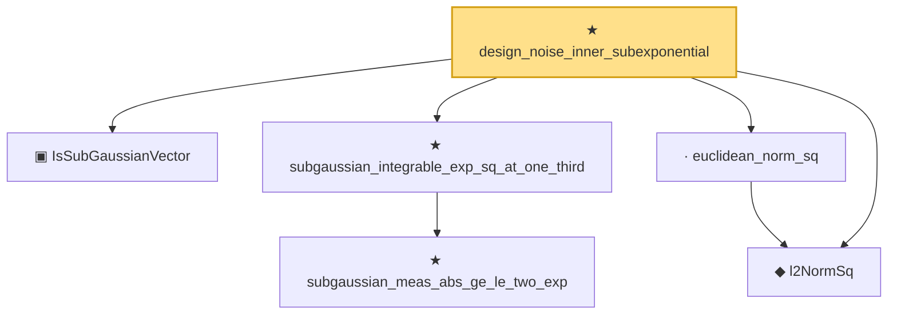

# Proof narrative — design_noise_inner_subexponential

Root: **design_noise_inner_subexponential** (theorem) `Statlib/HighDim/Regression/DesignNoiseInnerSubexponential.lean:25` · topic `HighDim`
Closure: 6 declarations across 5 files. Generated from `proof_graph.json` — no files were moved.

Reading order (foundations first, headline last):

  ▣ `IsSubGaussianVector` — structure · `Statlib/HighDim/Vocabulary/RandomVector.lean:52`  _(also used by 79: decoupledOffDiagQuadForm_const_right_subgaussian, decoupledOffDiagQuadForm_const_right_abs_tail_real, decoupledOffDiagQuadForm_prod_first_section_abs_tail_real, …)_
    ★ `subgaussian_meas_abs_ge_le_two_exp` — theorem · `Statlib/StatFoundation/RandomVariable/SubGaussian/subgaussian_meas_abs_ge_le_two_exp.lean:9`  _(also used by 4: subgaussian_linf_tail, lasso_noise_condition, subgaussian_even_moment_le, …)_
  ★ `subgaussian_integrable_exp_sq_at_one_third` — theorem · `Statlib/StatFoundation/RandomVariable/SubGaussian/subgaussian_exp_sq_le_at_one_third.lean:165`  _(also used by 5: coord_mul_subexponential_exists_of_indep, coord_sq_centered_scaled_exp_integrable, coord_sq_centered_subexponential_exists, …)_
  ◆ `l2NormSq` — noncomputable def · `Statlib/HighDim/Vocabulary/Norms.lean:13`  _(also used by 33: matrixRowVec_norm_sq, offDiagCoeffVec_norm_sq_le_frobenius, offDiagCoeffVec_norm_sq_integral_le_frobenius, …)_
  · `euclidean_norm_sq` — lemma · `Statlib/HighDim/Vocabulary/Norms.lean:21`  _(also used by 12: matrixRowVec_norm_sq, offDiagCoeffVec_norm_sq_le_frobenius, offDiagCoeffVec_norm_sq_integral_le_frobenius, …)_
★ `design_noise_inner_subexponential` — theorem · `Statlib/HighDim/Regression/DesignNoiseInnerSubexponential.lean:25` **← headline**

## Dependency diagram

