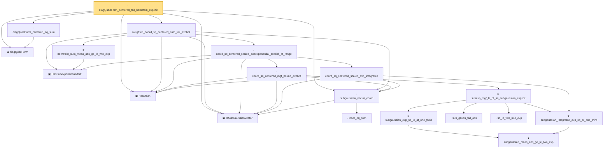

# Proof narrative — diagQuadForm_centered_tail_bernstein_explicit

Root: **diagQuadForm_centered_tail_bernstein_explicit** (lemma) `Statlib/HighDim/Concentration/HansonWright.lean:2342` · topic `HighDim`
Closure: 19 declarations across 10 files. Generated from `proof_graph.json` — no files were moved.

Reading order (foundations first, headline last):

  ▣ `HasMean` — structure · `Statlib/HighDim/Vocabulary/RandomVector.lean:83`  _(also used by 53: coord_mul_integral_eq_zero_of_indep, offDiagQuadForm_integral_eq_zero_of_indep, offDiagQuadForm_centered_eq_self_of_indep, …)_
  ▣ `IsSubGaussianVector` — structure · `Statlib/HighDim/Vocabulary/RandomVector.lean:52`  _(also used by 68: decoupledOffDiagQuadForm_const_right_subgaussian, decoupledOffDiagQuadForm_const_right_abs_tail_real, decoupledOffDiagQuadForm_prod_first_section_abs_tail_real, …)_
  ◆ `diagQuadForm` — noncomputable def · `Statlib/HighDim/Vocabulary/QuadraticForms.lean:21`  _(also used by 8: quadForm_eq_diag_add_offdiag, diagQuadForm_zeroDiagMatrix, quadForm_centered_eq_diag_offdiag_centered, …)_
    · `inner_eq_sum` — lemma · `Statlib/HighDim/Vocabulary/Norms.lean:32`  _(also used by 12: decoupledOffDiagQuadForm_eq_inner_coeff, offDiagCoeffVec_apply_eq_inner_row_zeroDiag, subgaussian_norm_sq_mean_le_dim, …)_
  · `subgaussian_vector_coord` — lemma · `Statlib/HighDim/Concentration/HansonWright.lean:1389`  _(also used by 14: coord_mul_subexponential_exists_of_indep, coord_sq_centered_mgf_bound, subgaussian_norm_sq_integrable, …)_
    ▣ `HasSubexponentialMGF` — structure · `Statlib/StatFoundation/Vocabulary/RandomVariable.lean:74`  _(also used by 22: coord_mul_subexponential_exists_of_indep, subexponential_mgf_const_mul, subexponential_mgf_const_mul_relaxed, …)_
          ★ `subgaussian_meas_abs_ge_le_two_exp` — theorem · `Statlib/StatFoundation/RandomVariable/SubGaussian/subgaussian_meas_abs_ge_le_two_exp.lean:9`  _(also used by 3: subgaussian_linf_tail, lasso_noise_condition, subgaussian_even_moment_le)_
        ★ `subgaussian_integrable_exp_sq_at_one_third` — theorem · `Statlib/StatFoundation/RandomVariable/SubGaussian/subgaussian_exp_sq_le_at_one_third.lean:166`  _(also used by 2: coord_mul_subexponential_exists_of_indep, coord_sq_centered_subexponential_exists)_
      · `coord_sq_centered_scaled_exp_integrable` — lemma · `Statlib/HighDim/Concentration/HansonWright.lean:2109`
          · `sub_gauss_tail_abs` — lemma · `Statlib/StatFoundation/RandomVariable/SubExponential/subexp_mgf_le_of_sq_subgaussian.lean:13`  _(also used by 1: sub_gauss_tail_sq)_
          · `sq_le_two_mul_exp` — lemma · `Statlib/StatFoundation/RandomVariable/SubGaussian/sq_le_two_mul_exp.lean:10`
          ★ `subgaussian_exp_sq_le_at_one_third` — theorem · `Statlib/StatFoundation/RandomVariable/SubGaussian/subgaussian_exp_sq_le_at_one_third.lean:14`
        ★ `subexp_mgf_le_of_sq_subgaussian_explicit` — theorem · `Statlib/StatFoundation/RandomVariable/SubExponential/subexp_mgf_le_of_sq_subgaussian.lean:72`  _(also used by 2: scalar_sq_centered_subexponential_explicit, subexp_mgf_le_of_sq_subgaussian)_
      · `coord_sq_centered_mgf_bound_explicit` — lemma · `Statlib/HighDim/Concentration/HansonWright.lean:2044`  _(also used by 1: coord_sq_centered_scaled_mgf_bound_explicit)_
    · `coord_sq_centered_scaled_subexponential_explicit_of_range` — lemma · `Statlib/HighDim/Concentration/HansonWright.lean:2192`  _(also used by 2: diag_hanson_wright_tail_high, subgaussian_norm_sq_subexponential)_
    ★ `bernstein_sum_meas_abs_ge_le_two_exp` — theorem · `Statlib/StatFoundation/Concentration/ExponentialType/bernstein_sum_meas_abs_ge_le_two_exp.lean:13`  _(also used by 4: diag_hanson_wright_tail_high, sampleCovariance_concentration, jl_single_pair, …)_
  · `weighted_coord_sq_centered_sum_tail_explicit` — lemma · `Statlib/HighDim/Concentration/HansonWright.lean:2248`  _(also used by 1: subgaussian_norm_sq_tail_bernstein_explicit)_
  · `diagQuadForm_centered_eq_sum` — lemma · `Statlib/HighDim/Concentration/HansonWright.lean:360`  _(also used by 1: diag_hanson_wright_tail_high)_
· `diagQuadForm_centered_tail_bernstein_explicit` — lemma · `Statlib/HighDim/Concentration/HansonWright.lean:2342` **← headline**

## Dependency diagram

