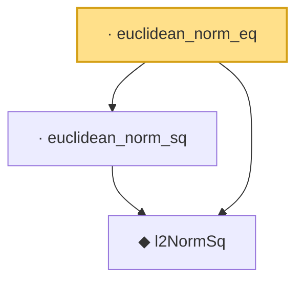

# Proof narrative — euclidean_norm_eq

Root: **euclidean_norm_eq** (lemma) `Statlib/HighDim/Basic.lean:60` · topic `HighDim`
Closure: 3 declarations across 1 files. Generated from `proof_graph.json` — no files were moved.

Reading order (foundations first, headline last):

  ◆ `l2NormSq` — noncomputable def · `Statlib/HighDim/Basic.lean:41`  _(also used by 4: lassoObj, lasso_basic_inequality, lasso_oracle_prediction, …)_
  · `euclidean_norm_sq` — lemma · `Statlib/HighDim/Basic.lean:54`
· `euclidean_norm_eq` — lemma · `Statlib/HighDim/Basic.lean:60` **← headline**

## Dependency diagram

