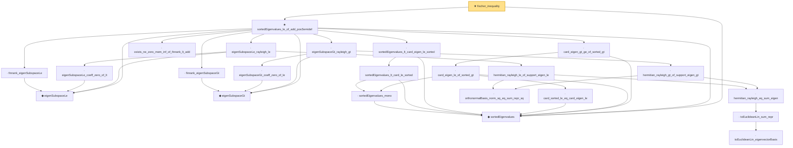

# Proof narrative — fischer_inequality

Root: **fischer_inequality** (theorem) `Statlib/HighDim/MatrixAnalysis/Fischer.lean:13` · topic `HighDim`
Closure: 24 declarations across 4 files. Generated from `proof_graph.json` — no files were moved.

Reading order (foundations first, headline last):

  ◆ `sortedEigenvalues` — noncomputable def · `Statlib/HighDim/Vocabulary/Spectral.lean:11`  _(also used by 15: hermitian_trace_exp_mono_of_sub_posSemidef, finrank_eigenSubspaceLe_eq_r, span_cols_eq_eigenSubspaceLe, …)_
    ◆ `eigenSubspaceLe` — noncomputable def · `Statlib/HighDim/Vocabulary/Spectral.lean:16`  _(also used by 12: von_neumann_trace_inequality, eigenvector_mem_eigenSubspaceLe, orthogonal_eigen_family_card_le, …)_
    ◆ `eigenSubspaceGt` — noncomputable def · `Statlib/HighDim/Vocabulary/Spectral.lean:23`  _(also used by 2: von_neumann_trace_inequality, weyl_sorted_upper)_
    · `finrank_eigenSubspaceLe` — lemma · `Statlib/HighDim/SpectralPerturbation/Eigenvalues.lean:435`  _(also used by 5: von_neumann_trace_inequality, orthogonal_eigen_family_card_le, finrank_eigenSubspaceLe_eq_r, …)_
        · `sortedEigenvalues_mono` — lemma · `Statlib/HighDim/SpectralPerturbation/Eigenvalues.lean:41`  _(also used by 3: wedin_sin_theta, sortedEigenvalues_zero_le_eigenvalue, eigenvalue_le_sortedEigenvalues_last)_
      · `sortedEigenvalues_lt_card_le_sorted` — lemma · `Statlib/HighDim/SpectralPerturbation/Eigenvalues.lean:70`
    · `sortedEigenvalues_lt_card_eigen_le_sorted` — lemma · `Statlib/HighDim/SpectralPerturbation/Eigenvalues.lean:79`  _(also used by 2: wedin_sin_theta, weyl_sorted_upper)_
    · `finrank_eigenSubspaceGt` — lemma · `Statlib/HighDim/SpectralPerturbation/Eigenvalues.lean:479`  _(also used by 2: von_neumann_trace_inequality, weyl_sorted_upper)_
        · `card_sorted_le_eq_card_eigen_le` — lemma · `Statlib/HighDim/SpectralPerturbation/Eigenvalues.lean:106`
      · `card_eigen_le_of_sorted_gt` — lemma · `Statlib/HighDim/SpectralPerturbation/Eigenvalues.lean:128`  _(also used by 1: wedin_sin_theta)_
    · `card_eigen_gt_ge_of_sorted_gt` — lemma · `Statlib/HighDim/SpectralPerturbation/Eigenvalues.lean:148`  _(also used by 1: weyl_sorted_upper)_
    · `exists_ne_zero_mem_inf_of_finrank_lt_add` — lemma · `Statlib/HighDim/SpectralPerturbation/Eigenvalues.lean:830`  _(also used by 1: weyl_sorted_upper)_
            · `toEuclideanLin_eigenvectorBasis` — lemma · `Statlib/HighDim/SpectralPerturbation/Eigenvalues.lean:201`  _(also used by 2: eigenvalues_lt_neg_singularValue_card_le, wedin_sin_theta)_
          · `toEuclideanLin_sum_repr` — lemma · `Statlib/HighDim/SpectralPerturbation/Eigenvalues.lean:208`  _(also used by 2: eigenvector_mem_eigenSubspaceLe, toEuclideanLin_sub_smul_eq_sum_eigen_sub)_
        · `hermitian_rayleigh_eq_sum_eigen` — lemma · `Statlib/HighDim/SpectralPerturbation/Eigenvalues.lean:226`
        · `orthonormalBasis_norm_sq_eq_sum_repr_sq` — lemma · `Statlib/HighDim/SpectralPerturbation/Eigenvalues.lean:259`  _(also used by 2: col_energy_eq_off_energy, off_target_energy_eq_one_sub_single_coeff_sq)_
      · `hermitian_rayleigh_le_of_support_eigen_le` — lemma · `Statlib/HighDim/SpectralPerturbation/Eigenvalues.lean:415`
      · `eigenSubspaceLe_coeff_zero_of_lt` — lemma · `Statlib/HighDim/SpectralPerturbation/Eigenvalues.lean:448`  _(also used by 1: proj_coeff_zero_of_mem)_
    · `eigenSubspaceLe_rayleigh_le` — lemma · `Statlib/HighDim/SpectralPerturbation/Eigenvalues.lean:470`  _(also used by 2: von_neumann_trace_inequality, weyl_sorted_upper)_
      · `hermitian_rayleigh_gt_of_support_eigen_gt` — lemma · `Statlib/HighDim/SpectralPerturbation/Eigenvalues.lean:514`
      · `eigenSubspaceGt_coeff_zero_of_le` — lemma · `Statlib/HighDim/SpectralPerturbation/Eigenvalues.lean:492`
    · `eigenSubspaceGt_rayleigh_gt` — lemma · `Statlib/HighDim/SpectralPerturbation/Eigenvalues.lean:563`  _(also used by 2: von_neumann_trace_inequality, weyl_sorted_upper)_
  ★ `sortedEigenvalues_le_of_add_posSemidef` — theorem · `Statlib/HighDim/MatrixAnalysis/TraceExp.lean:150`  _(also used by 1: hermitian_trace_exp_mono_of_sub_posSemidef)_
★ `fischer_inequality` — theorem · `Statlib/HighDim/MatrixAnalysis/Fischer.lean:13` **← headline**

## Dependency diagram

