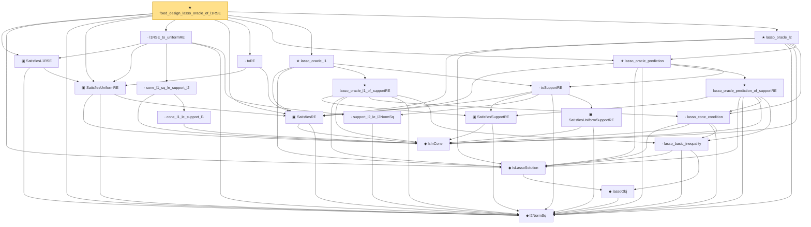

# Proof narrative — fixed_design_lasso_oracle_of_l1RSE

Root: **fixed_design_lasso_oracle_of_l1RSE** (theorem) `Statlib/HighDim/Regression/LassoRSEOracle.lean:23` · topic `HighDim`
Closure: 23 declarations across 5 files. Generated from `proof_graph.json` — no files were moved.

Reading order (foundations first, headline last):

  ◆ `l2NormSq` — noncomputable def · `Statlib/HighDim/Vocabulary/Norms.lean:13`  _(also used by 41: matrixRowVec_norm_sq, offDiagCoeffVec_norm_sq_le_frobenius, offDiagCoeffVec_norm_sq_integral_le_frobenius, …)_
    ◆ `IsInCone` — def · `Statlib/HighDim/Vocabulary/Sparse.lean:49`  _(also used by 4: rip_implies_uniformRE, lasso_oracle_support_l2_of_supportRE, sampleSecondMoment_cone_lower_to_SatisfiesRE, …)_
  ▣ `SatisfiesRE` — structure · `Statlib/HighDim/Vocabulary/DesignMatrix.lean:65`  _(also used by 2: lasso_oracle_support_l2, sampleSecondMoment_cone_lower_to_SatisfiesRE)_
  ▣ `SatisfiesUniformRE` — structure · `Statlib/HighDim/Vocabulary/DesignMatrix.lean:99`  _(also used by 7: rip_implies_uniformRE, lasso_oracle_prediction_of_uniformRE, lasso_oracle_l1_of_uniformRE, …)_
  ▣ `SatisfiesL1RSE` — structure · `Statlib/HighDim/Vocabulary/DesignMatrix.lean:140`
    ◆ `lassoObj` — noncomputable def · `Statlib/HighDim/Regression/LassoOracle.lean:48`
  ◆ `IsLassoSolution` — def · `Statlib/HighDim/Regression/LassoOracle.lean:53`  _(also used by 9: lasso_oracle_prediction_of_uniformSupportRE, lasso_oracle_prediction_of_uniformRE, lasso_oracle_l1_of_uniformSupportRE, …)_
      · `cone_l1_le_support_l1` — lemma · `Statlib/HighDim/Vocabulary/Sparse.lean:62`
    · `cone_l1_sq_le_support_l2` — lemma · `Statlib/HighDim/Vocabulary/Sparse.lean:79`
    · `support_l2_le_l2NormSq` — lemma · `Statlib/HighDim/Vocabulary/Sparse.lean:54`  _(also used by 1: toUniformSupportRE)_
  · `l1RSE_to_uniformRE` — lemma · `Statlib/HighDim/Vocabulary/DesignMatrix.lean:177`
  · `toRE` — lemma · `Statlib/HighDim/Vocabulary/DesignMatrix.lean:151`  _(also used by 4: lasso_oracle_prediction_of_uniformRE, lasso_oracle_l1_of_uniformRE, lasso_oracle_support_l2_of_uniformRE, …)_
      ▣ `SatisfiesSupportRE` — structure · `Statlib/HighDim/Vocabulary/DesignMatrix.lean:50`  _(also used by 3: lasso_oracle_support_l2_of_supportRE, sampleSecondMoment_cone_lower_to_SatisfiesSupportRE, toSupportRE)_
      · `lasso_basic_inequality` — lemma · `Statlib/HighDim/Regression/LassoOracle.lean:65`
    · `lasso_cone_condition` — lemma · `Statlib/HighDim/Regression/LassoOracle.lean:257`  _(also used by 1: lasso_oracle_support_l2_of_supportRE)_
    ★ `lasso_oracle_prediction_of_supportRE` — theorem · `Statlib/HighDim/Regression/LassoOracle.lean:416`  _(also used by 2: lasso_oracle_prediction_of_uniformSupportRE, lasso_oracle_support_l2_of_supportRE)_
      ▣ `SatisfiesUniformSupportRE` — structure · `Statlib/HighDim/Vocabulary/DesignMatrix.lean:82`  _(also used by 6: lasso_oracle_prediction_of_uniformSupportRE, lasso_oracle_l1_of_uniformSupportRE, lasso_oracle_support_l2_of_uniformSupportRE, …)_
    · `toSupportRE` — lemma · `Statlib/HighDim/Vocabulary/DesignMatrix.lean:110`  _(also used by 6: lasso_oracle_prediction_of_uniformSupportRE, lasso_oracle_l1_of_uniformSupportRE, lasso_oracle_support_l2_of_uniformSupportRE, …)_
  ★ `lasso_oracle_prediction` — theorem · `Statlib/HighDim/Regression/LassoOracle.lean:629`  _(also used by 1: lasso_oracle_prediction_of_uniformRE)_
    ★ `lasso_oracle_l1_of_supportRE` — theorem · `Statlib/HighDim/Regression/LassoOracle.lean:663`  _(also used by 1: lasso_oracle_l1_of_uniformSupportRE)_
  ★ `lasso_oracle_l1` — theorem · `Statlib/HighDim/Regression/LassoOracle.lean:877`  _(also used by 1: lasso_oracle_l1_of_uniformRE)_
  ★ `lasso_oracle_l2` — theorem · `Statlib/HighDim/Regression/LassoOracle.lean:980`  _(also used by 1: lasso_oracle_l2_of_uniformRE)_
★ `fixed_design_lasso_oracle_of_l1RSE` — theorem · `Statlib/HighDim/Regression/LassoRSEOracle.lean:23` **← headline**

## Dependency diagram

