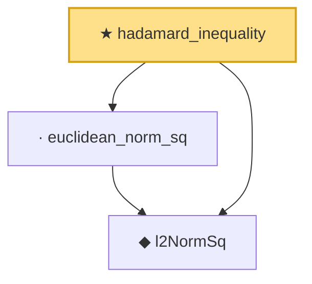

# Proof narrative — hadamard_inequality

Root: **hadamard_inequality** (theorem) `Statlib/HighDim/MatrixAnalysis/Hadamard.lean:17` · topic `HighDim`
Closure: 3 declarations across 2 files. Generated from `proof_graph.json` — no files were moved.

Reading order (foundations first, headline last):

  ◆ `l2NormSq` — noncomputable def · `Statlib/HighDim/Vocabulary/Norms.lean:13`  _(also used by 220: matrixRowVec_norm_sq, offDiagCoeffVec_norm_sq_le_frobenius, offDiagCoeffVec_norm_sq_integral_le_frobenius, …)_
  · `euclidean_norm_sq` — lemma · `Statlib/HighDim/Vocabulary/Norms.lean:89`  _(also used by 31: matrixRowVec_norm_sq, offDiagCoeffVec_norm_sq_le_frobenius, offDiagCoeffVec_norm_sq_integral_le_frobenius, …)_
★ `hadamard_inequality` — theorem · `Statlib/HighDim/MatrixAnalysis/Hadamard.lean:17` **← headline**

## Dependency diagram

