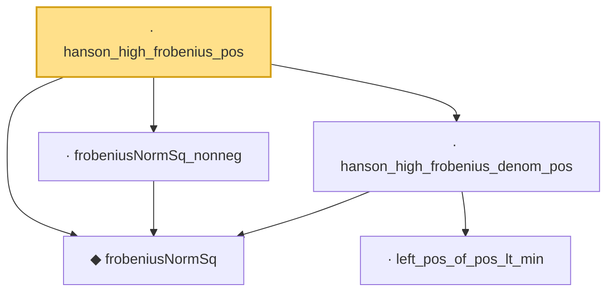

# Proof narrative — hanson_high_frobenius_pos

Root: **hanson_high_frobenius_pos** (lemma) `Statlib/HighDim/Concentration/HansonWright.lean:1565` · topic `HighDim`
Closure: 5 declarations across 2 files. Generated from `proof_graph.json` — no files were moved.

Reading order (foundations first, headline last):

  ◆ `frobeniusNormSq` — noncomputable def · `Statlib/HighDim/Vocabulary/Norms.lean:37`  _(also used by 43: diag_sq_sum_le_frobeniusNormSq, frobeniusNormSq_zeroDiagMatrix_le, offDiagCoeffVec_norm_sq_le_frobenius, …)_
    · `left_pos_of_pos_lt_min` — lemma · `Statlib/HighDim/Concentration/HansonWright.lean:1512`
  · `hanson_high_frobenius_denom_pos` — lemma · `Statlib/HighDim/Concentration/HansonWright.lean:1524`  _(also used by 1: diag_hanson_wright_tail_high)_
  · `frobeniusNormSq_nonneg` — lemma · `Statlib/HighDim/Concentration/HansonWright.lean:401`  _(also used by 2: decoupledOffDiagQuadForm_const_right_abs_tail_real_frobenius, decoupledOffDiagQuadForm_prod_tail_le_markov_plus_good_ofReal)_
· `hanson_high_frobenius_pos` — lemma · `Statlib/HighDim/Concentration/HansonWright.lean:1565` **← headline**

## Dependency diagram

