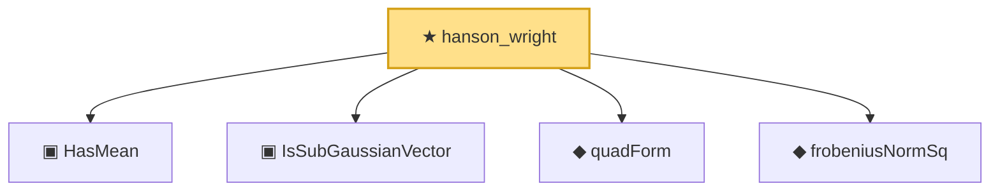

# Proof narrative — hanson_wright

Root: **hanson_wright** (theorem) `Statlib/HighDim/HansonWright.lean:65` · topic `HighDim`
Closure: 5 declarations across 3 files. Generated from `proof_graph.json` — no files were moved.

Reading order (foundations first, headline last):

  ▣ `HasMean` — structure · `Statlib/Vocabulary/RandomVector.lean:83`  _(also used by 10: hanson_wright_isotropic, secondMoment_eq_cov_centered, subgaussian_variance_bound, …)_
  ▣ `IsSubGaussianVector` — structure · `Statlib/Vocabulary/RandomVector.lean:52`  _(also used by 11: hanson_wright_isotropic, subgaussian_variance_bound, subgaussian_cov_offdiag_bound, …)_
  ◆ `quadForm` — noncomputable def · `Statlib/HighDim/HansonWright.lean:33`  _(also used by 2: quadratic_form_mean_isotropic, hanson_wright_isotropic)_
  ◆ `frobeniusNormSq` — noncomputable def · `Statlib/HighDim/Basic.lean:71`  _(also used by 2: hanson_wright_isotropic, davis_kahan_subspace)_
★ `hanson_wright` — theorem · `Statlib/HighDim/HansonWright.lean:65` **← headline**

## Dependency diagram

