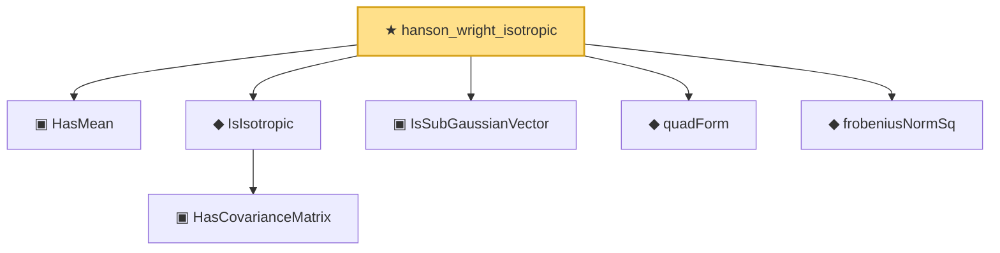

# Proof narrative — hanson_wright_isotropic

Root: **hanson_wright_isotropic** (theorem) `Statlib/HighDim/HansonWright.lean:85` · topic `HighDim`
Closure: 7 declarations across 3 files. Generated from `proof_graph.json` — no files were moved.

Reading order (foundations first, headline last):

  ▣ `HasMean` — structure · `Statlib/Vocabulary/RandomVector.lean:83`  _(also used by 10: hanson_wright, secondMoment_eq_cov_centered, subgaussian_variance_bound, …)_
    ▣ `HasCovarianceMatrix` — structure · `Statlib/Vocabulary/RandomVector.lean:101`  _(also used by 8: secondMoment_isSymm, secondMoment_posSemidef, secondMoment_eq_cov_centered, …)_
  ◆ `IsIsotropic` — def · `Statlib/Vocabulary/RandomVector.lean:109`  _(also used by 6: quadratic_form_mean_isotropic, subgaussian_norm_sq_subexponential, isotropic_mean_sq_norm, …)_
  ▣ `IsSubGaussianVector` — structure · `Statlib/Vocabulary/RandomVector.lean:52`  _(also used by 11: hanson_wright, subgaussian_variance_bound, subgaussian_cov_offdiag_bound, …)_
  ◆ `quadForm` — noncomputable def · `Statlib/HighDim/HansonWright.lean:33`  _(also used by 2: quadratic_form_mean_isotropic, hanson_wright)_
  ◆ `frobeniusNormSq` — noncomputable def · `Statlib/HighDim/Basic.lean:71`  _(also used by 2: hanson_wright, davis_kahan_subspace)_
★ `hanson_wright_isotropic` — theorem · `Statlib/HighDim/HansonWright.lean:85` **← headline**

## Dependency diagram

