# Proof narrative — hanson_wright_of_const_decoupling_norm_bernstein_absorb_of_exponents

Root: **hanson_wright_of_const_decoupling_norm_bernstein_absorb_of_exponents** (theorem) `Statlib/HighDim/Concentration/HansonWright.lean:4612` · topic `HighDim`
Closure: 56 declarations across 10 files. Generated from `proof_graph.json` — no files were moved.

Reading order (foundations first, headline last):

  ▣ `HasMean` — structure · `Statlib/HighDim/Vocabulary/RandomVector.lean:83`  _(also used by 29: coord_mul_subexponential_exists_of_indep, coord_mul_scaled_subexponential_exists_of_indep, offdiag_hanson_wright_tail_high_norm_bernstein_of_decoupling, …)_
  ▣ `IsSubGaussianVector` — structure · `Statlib/HighDim/Vocabulary/RandomVector.lean:52`  _(also used by 68: decoupledOffDiagQuadForm_const_right_subgaussian, decoupledOffDiagQuadForm_const_right_abs_tail_real, decoupledOffDiagQuadForm_prod_first_section_abs_tail_real, …)_
  ◆ `frobeniusNormSq` — noncomputable def · `Statlib/HighDim/Vocabulary/Norms.lean:37`  _(also used by 33: frobeniusNormSq_zeroDiagMatrix_le, frobeniusNormSq_nonneg, offDiagCoeffVec_norm_sq_le_frobenius, …)_
  ◆ `quadForm` — noncomputable def · `Statlib/HighDim/Vocabulary/QuadraticForms.lean:15`  _(also used by 20: quadratic_form_mean_isotropic, zeroDiag_centered_quadratic_form_tail_high_of_decoupling_and_decoupled_tail, zeroDiag_centered_quadratic_form_tail_high_of_const_decoupling_and_decoupled_tail, …)_
  ◆ `zeroDiagMatrix` — def · `Statlib/HighDim/Vocabulary/QuadraticForms.lean:52`  _(also used by 32: offDiagCoeff_eq_zeroDiagMatrix_mulVec, offDiagCoeff_norm_le_zeroDiag, offDiagCoeffVec_eq_zeroDiagMatrix_mulVec, …)_
  ◆ `decoupledOffDiagQuadForm` — noncomputable def · `Statlib/HighDim/Vocabulary/QuadraticForms.lean:33`  _(also used by 44: decoupledOffDiagQuadForm_eq_sum_coeff, decoupledOffDiagQuadForm_eq_inner_coeff, decoupledOffDiagQuadForm_const_right_eq_inner_coeffVec, …)_
    · `measure_event_le_ofReal_of_one_le` — lemma · `Statlib/HighDim/Concentration/HansonWright.lean:1495`
      ◆ `offDiagQuadForm` — noncomputable def · `Statlib/HighDim/Vocabulary/QuadraticForms.lean:27`  _(also used by 8: offdiag_hanson_wright_tail_high_norm_bernstein_of_decoupling, offdiag_hanson_wright_tail_high_norm_bernstein_of_const_decoupling, offdiag_hanson_wright_tail_high_of_decoupling_norm_bernstein_absorb, …)_
        · `offDiagQuadForm_eq_zero_of_entries` — lemma · `Statlib/HighDim/Concentration/HansonWright.lean:280`  _(also used by 1: zeroDiag_centered_quadratic_form_tail_high_of_offdiag_entries_zero)_
      ★ `offdiag_hanson_wright_tail_high_of_offdiag_entries_zero` — theorem · `Statlib/HighDim/Concentration/HansonWright.lean:4352`
          · `inner_eq_sum` — lemma · `Statlib/HighDim/Vocabulary/Norms.lean:32`  _(also used by 15: decoupledOffDiagQuadForm_eq_inner_coeff, offDiagCoeffVec_apply_eq_inner_row_zeroDiag, subgaussian_norm_sq_mean_le_dim, …)_
        · `subgaussian_vector_coord` — lemma · `Statlib/HighDim/Concentration/HansonWright.lean:1341`  _(also used by 14: coord_mul_subexponential_exists_of_indep, coord_sq_centered_mgf_bound, weighted_coord_sq_centered_sum_tail_explicit, …)_
        ◆ `diagQuadForm` — noncomputable def · `Statlib/HighDim/Vocabulary/QuadraticForms.lean:21`  _(also used by 2: diagQuadForm_centered_tail_bernstein_explicit, hanson_wright_tail_high_of_offdiag_tail)_
          · `coord_mul_integrable_of_sq_integrable` — lemma · `Statlib/HighDim/Concentration/HansonWright.lean:1232`
        · `offDiagQuadForm_integrable_of_coord_sq_integrable` — lemma · `Statlib/HighDim/Concentration/HansonWright.lean:1270`  _(also used by 1: hanson_wright_tail_high_of_offdiag_tail)_
          · `diagQuadForm_centered_eq_sum` — lemma · `Statlib/HighDim/Concentration/HansonWright.lean:312`  _(also used by 1: diagQuadForm_centered_tail_bernstein_explicit)_
            · `right_pos_of_pos_lt_min` — lemma · `Statlib/HighDim/Concentration/HansonWright.lean:1518`
          · `hanson_high_spectral_denom_pos` — lemma · `Statlib/HighDim/Concentration/HansonWright.lean:1539`
          · `hanson_high_norm_pos` — lemma · `Statlib/HighDim/Concentration/HansonWright.lean:1552`
          ▣ `HasSubexponentialMGF` — structure · `Statlib/StatFoundation/Vocabulary/RandomVariable.lean:74`  _(also used by 30: coord_mul_subexponential_exists_of_indep, subexponential_mgf_const_mul_relaxed, coord_mul_scaled_subexponential_exists_of_indep, …)_
          · `matrix_entry_abs_le_l2_opNorm` — lemma · `Statlib/HighDim/Concentration/HansonWright.lean:350`  _(also used by 1: diagPartMatrix_norm_le)_
            ★ `subgaussian_meas_abs_ge_le_two_exp` — theorem · `Statlib/StatFoundation/RandomVariable/SubGaussian/subgaussian_meas_abs_ge_le_two_exp.lean:9`  _(also used by 3: subgaussian_linf_tail, lasso_noise_condition, subgaussian_even_moment_le)_
            ★ `subgaussian_integrable_exp_sq_at_one_third` — theorem · `Statlib/StatFoundation/RandomVariable/SubGaussian/subgaussian_exp_sq_le_at_one_third.lean:165`  _(also used by 4: coord_mul_subexponential_exists_of_indep, coord_sq_centered_subexponential_exists, design_noise_inner_subexponential, …)_
            · `coord_sq_centered_scaled_exp_integrable` — lemma · `Statlib/HighDim/Concentration/HansonWright.lean:2016`  _(also used by 1: cov_trace_concentration)_
            · `sub_gauss_tail_abs` — lemma · `Statlib/StatFoundation/RandomVariable/SubExponential/subexp_mgf_le_of_sq_subgaussian.lean:13`  _(also used by 1: sub_gauss_tail_sq)_
            · `sq_le_two_mul_exp` — lemma · `Statlib/StatFoundation/RandomVariable/SubGaussian/sq_le_two_mul_exp.lean:10`
            ★ `subgaussian_exp_sq_le_at_one_third` — theorem · `Statlib/StatFoundation/RandomVariable/SubGaussian/subgaussian_exp_sq_le_at_one_third.lean:14`
            ★ `subexp_mgf_le_of_sq_subgaussian_explicit` — theorem · `Statlib/StatFoundation/RandomVariable/SubExponential/subexp_mgf_le_of_sq_subgaussian.lean:73`  _(also used by 2: scalar_sq_centered_subexponential_explicit, subexp_mgf_le_of_sq_subgaussian)_
            · `coord_sq_centered_mgf_bound_explicit` — lemma · `Statlib/HighDim/Concentration/HansonWright.lean:1952`  _(also used by 2: coord_sq_centered_scaled_mgf_bound_explicit, cov_trace_concentration)_
          · `coord_sq_centered_scaled_subexponential_explicit_of_range` — lemma · `Statlib/HighDim/Concentration/HansonWright.lean:2097`  _(also used by 2: weighted_coord_sq_centered_sum_tail_explicit, subgaussian_norm_sq_subexponential)_
          ★ `bernstein_sum_meas_abs_ge_le_two_exp` — theorem · `Statlib/StatFoundation/Concentration/ExponentialType/bernstein_sum_meas_abs_ge_le_two_exp.lean:13`  _(also used by 5: weighted_coord_sq_centered_sum_tail_explicit, cov_trace_concentration, sampleCovariance_concentration, …)_
            · `left_pos_of_pos_lt_min` — lemma · `Statlib/HighDim/Concentration/HansonWright.lean:1513`
          · `hanson_high_frobenius_denom_pos` — lemma · `Statlib/HighDim/Concentration/HansonWright.lean:1525`  _(also used by 1: hanson_high_frobenius_pos)_
          · `diag_sq_sum_le_frobeniusNormSq` — lemma · `Statlib/HighDim/Concentration/HansonWright.lean:377`
            · `two_mul_exp_neg_le_exp_neg_hanson_high` — lemma · `Statlib/HighDim/Concentration/HansonWright.lean:1580`
          · `diagonal_bernstein_real_bound` — lemma · `Statlib/HighDim/Concentration/HansonWright.lean:1678`
        ★ `diag_hanson_wright_tail_high` — theorem · `Statlib/HighDim/Concentration/HansonWright.lean:3897`  _(also used by 1: hanson_wright_tail_high_of_offdiag_tail)_
        · `exp_neg_hanson_stronger_le_weaker` — lemma · `Statlib/HighDim/Concentration/HansonWright.lean:1670`
            · `coord_mul_integral_eq_zero_of_indep` — lemma · `Statlib/HighDim/Concentration/HansonWright.lean:1249`  _(also used by 1: coord_mul_subexponential_exists_of_indep)_
          · `offDiagQuadForm_integral_eq_zero_of_indep` — lemma · `Statlib/HighDim/Concentration/HansonWright.lean:1283`
        · `offDiagQuadForm_centered_eq_self_of_indep` — lemma · `Statlib/HighDim/Concentration/HansonWright.lean:1328`  _(also used by 1: hanson_wright_tail_high_of_offdiag_tail)_
            · `quadForm_eq_diag_add_offdiag` — lemma · `Statlib/HighDim/Concentration/HansonWright.lean:236`
            · `quadForm_centered_eq_diag_offdiag_centered` — lemma · `Statlib/HighDim/Concentration/HansonWright.lean:295`
            · `abs_add_event_subset_half` — lemma · `Statlib/HighDim/Concentration/HansonWright.lean:1728`
          · `quadForm_centered_tail_le_diag_offdiag_tail` — lemma · `Statlib/HighDim/Concentration/HansonWright.lean:1745`
        · `quadForm_centered_tail_le_two_mul_of_diag_offdiag_tail_bounds` — lemma · `Statlib/HighDim/Concentration/HansonWright.lean:1795`  _(also used by 1: hanson_wright_tail_high_of_offdiag_tail)_
      ★ `hanson_wright_tail_high_of_offdiag_tail_weakened` — theorem · `Statlib/HighDim/Concentration/HansonWright.lean:4202`
            · `diagQuadForm_zeroDiagMatrix` — lemma · `Statlib/HighDim/Concentration/HansonWright.lean:254`
            · `offDiagQuadForm_zeroDiagMatrix` — lemma · `Statlib/HighDim/Concentration/HansonWright.lean:260`
            · `quadForm_zeroDiagMatrix_eq_offDiagQuadForm` — lemma · `Statlib/HighDim/Concentration/HansonWright.lean:271`  _(also used by 1: zeroDiag_centered_quadratic_form_tail_high_of_offdiag_entries_zero)_
          · `offdiag_tail_of_zeroDiag_centered_quad_tail` — lemma · `Statlib/HighDim/Concentration/HansonWright.lean:2885`  _(also used by 6: offdiag_hanson_wright_tail_high_norm_bernstein_of_decoupling, offdiag_hanson_wright_tail_high_norm_bernstein_of_const_decoupling, offdiag_hanson_wright_tail_high_of_const_decoupling_norm_bernstein_absorb, …)_
        ★ `offdiag_hanson_wright_tail_high_of_const_decoupling_norm_bernstein_absorb_of_exponents` — theorem · `Statlib/HighDim/Concentration/HansonWright.lean:3676`
      ★ `hanson_wright_tail_high_of_const_decoupling_norm_bernstein_absorb_of_exponents` — theorem · `Statlib/HighDim/Concentration/HansonWright.lean:4289`
    ★ `hanson_wright_tail_high_of_const_decoupling_norm_bernstein_absorb_of_exponents'` — theorem · `Statlib/HighDim/Concentration/HansonWright.lean:4399`
  ★ `hanson_wright_tail_of_const_decoupling_norm_bernstein_absorb_of_exponents` — theorem · `Statlib/HighDim/Concentration/HansonWright.lean:4484`  _(also used by 1: hanson_wright_tail_of_const_decoupling_scale_conditions)_
★ `hanson_wright_of_const_decoupling_norm_bernstein_absorb_of_exponents` — theorem · `Statlib/HighDim/Concentration/HansonWright.lean:4612` **← headline**

## Dependency diagram

```mermaid
flowchart TD
  n0["▣ HasMean"]
  n1["▣ IsSubGaussianVector"]
  n2["◆ frobeniusNormSq"]
  n3["◆ quadForm"]
  n4["◆ zeroDiagMatrix"]
  n5["◆ decoupledOffDiagQuadForm"]
  n6["· measure_event_le_ofReal_of_one_le"]
  n7["◆ offDiagQuadForm"]
  n8["· offDiagQuadForm_eq_zero_of_entries"]
  n9["★ offdiag_hanson_wright_tail_high_of_offdiag_entries_zero"]
  n10["· inner_eq_sum"]
  n11["· subgaussian_vector_coord"]
  n12["◆ diagQuadForm"]
  n13["· coord_mul_integrable_of_sq_integrable"]
  n14["· offDiagQuadForm_integrable_of_coord_sq_integrable"]
  n15["· diagQuadForm_centered_eq_sum"]
  n16["· right_pos_of_pos_lt_min"]
  n17["· hanson_high_spectral_denom_pos"]
  n18["· hanson_high_norm_pos"]
  n19["▣ HasSubexponentialMGF"]
  n20["· matrix_entry_abs_le_l2_opNorm"]
  n21["★ subgaussian_meas_abs_ge_le_two_exp"]
  n22["★ subgaussian_integrable_exp_sq_at_one_third"]
  n23["· coord_sq_centered_scaled_exp_integrable"]
  n24["· sub_gauss_tail_abs"]
  n25["· sq_le_two_mul_exp"]
  n26["★ subgaussian_exp_sq_le_at_one_third"]
  n27["★ subexp_mgf_le_of_sq_subgaussian_explicit"]
  n28["· coord_sq_centered_mgf_bound_explicit"]
  n29["· coord_sq_centered_scaled_subexponential_explicit_of_range"]
  n30["★ bernstein_sum_meas_abs_ge_le_two_exp"]
  n31["· left_pos_of_pos_lt_min"]
  n32["· hanson_high_frobenius_denom_pos"]
  n33["· diag_sq_sum_le_frobeniusNormSq"]
  n34["· two_mul_exp_neg_le_exp_neg_hanson_high"]
  n35["· diagonal_bernstein_real_bound"]
  n36["★ diag_hanson_wright_tail_high"]
  n37["· exp_neg_hanson_stronger_le_weaker"]
  n38["· coord_mul_integral_eq_zero_of_indep"]
  n39["· offDiagQuadForm_integral_eq_zero_of_indep"]
  n40["· offDiagQuadForm_centered_eq_self_of_indep"]
  n41["· quadForm_eq_diag_add_offdiag"]
  n42["· quadForm_centered_eq_diag_offdiag_centered"]
  n43["· abs_add_event_subset_half"]
  n44["· quadForm_centered_tail_le_diag_offdiag_tail"]
  n45["· quadForm_centered_tail_le_two_mul_of_diag_offdiag_tail_bounds"]
  n46["★ hanson_wright_tail_high_of_offdiag_tail_weakened"]
  n47["· diagQuadForm_zeroDiagMatrix"]
  n48["· offDiagQuadForm_zeroDiagMatrix"]
  n49["· quadForm_zeroDiagMatrix_eq_offDiagQuadForm"]
  n50["· offdiag_tail_of_zeroDiag_centered_quad_tail"]
  n51["★ offdiag_hanson_wright_tail_high_of_const_decoupling_norm_bernstein_absorb_of_exponents"]
  n52["★ hanson_wright_tail_high_of_const_decoupling_norm_bernstein_absorb_of_exponents"]
  n53["★ hanson_wright_tail_high_of_const_decoupling_norm_bernstein_absorb_of_exponents'"]
  n54["★ hanson_wright_tail_of_const_decoupling_norm_bernstein_absorb_of_exponents"]
  n55["★ hanson_wright_of_const_decoupling_norm_bernstein_absorb_of_exponents"]
  n8 --> n7
  n9 --> n7
  n9 --> n8
  n11 --> n1
  n11 --> n10
  n14 --> n7
  n14 --> n13
  n15 --> n12
  n17 --> n2
  n17 --> n16
  n18 --> n2
  n18 --> n17
  n22 --> n21
  n23 --> n1
  n23 --> n11
  n23 --> n22
  n26 --> n21
  n27 --> n24
  n27 --> n25
  n27 --> n26
  n27 --> n22
  n28 --> n1
  n28 --> n11
  n28 --> n27
  n29 --> n1
  n29 --> n19
  n29 --> n23
  n29 --> n28
  n30 --> n19
  n32 --> n2
  n32 --> n31
  n33 --> n2
  n35 --> n34
  n36 --> n1
  n36 --> n2
  n36 --> n12
  n36 --> n11
  n36 --> n15
  n36 --> n17
  n36 --> n18
  n36 --> n19
  n36 --> n20
  n36 --> n29
  n36 --> n30
  n36 --> n32
  n36 --> n33
  n36 --> n35
  n38 --> n0
  n39 --> n0
  n39 --> n7
  n39 --> n13
  n39 --> n38
  n40 --> n0
  n40 --> n7
  n40 --> n39
  n41 --> n3
  n41 --> n12
  n41 --> n7
  n42 --> n12
  n42 --> n7
  n42 --> n3
  n42 --> n41
  n44 --> n12
  n44 --> n7
  n44 --> n3
  n44 --> n42
  n44 --> n43
  n45 --> n12
  n45 --> n7
  n45 --> n3
  n45 --> n44
  n46 --> n0
  n46 --> n1
  n46 --> n2
  n46 --> n7
  n46 --> n3
  n46 --> n11
  n46 --> n12
  n46 --> n14
  n46 --> n36
  n46 --> n37
  n46 --> n40
  n46 --> n45
  n47 --> n12
  n47 --> n4
  n48 --> n7
  n48 --> n4
  n49 --> n3
  n49 --> n4
  n49 --> n7
  n49 --> n41
  n49 --> n47
  n49 --> n48
  n50 --> n0
  n50 --> n3
  n50 --> n4
  n50 --> n7
  n50 --> n49
  n50 --> n39
  n51 --> n0
  n51 --> n1
  n51 --> n2
  n51 --> n3
  n51 --> n4
  n51 --> n5
  n51 --> n7
  n51 --> n11
  n51 --> n50
  n52 --> n0
  n52 --> n1
  n52 --> n2
  n52 --> n3
  n52 --> n4
  n52 --> n5
  n52 --> n46
  n52 --> n51
  n53 --> n0
  n53 --> n1
  n53 --> n2
  n53 --> n3
  n53 --> n4
  n53 --> n5
  n53 --> n7
  n53 --> n9
  n53 --> n46
  n53 --> n52
  n54 --> n0
  n54 --> n1
  n54 --> n2
  n54 --> n3
  n54 --> n4
  n54 --> n5
  n54 --> n6
  n54 --> n53
  n55 --> n0
  n55 --> n1
  n55 --> n2
  n55 --> n3
  n55 --> n4
  n55 --> n5
  n55 --> n54
  class n55 headline;
  classDef headline fill:#ffe08a,stroke:#d4a017,stroke-width:2px;
  classDef axiomNode fill:#ffd0d0,stroke:#c0392b,stroke-dasharray:4 2;
```

