# Proof narrative — hanson_wright_tail_high_of_offdiag_tail

Root: **hanson_wright_tail_high_of_offdiag_tail** (theorem) `Statlib/HighDim/Concentration/HansonWright.lean:4205` · topic `HighDim`
Closure: 41 declarations across 10 files. Generated from `proof_graph.json` — no files were moved.

Reading order (foundations first, headline last):

  ▣ `HasMean` — structure · `Statlib/HighDim/Vocabulary/RandomVector.lean:83`  _(also used by 33: coord_mul_subexponential_exists_of_indep, coord_mul_scaled_subexponential_exists_of_indep, offdiag_tail_of_zeroDiag_centered_quad_tail, …)_
  ▣ `IsSubGaussianVector` — structure · `Statlib/HighDim/Vocabulary/RandomVector.lean:52`  _(also used by 71: decoupledOffDiagQuadForm_const_right_subgaussian, decoupledOffDiagQuadForm_const_right_abs_tail_real, decoupledOffDiagQuadForm_prod_first_section_abs_tail_real, …)_
  ◆ `frobeniusNormSq` — noncomputable def · `Statlib/HighDim/Vocabulary/Norms.lean:37`  _(also used by 40: frobeniusNormSq_zeroDiagMatrix_le, frobeniusNormSq_nonneg, offDiagCoeffVec_norm_sq_le_frobenius, …)_
  ◆ `offDiagQuadForm` — noncomputable def · `Statlib/HighDim/Vocabulary/QuadraticForms.lean:27`  _(also used by 15: offDiagQuadForm_zeroDiagMatrix, quadForm_zeroDiagMatrix_eq_offDiagQuadForm, offDiagQuadForm_eq_zero_of_entries, …)_
  ◆ `quadForm` — noncomputable def · `Statlib/HighDim/Vocabulary/QuadraticForms.lean:15`  _(also used by 29: quadForm_zeroDiagMatrix_eq_offDiagQuadForm, quadratic_form_mean_isotropic, offdiag_tail_of_zeroDiag_centered_quad_tail, …)_
    · `inner_eq_sum` — lemma · `Statlib/HighDim/Vocabulary/Norms.lean:32`  _(also used by 13: decoupledOffDiagQuadForm_eq_inner_coeff, offDiagCoeffVec_apply_eq_inner_row_zeroDiag, subgaussian_norm_sq_mean_le_dim, …)_
  · `subgaussian_vector_coord` — lemma · `Statlib/HighDim/Concentration/HansonWright.lean:1389`  _(also used by 14: coord_mul_subexponential_exists_of_indep, coord_sq_centered_mgf_bound, weighted_coord_sq_centered_sum_tail_explicit, …)_
  ◆ `diagQuadForm` — noncomputable def · `Statlib/HighDim/Vocabulary/QuadraticForms.lean:21`  _(also used by 3: diagQuadForm_zeroDiagMatrix, diagQuadForm_centered_tail_bernstein_explicit, hanson_wright_tail_high_of_offdiag_tail_weakened)_
    · `coord_mul_integrable_of_sq_integrable` — lemma · `Statlib/HighDim/Concentration/HansonWright.lean:1280`
  · `offDiagQuadForm_integrable_of_coord_sq_integrable` — lemma · `Statlib/HighDim/Concentration/HansonWright.lean:1318`  _(also used by 1: hanson_wright_tail_high_of_offdiag_tail_weakened)_
    · `diagQuadForm_centered_eq_sum` — lemma · `Statlib/HighDim/Concentration/HansonWright.lean:360`  _(also used by 1: diagQuadForm_centered_tail_bernstein_explicit)_
      · `right_pos_of_pos_lt_min` — lemma · `Statlib/HighDim/Concentration/HansonWright.lean:1566`
    · `hanson_high_spectral_denom_pos` — lemma · `Statlib/HighDim/Concentration/HansonWright.lean:1587`
    · `hanson_high_norm_pos` — lemma · `Statlib/HighDim/Concentration/HansonWright.lean:1600`
    ▣ `HasSubexponentialMGF` — structure · `Statlib/StatFoundation/Vocabulary/RandomVariable.lean:74`  _(also used by 22: coord_mul_subexponential_exists_of_indep, subexponential_mgf_const_mul, subexponential_mgf_const_mul_relaxed, …)_
    · `matrix_entry_abs_le_l2_opNorm` — lemma · `Statlib/HighDim/Concentration/HansonWright.lean:398`  _(also used by 1: diagPartMatrix_norm_le)_
          ★ `subgaussian_meas_abs_ge_le_two_exp` — theorem · `Statlib/StatFoundation/RandomVariable/SubGaussian/subgaussian_meas_abs_ge_le_two_exp.lean:9`  _(also used by 3: subgaussian_linf_tail, lasso_noise_condition, subgaussian_even_moment_le)_
        ★ `subgaussian_integrable_exp_sq_at_one_third` — theorem · `Statlib/StatFoundation/RandomVariable/SubGaussian/subgaussian_exp_sq_le_at_one_third.lean:165`  _(also used by 2: coord_mul_subexponential_exists_of_indep, coord_sq_centered_subexponential_exists)_
      · `coord_sq_centered_scaled_exp_integrable` — lemma · `Statlib/HighDim/Concentration/HansonWright.lean:2101`
          · `sub_gauss_tail_abs` — lemma · `Statlib/StatFoundation/RandomVariable/SubExponential/subexp_mgf_le_of_sq_subgaussian.lean:13`  _(also used by 1: sub_gauss_tail_sq)_
          · `sq_le_two_mul_exp` — lemma · `Statlib/StatFoundation/RandomVariable/SubGaussian/sq_le_two_mul_exp.lean:10`
          ★ `subgaussian_exp_sq_le_at_one_third` — theorem · `Statlib/StatFoundation/RandomVariable/SubGaussian/subgaussian_exp_sq_le_at_one_third.lean:14`
        ★ `subexp_mgf_le_of_sq_subgaussian_explicit` — theorem · `Statlib/StatFoundation/RandomVariable/SubExponential/subexp_mgf_le_of_sq_subgaussian.lean:72`  _(also used by 2: scalar_sq_centered_subexponential_explicit, subexp_mgf_le_of_sq_subgaussian)_
      · `coord_sq_centered_mgf_bound_explicit` — lemma · `Statlib/HighDim/Concentration/HansonWright.lean:2038`  _(also used by 1: coord_sq_centered_scaled_mgf_bound_explicit)_
    · `coord_sq_centered_scaled_subexponential_explicit_of_range` — lemma · `Statlib/HighDim/Concentration/HansonWright.lean:2182`  _(also used by 2: weighted_coord_sq_centered_sum_tail_explicit, subgaussian_norm_sq_subexponential)_
    ★ `bernstein_sum_meas_abs_ge_le_two_exp` — theorem · `Statlib/StatFoundation/Concentration/ExponentialType/bernstein_sum_meas_abs_ge_le_two_exp.lean:13`  _(also used by 4: weighted_coord_sq_centered_sum_tail_explicit, sampleCovariance_concentration, jl_single_pair, …)_
      · `left_pos_of_pos_lt_min` — lemma · `Statlib/HighDim/Concentration/HansonWright.lean:1561`
    · `hanson_high_frobenius_denom_pos` — lemma · `Statlib/HighDim/Concentration/HansonWright.lean:1573`  _(also used by 1: hanson_high_frobenius_pos)_
    · `diag_sq_sum_le_frobeniusNormSq` — lemma · `Statlib/HighDim/Concentration/HansonWright.lean:425`
      · `two_mul_exp_neg_le_exp_neg_hanson_high` — lemma · `Statlib/HighDim/Concentration/HansonWright.lean:1628`
    · `diagonal_bernstein_real_bound` — lemma · `Statlib/HighDim/Concentration/HansonWright.lean:1726`
  ★ `diag_hanson_wright_tail_high` — theorem · `Statlib/HighDim/Concentration/HansonWright.lean:3976`  _(also used by 1: hanson_wright_tail_high_of_offdiag_tail_weakened)_
      · `coord_mul_integral_eq_zero_of_indep` — lemma · `Statlib/HighDim/Concentration/HansonWright.lean:1297`  _(also used by 1: coord_mul_subexponential_exists_of_indep)_
    · `offDiagQuadForm_integral_eq_zero_of_indep` — lemma · `Statlib/HighDim/Concentration/HansonWright.lean:1331`  _(also used by 1: offdiag_tail_of_zeroDiag_centered_quad_tail)_
  · `offDiagQuadForm_centered_eq_self_of_indep` — lemma · `Statlib/HighDim/Concentration/HansonWright.lean:1376`  _(also used by 1: hanson_wright_tail_high_of_offdiag_tail_weakened)_
        · `quadForm_eq_diag_add_offdiag` — lemma · `Statlib/HighDim/Concentration/HansonWright.lean:284`  _(also used by 1: quadForm_zeroDiagMatrix_eq_offDiagQuadForm)_
      · `quadForm_centered_eq_diag_offdiag_centered` — lemma · `Statlib/HighDim/Concentration/HansonWright.lean:343`
      · `abs_add_event_subset_half` — lemma · `Statlib/HighDim/Concentration/HansonWright.lean:1776`
    · `quadForm_centered_tail_le_diag_offdiag_tail` — lemma · `Statlib/HighDim/Concentration/HansonWright.lean:1793`
  · `quadForm_centered_tail_le_two_mul_of_diag_offdiag_tail_bounds` — lemma · `Statlib/HighDim/Concentration/HansonWright.lean:1843`  _(also used by 1: hanson_wright_tail_high_of_offdiag_tail_weakened)_
★ `hanson_wright_tail_high_of_offdiag_tail` — theorem · `Statlib/HighDim/Concentration/HansonWright.lean:4205` **← headline**

## Dependency diagram

```mermaid
flowchart TD
  n0["▣ HasMean"]
  n1["▣ IsSubGaussianVector"]
  n2["◆ frobeniusNormSq"]
  n3["◆ offDiagQuadForm"]
  n4["◆ quadForm"]
  n5["· inner_eq_sum"]
  n6["· subgaussian_vector_coord"]
  n7["◆ diagQuadForm"]
  n8["· coord_mul_integrable_of_sq_integrable"]
  n9["· offDiagQuadForm_integrable_of_coord_sq_integrable"]
  n10["· diagQuadForm_centered_eq_sum"]
  n11["· right_pos_of_pos_lt_min"]
  n12["· hanson_high_spectral_denom_pos"]
  n13["· hanson_high_norm_pos"]
  n14["▣ HasSubexponentialMGF"]
  n15["· matrix_entry_abs_le_l2_opNorm"]
  n16["★ subgaussian_meas_abs_ge_le_two_exp"]
  n17["★ subgaussian_integrable_exp_sq_at_one_third"]
  n18["· coord_sq_centered_scaled_exp_integrable"]
  n19["· sub_gauss_tail_abs"]
  n20["· sq_le_two_mul_exp"]
  n21["★ subgaussian_exp_sq_le_at_one_third"]
  n22["★ subexp_mgf_le_of_sq_subgaussian_explicit"]
  n23["· coord_sq_centered_mgf_bound_explicit"]
  n24["· coord_sq_centered_scaled_subexponential_explicit_of_range"]
  n25["★ bernstein_sum_meas_abs_ge_le_two_exp"]
  n26["· left_pos_of_pos_lt_min"]
  n27["· hanson_high_frobenius_denom_pos"]
  n28["· diag_sq_sum_le_frobeniusNormSq"]
  n29["· two_mul_exp_neg_le_exp_neg_hanson_high"]
  n30["· diagonal_bernstein_real_bound"]
  n31["★ diag_hanson_wright_tail_high"]
  n32["· coord_mul_integral_eq_zero_of_indep"]
  n33["· offDiagQuadForm_integral_eq_zero_of_indep"]
  n34["· offDiagQuadForm_centered_eq_self_of_indep"]
  n35["· quadForm_eq_diag_add_offdiag"]
  n36["· quadForm_centered_eq_diag_offdiag_centered"]
  n37["· abs_add_event_subset_half"]
  n38["· quadForm_centered_tail_le_diag_offdiag_tail"]
  n39["· quadForm_centered_tail_le_two_mul_of_diag_offdiag_tail_bounds"]
  n40["★ hanson_wright_tail_high_of_offdiag_tail"]
  n6 --> n1
  n6 --> n5
  n9 --> n3
  n9 --> n8
  n10 --> n7
  n12 --> n2
  n12 --> n11
  n13 --> n2
  n13 --> n12
  n17 --> n16
  n18 --> n1
  n18 --> n6
  n18 --> n17
  n21 --> n16
  n22 --> n19
  n22 --> n20
  n22 --> n21
  n22 --> n17
  n23 --> n1
  n23 --> n6
  n23 --> n22
  n24 --> n1
  n24 --> n14
  n24 --> n18
  n24 --> n23
  n25 --> n14
  n27 --> n2
  n27 --> n26
  n28 --> n2
  n30 --> n29
  n31 --> n1
  n31 --> n2
  n31 --> n7
  n31 --> n6
  n31 --> n10
  n31 --> n12
  n31 --> n13
  n31 --> n14
  n31 --> n15
  n31 --> n24
  n31 --> n25
  n31 --> n27
  n31 --> n28
  n31 --> n30
  n32 --> n0
  n33 --> n0
  n33 --> n3
  n33 --> n8
  n33 --> n32
  n34 --> n0
  n34 --> n3
  n34 --> n33
  n35 --> n4
  n35 --> n7
  n35 --> n3
  n36 --> n7
  n36 --> n3
  n36 --> n4
  n36 --> n35
  n38 --> n7
  n38 --> n3
  n38 --> n4
  n38 --> n36
  n38 --> n37
  n39 --> n7
  n39 --> n3
  n39 --> n4
  n39 --> n38
  n40 --> n0
  n40 --> n1
  n40 --> n2
  n40 --> n3
  n40 --> n4
  n40 --> n6
  n40 --> n7
  n40 --> n9
  n40 --> n31
  n40 --> n34
  n40 --> n39
  class n40 headline;
  classDef headline fill:#ffe08a,stroke:#d4a017,stroke-width:2px;
  classDef axiomNode fill:#ffd0d0,stroke:#c0392b,stroke-dasharray:4 2;
```

