# Proof narrative — hard_sv_threshold_is_rank_constrained_minimizer

Root: **hard_sv_threshold_is_rank_constrained_minimizer** (theorem) `Statlib/HighDim/MatrixAnalysis/HardSvThreshold.lean:21` · topic `HighDim`
Closure: 30 declarations across 12 files. Generated from `proof_graph.json` — no files were moved.

Reading order (foundations first, headline last):

  ◆ `frobeniusNormSq` — noncomputable def · `Statlib/HighDim/Vocabulary/Norms.lean:105`  _(also used by 56: frobenius_norm_sq_subgaussian_concentration, gaussian_quadratic_form_concentration, diag_sq_sum_le_frobeniusNormSq, …)_
  ◆ `frobeniusNorm` — def · `Statlib/HighDim/MatrixAnalysis/SvSoftThreshold.lean:26`  _(also used by 11: nuclear_norm_le_sqrt_rank_mul_frobenius, rank_one_sin_theta_vec_dist, proxObjective, …)_
    ◆ `singularValues` — noncomputable def · `Statlib/HighDim/MatrixAnalysis/SingularValueProperties.lean:22`  _(also used by 16: ky_fan_singular_values_product, nuclear_norm_le_sqrt_rank_mul_frobenius, nuclearNorm_nonneg, …)_
    ★ `frobenius_norm_svd_relation` — theorem · `Statlib/HighDim/MatrixAnalysis/FrobeniusNormSvdRelation.lean:11`  _(also used by 3: nuclear_norm_le_sqrt_rank_mul_frobenius, svSoftThreshold_eq_prox_nuclearNorm, svSoftThreshold_frobenius_non_expansive)_
    ▣ `SVD` — structure · `Statlib/HighDim/Vocabulary/SVD.lean:37`  _(also used by 31: nuclearNorm_add_le, nuclearNorm_eq_iSup_opNorm_le_one, svSoftThreshold_eq_prox_nuclearNorm, …)_
      ★ `svd_exists` — theorem · `Statlib/HighDim/MatrixAnalysis/SVDFoundation.lean:20`  _(also used by 6: nuclearNorm_add_le, nuclearNorm_eq_iSup_opNorm_le_one, svSoftThreshold, …)_
    ★ `sorted_svd_exists` — theorem · `Statlib/HighDim/MatrixAnalysis/KyFan.lean:17`  _(also used by 2: ky_fan_singular_values_product, weyl_product_inequality)_
    ★ `singular_value_properties` — theorem · `Statlib/HighDim/MatrixAnalysis/SingularValueProperties.lean:39`  _(also used by 4: ky_fan_singular_values_product, wedin_sin_theta, weyl_product_inequality, …)_
      ◆ `singularValue` — def · `Statlib/HighDim/Vocabulary/SVD.lean:79`  _(also used by 23: nuclearNorm_add_le, nuclearNorm_eq_iSup_opNorm_le_one, svd_rank1_decomposition, …)_
    · `singularValues_eq_vocabulary` — lemma · `Statlib/HighDim/MatrixAnalysis/SingularValueProperties.lean:30`  _(also used by 5: ky_fan_singular_values_product, nuclear_norm_le_sqrt_rank_mul_frobenius, wedin_sin_theta, …)_
    ★ `svd_singular_values_unique` — theorem · `Statlib/HighDim/MatrixAnalysis/SVDFoundation.lean:663`  _(also used by 2: nuclearNorm_eq_iSup_opNorm_le_one, weyl_product_inequality)_
      ◆ `eigenSubspaceGt` — noncomputable def · `Statlib/HighDim/Vocabulary/Spectral.lean:23`  _(also used by 2: sortedEigenvalues_le_of_add_posSemidef, weyl_sorted_upper)_
      ◆ `eigenSubspaceLe` — noncomputable def · `Statlib/HighDim/Vocabulary/Spectral.lean:16`  _(also used by 12: sortedEigenvalues_le_of_add_posSemidef, eigenvector_mem_eigenSubspaceLe, orthogonal_eigen_family_card_le, …)_
            · `toEuclideanLin_eigenvectorBasis` — lemma · `Statlib/HighDim/SpectralPerturbation/Eigenvalues.lean:201`  _(also used by 2: eigenvalues_lt_neg_singularValue_card_le, wedin_sin_theta)_
            · `toEuclideanLin_sum_repr` — lemma · `Statlib/HighDim/SpectralPerturbation/Eigenvalues.lean:208`  _(also used by 2: eigenvector_mem_eigenSubspaceLe, toEuclideanLin_sub_smul_eq_sum_eigen_sub)_
          · `hermitian_rayleigh_eq_sum_eigen` — lemma · `Statlib/HighDim/SpectralPerturbation/Eigenvalues.lean:226`
          · `orthonormalBasis_norm_sq_eq_sum_repr_sq` — lemma · `Statlib/HighDim/SpectralPerturbation/Eigenvalues.lean:259`  _(also used by 2: col_energy_eq_off_energy, off_target_energy_eq_one_sub_single_coeff_sq)_
        · `hermitian_rayleigh_gt_of_support_eigen_gt` — lemma · `Statlib/HighDim/SpectralPerturbation/Eigenvalues.lean:514`
        · `eigenSubspaceGt_coeff_zero_of_le` — lemma · `Statlib/HighDim/SpectralPerturbation/Eigenvalues.lean:492`
      · `eigenSubspaceGt_rayleigh_gt` — lemma · `Statlib/HighDim/SpectralPerturbation/Eigenvalues.lean:563`  _(also used by 2: sortedEigenvalues_le_of_add_posSemidef, weyl_sorted_upper)_
        · `hermitian_rayleigh_le_of_support_eigen_le` — lemma · `Statlib/HighDim/SpectralPerturbation/Eigenvalues.lean:415`
        · `eigenSubspaceLe_coeff_zero_of_lt` — lemma · `Statlib/HighDim/SpectralPerturbation/Eigenvalues.lean:448`  _(also used by 1: proj_coeff_zero_of_mem)_
      · `eigenSubspaceLe_rayleigh_le` — lemma · `Statlib/HighDim/SpectralPerturbation/Eigenvalues.lean:470`  _(also used by 2: sortedEigenvalues_le_of_add_posSemidef, weyl_sorted_upper)_
      · `finrank_eigenSubspaceGt` — lemma · `Statlib/HighDim/SpectralPerturbation/Eigenvalues.lean:479`  _(also used by 2: sortedEigenvalues_le_of_add_posSemidef, weyl_sorted_upper)_
      · `finrank_eigenSubspaceLe` — lemma · `Statlib/HighDim/SpectralPerturbation/Eigenvalues.lean:435`  _(also used by 5: sortedEigenvalues_le_of_add_posSemidef, orthogonal_eigen_family_card_le, finrank_eigenSubspaceLe_eq_r, …)_
    ★ `von_neumann_trace_inequality` — theorem · `Statlib/HighDim/MatrixAnalysis/VonNeumann.lean:20`
    · `sv_diag_singularValues` — lemma · `Statlib/HighDim/MatrixAnalysis/LowRankFrobeniusErrorDecomposition.lean:20`
    · `orth_square_mul_transpose` — lemma · `Statlib/HighDim/MatrixAnalysis/KyFan.lean:439`  _(also used by 1: ky_fan_singular_values_product)_
  ★ `low_rank_frobenius_error_decomposition` — theorem · `Statlib/HighDim/MatrixAnalysis/LowRankFrobeniusErrorDecomposition.lean:189`
★ `hard_sv_threshold_is_rank_constrained_minimizer` — theorem · `Statlib/HighDim/MatrixAnalysis/HardSvThreshold.lean:21` **← headline**

## Dependency diagram

```mermaid
flowchart TD
  n0["◆ frobeniusNormSq"]
  n1["◆ frobeniusNorm"]
  n2["◆ singularValues"]
  n3["★ frobenius_norm_svd_relation"]
  n4["▣ SVD"]
  n5["★ svd_exists"]
  n6["★ sorted_svd_exists"]
  n7["★ singular_value_properties"]
  n8["◆ singularValue"]
  n9["· singularValues_eq_vocabulary"]
  n10["★ svd_singular_values_unique"]
  n11["◆ eigenSubspaceGt"]
  n12["◆ eigenSubspaceLe"]
  n13["· toEuclideanLin_eigenvectorBasis"]
  n14["· toEuclideanLin_sum_repr"]
  n15["· hermitian_rayleigh_eq_sum_eigen"]
  n16["· orthonormalBasis_norm_sq_eq_sum_repr_sq"]
  n17["· hermitian_rayleigh_gt_of_support_eigen_gt"]
  n18["· eigenSubspaceGt_coeff_zero_of_le"]
  n19["· eigenSubspaceGt_rayleigh_gt"]
  n20["· hermitian_rayleigh_le_of_support_eigen_le"]
  n21["· eigenSubspaceLe_coeff_zero_of_lt"]
  n22["· eigenSubspaceLe_rayleigh_le"]
  n23["· finrank_eigenSubspaceGt"]
  n24["· finrank_eigenSubspaceLe"]
  n25["★ von_neumann_trace_inequality"]
  n26["· sv_diag_singularValues"]
  n27["· orth_square_mul_transpose"]
  n28["★ low_rank_frobenius_error_decomposition"]
  n29["★ hard_sv_threshold_is_rank_constrained_minimizer"]
  n3 --> n2
  n5 --> n4
  n6 --> n4
  n6 --> n2
  n6 --> n5
  n7 --> n2
  n9 --> n2
  n10 --> n4
  n14 --> n13
  n15 --> n14
  n17 --> n15
  n17 --> n16
  n18 --> n11
  n19 --> n11
  n19 --> n17
  n19 --> n18
  n20 --> n15
  n20 --> n16
  n21 --> n12
  n22 --> n12
  n22 --> n20
  n22 --> n21
  n23 --> n11
  n24 --> n12
  n25 --> n2
  n25 --> n5
  n25 --> n7
  n25 --> n4
  n25 --> n8
  n25 --> n9
  n25 --> n10
  n25 --> n11
  n25 --> n12
  n25 --> n19
  n25 --> n22
  n25 --> n23
  n25 --> n24
  n26 --> n2
  n26 --> n4
  n26 --> n6
  n26 --> n10
  n26 --> n7
  n26 --> n9
  n28 --> n1
  n28 --> n3
  n28 --> n6
  n28 --> n2
  n28 --> n25
  n28 --> n7
  n28 --> n4
  n28 --> n10
  n28 --> n9
  n28 --> n26
  n28 --> n27
  n29 --> n0
  n29 --> n28
  n29 --> n1
  class n29 headline;
  classDef headline fill:#ffe08a,stroke:#d4a017,stroke-width:2px;
  classDef axiomNode fill:#ffd0d0,stroke:#c0392b,stroke-dasharray:4 2;
```

