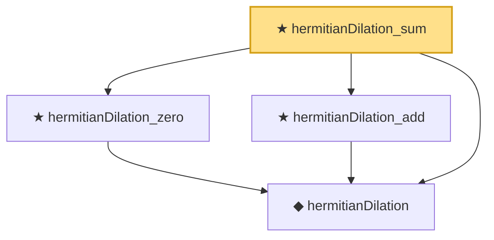

# Proof narrative — hermitianDilation_sum

Root: **hermitianDilation_sum** (private theorem) `Statlib/HighDim/Concentration/MatrixBernstein.lean:2231` · topic `HighDim`
Closure: 4 declarations across 1 files. Generated from `proof_graph.json` — no files were moved.

Reading order (foundations first, headline last):

  ◆ `hermitianDilation` — private def · `Statlib/HighDim/Concentration/MatrixBernstein.lean:2208`  _(also used by 13: hermitianDilation_isHermitian, hermitianDilation_l2_opNorm_le, l2_opNorm_le_hermitianDilation, …)_
  ★ `hermitianDilation_zero` — private theorem · `Statlib/HighDim/Concentration/MatrixBernstein.lean:2221`  _(also used by 1: hermitianDilationFin_zero)_
  ★ `hermitianDilation_add` — private theorem · `Statlib/HighDim/Concentration/MatrixBernstein.lean:2225`  _(also used by 1: hermitianDilationFin_add)_
★ `hermitianDilation_sum` — private theorem · `Statlib/HighDim/Concentration/MatrixBernstein.lean:2231` **← headline**

## Dependency diagram

