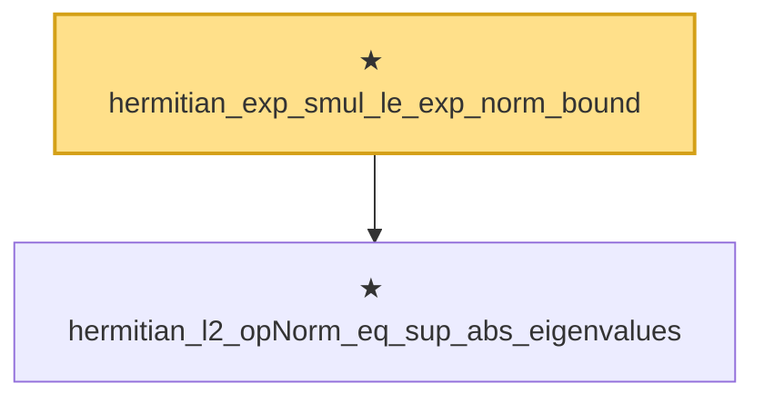

# Proof narrative — hermitian_exp_smul_le_exp_norm_bound

Root: **hermitian_exp_smul_le_exp_norm_bound** (private theorem) `Statlib/HighDim/Concentration/MatrixBernstein.lean:317` · topic `HighDim`
Closure: 2 declarations across 1 files. Generated from `proof_graph.json` — no files were moved.

Reading order (foundations first, headline last):

  ★ `hermitian_l2_opNorm_eq_sup_abs_eigenvalues` — private theorem · `Statlib/HighDim/Concentration/MatrixBernstein.lean:246`  _(also used by 4: hermitian_exp_le_quadratic_norm, hermitian_trace_exp_le_card_mul_exp_norm, hermitian_l2_opNorm_lt_of_posDef_sub_add, …)_
★ `hermitian_exp_smul_le_exp_norm_bound` — private theorem · `Statlib/HighDim/Concentration/MatrixBernstein.lean:317` **← headline**

## Dependency diagram

