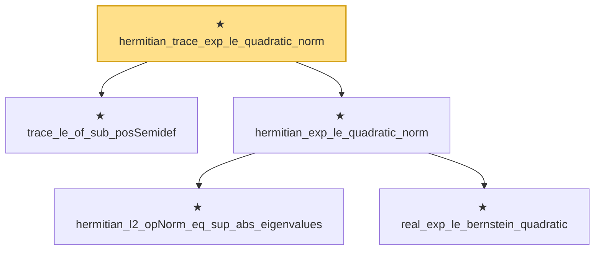

# Proof narrative — hermitian_trace_exp_le_quadratic_norm

Root: **hermitian_trace_exp_le_quadratic_norm** (private theorem) `Statlib/HighDim/Concentration/MatrixBernstein.lean:884` · topic `HighDim`
Closure: 5 declarations across 1 files. Generated from `proof_graph.json` — no files were moved.

Reading order (foundations first, headline last):

  ★ `trace_le_of_sub_posSemidef` — private theorem · `Statlib/HighDim/Concentration/MatrixBernstein.lean:809`  _(also used by 3: hermitian_trace_exp_smul_le_quadratic, matrix_lieb_one_step_trace, matrix_laplace_trace_mgf_bound_lieb_core)_
    ★ `hermitian_l2_opNorm_eq_sup_abs_eigenvalues` — private theorem · `Statlib/HighDim/Concentration/MatrixBernstein.lean:293`  _(also used by 4: hermitian_exp_smul_le_exp_norm_bound, hermitian_trace_exp_le_card_mul_exp_norm, hermitian_l2_opNorm_lt_of_posDef_sub_add, …)_
    ★ `real_exp_le_bernstein_quadratic` — private theorem · `Statlib/HighDim/Concentration/MatrixBernstein.lean:80`
  ★ `hermitian_exp_le_quadratic_norm` — private theorem · `Statlib/HighDim/Concentration/MatrixBernstein.lean:818`  _(also used by 1: hermitian_exp_smul_le_quadratic)_
★ `hermitian_trace_exp_le_quadratic_norm` — private theorem · `Statlib/HighDim/Concentration/MatrixBernstein.lean:884` **← headline**

## Dependency diagram

