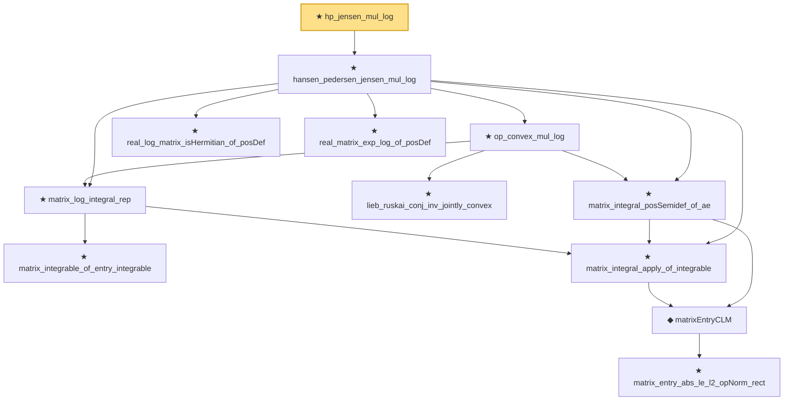

# Proof narrative — hp_jensen_mul_log

Root: **hp_jensen_mul_log** (theorem) `Statlib/HighDim/MatrixAnalysis/HansenPedersenJensenMulLog.lean:1300` · topic `HighDim`
Closure: 12 declarations across 5 files. Generated from `proof_graph.json` — no files were moved.

Reading order (foundations first, headline last):

        ★ `matrix_integrable_of_entry_integrable` — theorem · `Statlib/HighDim/MatrixAnalysis/TraceExp.lean:316`  _(also used by 5: matrix_integral_eq_zero_of_hasZeroMean, matrix_lieb_one_step_trace, single_exp_integral_le_quadratic_matrix, …)_
            ★ `matrix_entry_abs_le_l2_opNorm_rect` — private theorem · `Statlib/HighDim/MatrixAnalysis/TraceExp.lean:274`
        ◆ `matrixEntryCLM` — private def · `Statlib/HighDim/MatrixAnalysis/TraceExp.lean:299`
    ★ `matrix_integral_apply_of_integrable` — theorem · `Statlib/HighDim/MatrixAnalysis/TraceExp.lean:309`  _(also used by 7: matrix_integral_eq_zero_of_hasZeroMean, matrix_integral_posDef_of_ae, matrix_trace_integral_of_integrable, …)_
    ★ `matrix_log_integral_rep` — theorem · `Statlib/HighDim/MatrixAnalysis/MatrixLogIntegralRep.lean:8`
      ★ `lieb_ruskai_conj_inv_jointly_convex` — theorem · `Statlib/HighDim/MatrixAnalysis/LiebRuskaiConjInvJointlyConvex.lean:7`
    ★ `matrix_integral_posSemidef_of_ae` — theorem · `Statlib/HighDim/MatrixAnalysis/TraceExp.lean:334`  _(also used by 4: matrix_integral_posDef_of_ae, matrix_integral_sub_posSemidef_of_ae, matrix_laplace_one_step_of_trace_exp_add_le, …)_
    ★ `op_convex_mul_log` — theorem · `Statlib/HighDim/MatrixAnalysis/OperatorConvexMulLog.lean:14`
    ★ `real_log_matrix_isHermitian_of_posDef` — theorem · `Statlib/HighDim/MatrixAnalysis/TraceExp.lean:89`  _(also used by 4: matrix_lieb_one_step_trace, quantumRelativeEntropy_eq_perspectiveInner, perspectiveInner_jointConvex, …)_
    ★ `real_matrix_exp_log_of_posDef` — theorem · `Statlib/HighDim/MatrixAnalysis/TraceExp.lean:94`  _(also used by 2: matrix_lieb_one_step_trace, quantumRelativeEntropy_eq_perspectiveInner)_
  ★ `hansen_pedersen_jensen_mul_log` — theorem · `Statlib/HighDim/MatrixAnalysis/HansenPedersenJensenMulLog.lean:28`  _(also used by 1: perspectiveInner_jointConvex)_
★ `hp_jensen_mul_log` — theorem · `Statlib/HighDim/MatrixAnalysis/HansenPedersenJensenMulLog.lean:1300` **← headline**

## Dependency diagram

