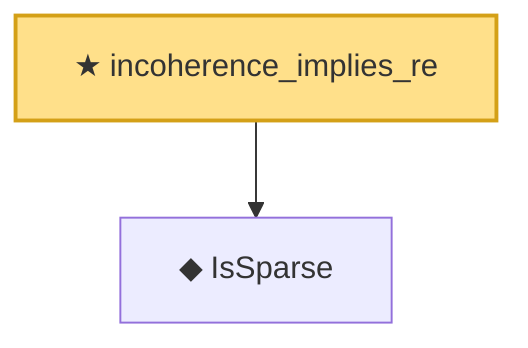

# Proof narrative — incoherence_implies_re

Root: **incoherence_implies_re** (theorem) `Statlib/HighDim/Regression/Incoherence.lean:19` · topic `HighDim`
Closure: 2 declarations across 2 files. Generated from `proof_graph.json` — no files were moved.

Reading order (foundations first, headline last):

  ◆ `IsSparse` — def · `Statlib/HighDim/Vocabulary/Sparse.lean:36`  _(also used by 14: covering_number_sparse_ball, log_covering_number_sparse, isSparse_mono, …)_
★ `incoherence_implies_re` — theorem · `Statlib/HighDim/Regression/Incoherence.lean:19` **← headline**

## Dependency diagram

