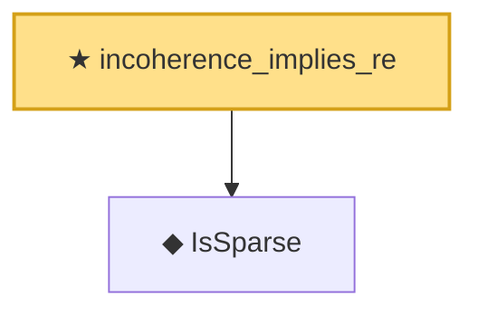

# Proof narrative — incoherence_implies_re

Root: **incoherence_implies_re** (theorem) `Statlib/HighDim/Regression/Incoherence.lean:19` · topic `HighDim`
Closure: 2 declarations across 2 files. Generated from `proof_graph.json` — no files were moved.

Reading order (foundations first, headline last):

  ◆ `IsSparse` — def · `Statlib/HighDim/Vocabulary/Sparse.lean:36`  _(also used by 49: threshold_head_quadratic_remainder_abs_from_bilinear_l2_tail, subgaussian_l1_shell_localized_centered_tail_from_sparse_approximation_cover, subgaussian_l1_shell_localized_centered_tail_from_sparse_ball_approximation_cover, …)_
★ `incoherence_implies_re` — theorem · `Statlib/HighDim/Regression/Incoherence.lean:19` **← headline**

## Dependency diagram

```mermaid
flowchart TD
  n0["◆ IsSparse"]
  n1["★ incoherence_implies_re"]
  n1 --> n0
  class n1 headline;
  classDef headline fill:#ffe08a,stroke:#d4a017,stroke-width:2px;
  classDef axiomNode fill:#ffd0d0,stroke:#c0392b,stroke-dasharray:4 2;
```
