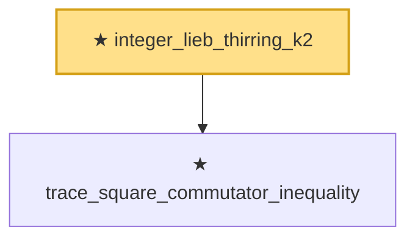

# Proof narrative — integer_lieb_thirring_k2

Root: **integer_lieb_thirring_k2** (theorem) `Statlib/HighDim/MatrixAnalysis/LiebThirring.lean:138` · topic `HighDim`
Closure: 2 declarations across 1 files. Generated from `proof_graph.json` — no files were moved.

Reading order (foundations first, headline last):

  ★ `trace_square_commutator_inequality` — theorem · `Statlib/HighDim/MatrixAnalysis/LiebThirring.lean:49`
★ `integer_lieb_thirring_k2` — theorem · `Statlib/HighDim/MatrixAnalysis/LiebThirring.lean:138` **← headline**

## Dependency diagram

