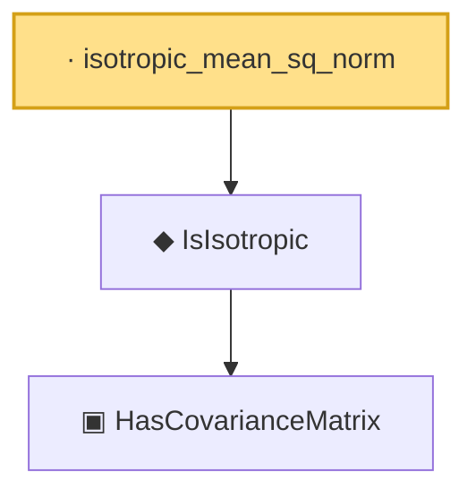

# Proof narrative — isotropic_mean_sq_norm

Root: **isotropic_mean_sq_norm** (lemma) `Statlib/HighDim/Properties.lean:110` · topic `HighDim`
Closure: 3 declarations across 2 files. Generated from `proof_graph.json` — no files were moved.

Reading order (foundations first, headline last):

    ▣ `HasCovarianceMatrix` — structure · `Statlib/Vocabulary/RandomVector.lean:101`  _(also used by 8: secondMoment_isSymm, secondMoment_posSemidef, secondMoment_eq_cov_centered, …)_
  ◆ `IsIsotropic` — def · `Statlib/Vocabulary/RandomVector.lean:109`  _(also used by 6: quadratic_form_mean_isotropic, hanson_wright_isotropic, subgaussian_norm_sq_subexponential, …)_
· `isotropic_mean_sq_norm` — lemma · `Statlib/HighDim/Properties.lean:110` **← headline**

## Dependency diagram

