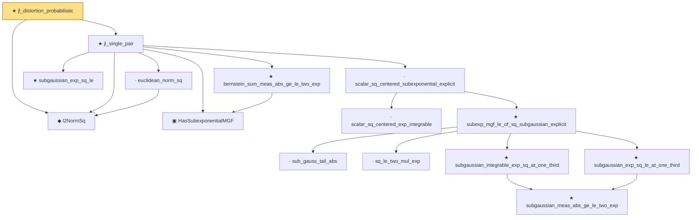

# Proof narrative — jl_distortion_probabilistic

Root: **jl_distortion_probabilistic** (theorem) `Statlib/HighDim/Geometry/JohnsonLindenstrauss.lean:530` · topic `HighDim`
Closure: 15 declarations across 10 files. Generated from `proof_graph.json` — no files were moved.

Reading order (foundations first, headline last):

  ◆ `l2NormSq` — noncomputable def · `Statlib/HighDim/Vocabulary/Norms.lean:13`  _(also used by 30: matrixRowVec_norm_sq, offDiagCoeffVec_norm_sq_le_frobenius, offDiagCoeffVec_norm_sq_integral_le_frobenius, …)_
    · `euclidean_norm_sq` — lemma · `Statlib/HighDim/Vocabulary/Norms.lean:21`  _(also used by 11: matrixRowVec_norm_sq, offDiagCoeffVec_norm_sq_le_frobenius, offDiagCoeffVec_norm_sq_integral_le_frobenius, …)_
    ★ `subgaussian_exp_sq_le` — theorem · `Statlib/StatFoundation/RandomVariable/SubGaussian/subgaussian_exp_sq_le.lean:22`
    ▣ `HasSubexponentialMGF` — structure · `Statlib/StatFoundation/Vocabulary/RandomVariable.lean:74`  _(also used by 23: coord_mul_subexponential_exists_of_indep, subexponential_mgf_const_mul, subexponential_mgf_const_mul_relaxed, …)_
      · `scalar_sq_centered_exp_integrable` — lemma · `Statlib/HighDim/CovarianceMatrix/SampleCovariance.lean:393`
        · `sub_gauss_tail_abs` — lemma · `Statlib/StatFoundation/RandomVariable/SubExponential/subexp_mgf_le_of_sq_subgaussian.lean:13`  _(also used by 1: sub_gauss_tail_sq)_
        · `sq_le_two_mul_exp` — lemma · `Statlib/StatFoundation/RandomVariable/SubGaussian/sq_le_two_mul_exp.lean:10`
          ★ `subgaussian_meas_abs_ge_le_two_exp` — theorem · `Statlib/StatFoundation/RandomVariable/SubGaussian/subgaussian_meas_abs_ge_le_two_exp.lean:9`  _(also used by 3: subgaussian_linf_tail, lasso_noise_condition, subgaussian_even_moment_le)_
        ★ `subgaussian_exp_sq_le_at_one_third` — theorem · `Statlib/StatFoundation/RandomVariable/SubGaussian/subgaussian_exp_sq_le_at_one_third.lean:14`
        ★ `subgaussian_integrable_exp_sq_at_one_third` — theorem · `Statlib/StatFoundation/RandomVariable/SubGaussian/subgaussian_exp_sq_le_at_one_third.lean:166`  _(also used by 3: coord_mul_subexponential_exists_of_indep, coord_sq_centered_scaled_exp_integrable, coord_sq_centered_subexponential_exists)_
      ★ `subexp_mgf_le_of_sq_subgaussian_explicit` — theorem · `Statlib/StatFoundation/RandomVariable/SubExponential/subexp_mgf_le_of_sq_subgaussian.lean:72`  _(also used by 2: coord_sq_centered_mgf_bound_explicit, subexp_mgf_le_of_sq_subgaussian)_
    · `scalar_sq_centered_subexponential_explicit` — lemma · `Statlib/HighDim/CovarianceMatrix/SampleCovariance.lean:451`  _(also used by 3: cov_quadratic_deviation, sampleCovariance_concentration, subgaussian_rip_tail)_
    ★ `bernstein_sum_meas_abs_ge_le_two_exp` — theorem · `Statlib/StatFoundation/Concentration/ExponentialType/bernstein_sum_meas_abs_ge_le_two_exp.lean:13`  _(also used by 4: weighted_coord_sq_centered_sum_tail_explicit, diag_hanson_wright_tail_high, sampleCovariance_concentration, …)_
  ★ `jl_single_pair` — theorem · `Statlib/HighDim/Geometry/JohnsonLindenstrauss.lean:45`
★ `jl_distortion_probabilistic` — theorem · `Statlib/HighDim/Geometry/JohnsonLindenstrauss.lean:530` **← headline**

## Dependency diagram

