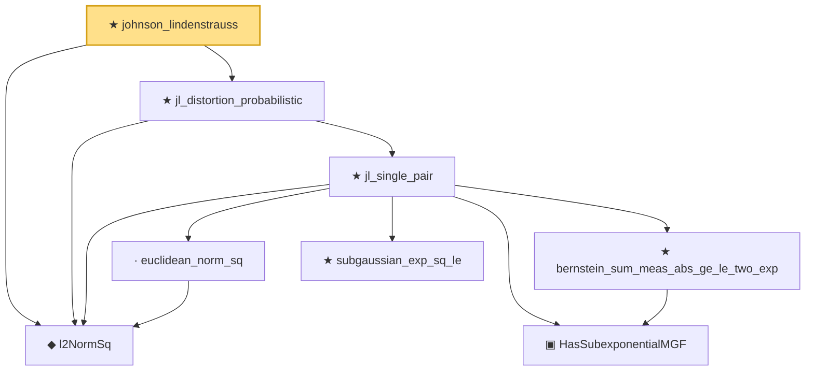

# Proof narrative — johnson_lindenstrauss

Root: **johnson_lindenstrauss** (theorem) `Statlib/HighDim/Geometry/JohnsonLindenstrauss.lean:726` · topic `HighDim`
Closure: 8 declarations across 5 files. Generated from `proof_graph.json` — no files were moved.

Reading order (foundations first, headline last):

  ◆ `l2NormSq` — noncomputable def · `Statlib/HighDim/Vocabulary/Norms.lean:13`  _(also used by 53: matrixRowVec_norm_sq, offDiagCoeffVec_norm_sq_le_frobenius, offDiagCoeffVec_norm_sq_integral_le_frobenius, …)_
      · `euclidean_norm_sq` — lemma · `Statlib/HighDim/Vocabulary/Norms.lean:21`  _(also used by 14: matrixRowVec_norm_sq, offDiagCoeffVec_norm_sq_le_frobenius, offDiagCoeffVec_norm_sq_integral_le_frobenius, …)_
      ★ `subgaussian_exp_sq_le` — theorem · `Statlib/StatFoundation/RandomVariable/SubGaussian/subgaussian_exp_sq_le.lean:22`
      ▣ `HasSubexponentialMGF` — structure · `Statlib/StatFoundation/Vocabulary/RandomVariable.lean:74`  _(also used by 31: coord_mul_subexponential_exists_of_indep, subexponential_mgf_const_mul_relaxed, coord_mul_scaled_subexponential_exists_of_indep, …)_
      ★ `bernstein_sum_meas_abs_ge_le_two_exp` — theorem · `Statlib/StatFoundation/Concentration/ExponentialType/bernstein_sum_meas_abs_ge_le_two_exp.lean:13`  _(also used by 5: weighted_coord_sq_centered_sum_tail_explicit, diag_hanson_wright_tail_high, cov_trace_concentration, …)_
    ★ `jl_single_pair` — theorem · `Statlib/HighDim/Geometry/JohnsonLindenstrauss.lean:48`
  ★ `jl_distortion_probabilistic` — theorem · `Statlib/HighDim/Geometry/JohnsonLindenstrauss.lean:526`
★ `johnson_lindenstrauss` — theorem · `Statlib/HighDim/Geometry/JohnsonLindenstrauss.lean:726` **← headline**

## Dependency diagram

