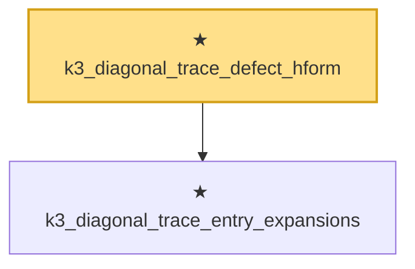

# Proof narrative — k3_diagonal_trace_defect_hform

Root: **k3_diagonal_trace_defect_hform** (theorem) `Statlib/HighDim/MatrixAnalysis/LiebThirring.lean:734` · topic `HighDim`
Closure: 2 declarations across 1 files. Generated from `proof_graph.json` — no files were moved.

Reading order (foundations first, headline last):

  ★ `k3_diagonal_trace_entry_expansions` — theorem · `Statlib/HighDim/MatrixAnalysis/LiebThirring.lean:695`
★ `k3_diagonal_trace_defect_hform` — theorem · `Statlib/HighDim/MatrixAnalysis/LiebThirring.lean:734` **← headline**

## Dependency diagram

