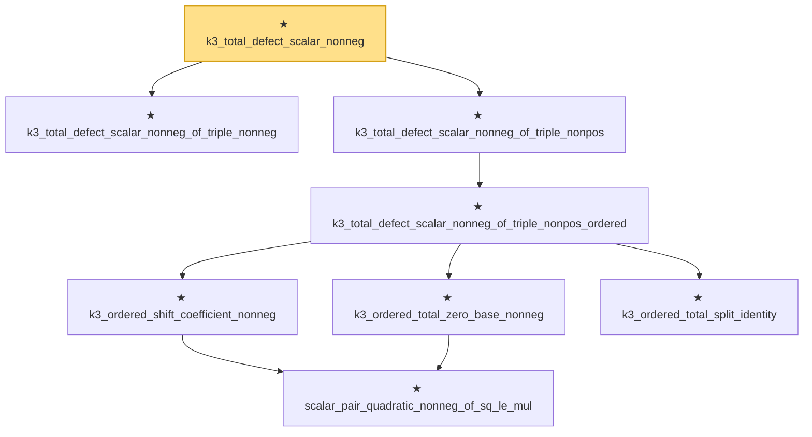

# Proof narrative — k3_total_defect_scalar_nonneg

Root: **k3_total_defect_scalar_nonneg** (theorem) `Statlib/HighDim/MatrixAnalysis/LiebThirring.lean:674` · topic `HighDim`
Closure: 8 declarations across 1 files. Generated from `proof_graph.json` — no files were moved.

Reading order (foundations first, headline last):

  ★ `k3_total_defect_scalar_nonneg_of_triple_nonneg` — theorem · `Statlib/HighDim/MatrixAnalysis/LiebThirring.lean:302`
        ★ `scalar_pair_quadratic_nonneg_of_sq_le_mul` — theorem · `Statlib/HighDim/MatrixAnalysis/LiebThirring.lean:247`
      ★ `k3_ordered_shift_coefficient_nonneg` — theorem · `Statlib/HighDim/MatrixAnalysis/LiebThirring.lean:280`
      ★ `k3_ordered_total_zero_base_nonneg` — theorem · `Statlib/HighDim/MatrixAnalysis/LiebThirring.lean:373`
      ★ `k3_ordered_total_split_identity` — theorem · `Statlib/HighDim/MatrixAnalysis/LiebThirring.lean:346`
    ★ `k3_total_defect_scalar_nonneg_of_triple_nonpos_ordered` — theorem · `Statlib/HighDim/MatrixAnalysis/LiebThirring.lean:527`
  ★ `k3_total_defect_scalar_nonneg_of_triple_nonpos` — theorem · `Statlib/HighDim/MatrixAnalysis/LiebThirring.lean:596`
★ `k3_total_defect_scalar_nonneg` — theorem · `Statlib/HighDim/MatrixAnalysis/LiebThirring.lean:674` **← headline**

## Dependency diagram

