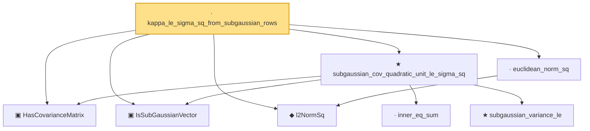

# Proof narrative — kappa_le_sigma_sq_from_subgaussian_rows

Root: **kappa_le_sigma_sq_from_subgaussian_rows** (lemma) `Statlib/HighDim/CovarianceMatrix/L1QuadraticProcess/RadiusFluctuation.lean:4232` · topic `HighDim`
Closure: 8 declarations across 5 files. Generated from `proof_graph.json` — no files were moved.

Reading order (foundations first, headline last):

  ▣ `HasCovarianceMatrix` — structure · `Statlib/HighDim/Vocabulary/RandomVector.lean:101`  _(also used by 116: cov_diagonal_concentration, cov_quadratic_deviation, cov_quadratic_deviation_uniform_const, …)_
  ▣ `IsSubGaussianVector` — structure · `Statlib/HighDim/Vocabulary/RandomVector.lean:52`  _(also used by 174: frobenius_norm_sq_subgaussian_concentration, gaussian_quadratic_form_concentration, decoupledOffDiagQuadForm_const_right_subgaussian, …)_
  ◆ `l2NormSq` — noncomputable def · `Statlib/HighDim/Vocabulary/Norms.lean:13`  _(also used by 220: matrixRowVec_norm_sq, offDiagCoeffVec_norm_sq_le_frobenius, offDiagCoeffVec_norm_sq_integral_le_frobenius, …)_
  · `euclidean_norm_sq` — lemma · `Statlib/HighDim/Vocabulary/Norms.lean:89`  _(also used by 31: matrixRowVec_norm_sq, offDiagCoeffVec_norm_sq_le_frobenius, offDiagCoeffVec_norm_sq_integral_le_frobenius, …)_
    · `inner_eq_sum` — lemma · `Statlib/HighDim/Vocabulary/Norms.lean:100`  _(also used by 20: decoupledOffDiagQuadForm_eq_inner_coeff, offDiagCoeffVec_apply_eq_inner_row_zeroDiag, subgaussian_vector_coord, …)_
    ★ `subgaussian_variance_le` — theorem · `Statlib/StatFoundation/RandomVariable/SubGaussian/subgaussian_variance_le.lean:8`  _(also used by 2: subgaussian_projection_second_moment_le, subgaussian_rip_tail)_
  ★ `subgaussian_cov_quadratic_unit_le_sigma_sq` — theorem · `Statlib/HighDim/CovarianceMatrix/Properties.lean:354`  _(also used by 3: cov_quadratic_deviation_unit_lower_tail, cov_quadratic_deviation_unit_shifted_lower_tail, l1_shell_bad_event_implies_large_l2NormSq_of_subgaussian_covariance)_
· `kappa_le_sigma_sq_from_subgaussian_rows` — lemma · `Statlib/HighDim/CovarianceMatrix/L1QuadraticProcess/RadiusFluctuation.lean:4232` **← headline**

## Dependency diagram

