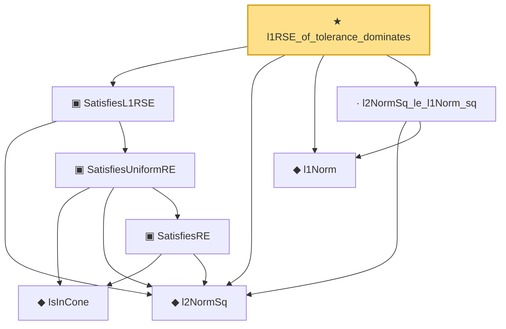

# Proof narrative — l1RSE_of_tolerance_dominates

Root: **l1RSE_of_tolerance_dominates** (theorem) `Statlib/HighDim/Regression/L1RSEFromCovariance.lean:16` · topic `HighDim`
Closure: 8 declarations across 4 files. Generated from `proof_graph.json` — no files were moved.

Reading order (foundations first, headline last):

  ◆ `l2NormSq` — noncomputable def · `Statlib/HighDim/Vocabulary/Norms.lean:13`  _(also used by 217: matrixRowVec_norm_sq, offDiagCoeffVec_norm_sq_le_frobenius, offDiagCoeffVec_norm_sq_integral_le_frobenius, …)_
      ◆ `IsInCone` — def · `Statlib/HighDim/Vocabulary/Sparse.lean:49`  _(also used by 12: rip_implies_uniformRE, lasso_cone_condition, lasso_oracle_prediction_of_supportRE, …)_
      ▣ `SatisfiesRE` — structure · `Statlib/HighDim/Vocabulary/DesignMatrix.lean:84`  _(also used by 8: lasso_oracle_prediction, lasso_oracle_l1, lasso_oracle_support_l2, …)_
    ▣ `SatisfiesUniformRE` — structure · `Statlib/HighDim/Vocabulary/DesignMatrix.lean:118`  _(also used by 10: rip_implies_uniformRE, lasso_oracle_prediction_of_uniformRE, lasso_oracle_l1_of_uniformRE, …)_
  ▣ `SatisfiesL1RSE` — structure · `Statlib/HighDim/Vocabulary/DesignMatrix.lean:159`  _(also used by 11: l1RSE_of_half_covariance_l1_lower, l1RSE_probability_from_lower_event, subgaussian_design_l1RSE_from_final_tau_eps_cover_budget_named_event, …)_
  ◆ `l1Norm` — noncomputable def · `Statlib/HighDim/Vocabulary/Norms.lean:17`  _(also used by 203: l1_linear_rademacher_complexity_bound, finite_l1_quadratic_rademacher_coord_bound, finite_l1_quadratic_rademacher_coord_energy_bound, …)_
  · `l2NormSq_le_l1Norm_sq` — lemma · `Statlib/HighDim/Vocabulary/Norms.lean:21`  _(also used by 3: quadratic_remainder_abs_from_bilinear_l2_tail, l1_shell_l2NormSq_pos_le_one, l1_shell_dyadic_endpoint_cover_from_finite_interval)_
★ `l1RSE_of_tolerance_dominates` — theorem · `Statlib/HighDim/Regression/L1RSEFromCovariance.lean:16` **← headline**

## Dependency diagram

