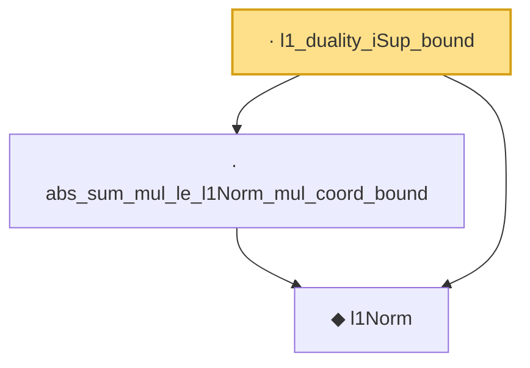

# Proof narrative — l1_duality_iSup_bound

Root: **l1_duality_iSup_bound** (lemma) `Statlib/HighDim/Vocabulary/Norms.lean:59` · topic `HighDim`
Closure: 3 declarations across 1 files. Generated from `proof_graph.json` — no files were moved.

Reading order (foundations first, headline last):

  ◆ `l1Norm` — noncomputable def · `Statlib/HighDim/Vocabulary/Norms.lean:17`  _(also used by 203: l1_linear_rademacher_complexity_bound, finite_l1_quadratic_rademacher_coord_bound, finite_l1_quadratic_rademacher_coord_energy_bound, …)_
  · `abs_sum_mul_le_l1Norm_mul_coord_bound` — lemma · `Statlib/HighDim/Vocabulary/Norms.lean:38`  _(also used by 6: l1_linear_rademacher_complexity_bound, finite_l1_quadratic_rademacher_coord_bound, finite_l1_quadratic_rademacher_sample_envelope_entrywise_good_bound, …)_
· `l1_duality_iSup_bound` — lemma · `Statlib/HighDim/Vocabulary/Norms.lean:59` **← headline**

## Dependency diagram

