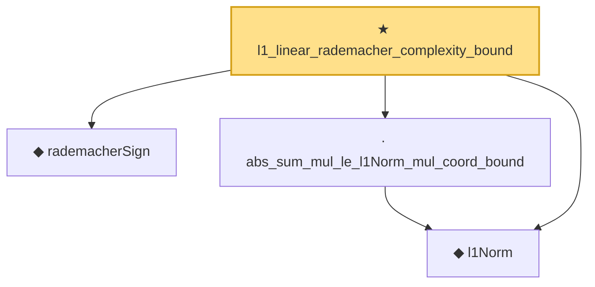

# Proof narrative — l1_linear_rademacher_complexity_bound

Root: **l1_linear_rademacher_complexity_bound** (theorem) `Statlib/HighDim/CovarianceMatrix/L1QuadraticProcess.lean:28` · topic `HighDim`
Closure: 4 declarations across 3 files. Generated from `proof_graph.json` — no files were moved.

Reading order (foundations first, headline last):

  ◆ `l1Norm` — noncomputable def · `Statlib/HighDim/Vocabulary/Norms.lean:17`  _(also used by 203: finite_l1_quadratic_rademacher_coord_bound, finite_l1_quadratic_rademacher_coord_energy_bound, finite_l1_quadratic_rademacher_sample_envelope_entrywise_good_bound, …)_
  ◆ `rademacherSign` — def · `Statlib/StatFoundation/Vocabulary/EmpiricalProcess.lean:50`  _(also used by 17: finite_l1_quadratic_rademacher_coord_bound, finite_l1_quadratic_rademacher_coord_energy_bound, finite_l1_quadratic_rademacher_sample_envelope_entrywise_good_bound, …)_
  · `abs_sum_mul_le_l1Norm_mul_coord_bound` — lemma · `Statlib/HighDim/Vocabulary/Norms.lean:38`  _(also used by 6: finite_l1_quadratic_rademacher_coord_bound, finite_l1_quadratic_rademacher_sample_envelope_entrywise_good_bound, l1_quadratic_form_entrywise_bound, …)_
★ `l1_linear_rademacher_complexity_bound` — theorem · `Statlib/HighDim/CovarianceMatrix/L1QuadraticProcess.lean:28` **← headline**

## Dependency diagram

