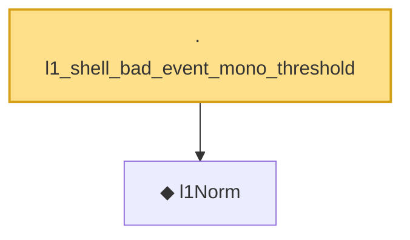

# Proof narrative — l1_shell_bad_event_mono_threshold

Root: **l1_shell_bad_event_mono_threshold** (lemma) `Statlib/HighDim/CovarianceMatrix/L1QuadraticProcess.lean:1048` · topic `HighDim`
Closure: 2 declarations across 2 files. Generated from `proof_graph.json` — no files were moved.

Reading order (foundations first, headline last):

  ◆ `l1Norm` — noncomputable def · `Statlib/HighDim/Vocabulary/Norms.lean:17`  _(also used by 204: l1_linear_rademacher_complexity_bound, finite_l1_quadratic_rademacher_coord_bound, finite_l1_quadratic_rademacher_coord_energy_bound, …)_
· `l1_shell_bad_event_mono_threshold` — lemma · `Statlib/HighDim/CovarianceMatrix/L1QuadraticProcess.lean:1048` **← headline**

## Dependency diagram

