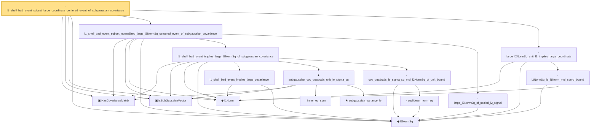

# Proof narrative — l1_shell_bad_event_subset_large_coordinate_centered_event_of_subgaussian_covariance

Root: **l1_shell_bad_event_subset_large_coordinate_centered_event_of_subgaussian_covariance** (lemma) `Statlib/HighDim/CovarianceMatrix/L1QuadraticProcess.lean:3312` · topic `HighDim`
Closure: 16 declarations across 5 files. Generated from `proof_graph.json` — no files were moved.

Reading order (foundations first, headline last):

  ▣ `HasCovarianceMatrix` — structure · `Statlib/HighDim/Vocabulary/RandomVector.lean:101`  _(also used by 114: cov_diagonal_concentration, cov_quadratic_deviation, cov_quadratic_deviation_uniform_const, …)_
  ▣ `IsSubGaussianVector` — structure · `Statlib/HighDim/Vocabulary/RandomVector.lean:52`  _(also used by 172: frobenius_norm_sq_subgaussian_concentration, gaussian_quadratic_form_concentration, decoupledOffDiagQuadForm_const_right_subgaussian, …)_
  ◆ `l1Norm` — noncomputable def · `Statlib/HighDim/Vocabulary/Norms.lean:17`  _(also used by 199: l1_linear_rademacher_complexity_bound, finite_l1_quadratic_rademacher_coord_bound, finite_l1_quadratic_rademacher_coord_energy_bound, …)_
  ◆ `l2NormSq` — noncomputable def · `Statlib/HighDim/Vocabulary/Norms.lean:13`  _(also used by 213: matrixRowVec_norm_sq, offDiagCoeffVec_norm_sq_le_frobenius, offDiagCoeffVec_norm_sq_integral_le_frobenius, …)_
      · `l1_shell_bad_event_implies_large_covariance` — lemma · `Statlib/HighDim/CovarianceMatrix/L1QuadraticProcess.lean:2972`
        · `inner_eq_sum` — lemma · `Statlib/HighDim/Vocabulary/Norms.lean:100`  _(also used by 20: decoupledOffDiagQuadForm_eq_inner_coeff, offDiagCoeffVec_apply_eq_inner_row_zeroDiag, subgaussian_vector_coord, …)_
        ★ `subgaussian_variance_le` — theorem · `Statlib/StatFoundation/RandomVariable/SubGaussian/subgaussian_variance_le.lean:8`  _(also used by 2: subgaussian_projection_second_moment_le, subgaussian_rip_tail)_
      ★ `subgaussian_cov_quadratic_unit_le_sigma_sq` — theorem · `Statlib/HighDim/CovarianceMatrix/Properties.lean:354`  _(also used by 3: cov_quadratic_deviation_unit_lower_tail, cov_quadratic_deviation_unit_shifted_lower_tail, kappa_le_sigma_sq_from_subgaussian_rows)_
        · `euclidean_norm_sq` — lemma · `Statlib/HighDim/Vocabulary/Norms.lean:89`  _(also used by 31: matrixRowVec_norm_sq, offDiagCoeffVec_norm_sq_le_frobenius, offDiagCoeffVec_norm_sq_integral_le_frobenius, …)_
      · `cov_quadratic_le_sigma_sq_mul_l2NormSq_of_unit_bound` — lemma · `Statlib/HighDim/CovarianceMatrix/L1QuadraticProcess.lean:3008`
    · `l1_shell_bad_event_implies_large_l2NormSq_of_subgaussian_covariance` — lemma · `Statlib/HighDim/CovarianceMatrix/L1QuadraticProcess.lean:3087`  _(also used by 1: l1_shell_bad_event_subset_large_l2NormSq_event_of_subgaussian_covariance)_
    · `large_l2NormSq_of_scaled_l2_signal` — lemma · `Statlib/HighDim/CovarianceMatrix/L1QuadraticProcess.lean:3158`  _(also used by 1: l1_shell_bad_event_subset_normalized_large_l2NormSq_event_of_subgaussian_covariance)_
  · `l1_shell_bad_event_subset_normalized_large_l2NormSq_centered_event_of_subgaussian_covariance` — lemma · `Statlib/HighDim/CovarianceMatrix/L1QuadraticProcess.lean:3271`  _(also used by 1: l1_shell_centered_deviation_tail_from_normalized_large_l2_tail)_
    · `l2NormSq_le_l1Norm_mul_coord_bound` — lemma · `Statlib/HighDim/CovarianceMatrix/L1QuadraticProcess.lean:3204`
  · `large_l2NormSq_unit_l1_implies_large_coordinate` — lemma · `Statlib/HighDim/CovarianceMatrix/L1QuadraticProcess.lean:3221`  _(also used by 1: l1_shell_bad_event_subset_large_coordinate_event_of_subgaussian_covariance)_
· `l1_shell_bad_event_subset_large_coordinate_centered_event_of_subgaussian_covariance` — lemma · `Statlib/HighDim/CovarianceMatrix/L1QuadraticProcess.lean:3312` **← headline**

## Dependency diagram

