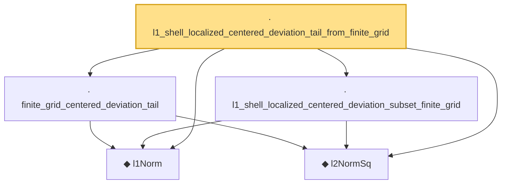

# Proof narrative — l1_shell_localized_centered_deviation_tail_from_finite_grid

Root: **l1_shell_localized_centered_deviation_tail_from_finite_grid** (lemma) `Statlib/HighDim/CovarianceMatrix/L1QuadraticProcess.lean:3579` · topic `HighDim`
Closure: 5 declarations across 2 files. Generated from `proof_graph.json` — no files were moved.

Reading order (foundations first, headline last):

  ◆ `l1Norm` — noncomputable def · `Statlib/HighDim/Vocabulary/Norms.lean:17`  _(also used by 202: l1_linear_rademacher_complexity_bound, finite_l1_quadratic_rademacher_coord_bound, finite_l1_quadratic_rademacher_coord_energy_bound, …)_
  ◆ `l2NormSq` — noncomputable def · `Statlib/HighDim/Vocabulary/Norms.lean:13`  _(also used by 219: matrixRowVec_norm_sq, offDiagCoeffVec_norm_sq_le_frobenius, offDiagCoeffVec_norm_sq_integral_le_frobenius, …)_
  · `finite_grid_centered_deviation_tail` — lemma · `Statlib/HighDim/CovarianceMatrix/L1QuadraticProcess.lean:586`  _(also used by 1: l1_shell_centered_deviation_tail_from_finite_grid)_
  · `l1_shell_localized_centered_deviation_subset_finite_grid` — lemma · `Statlib/HighDim/CovarianceMatrix/L1QuadraticProcess.lean:3526`
· `l1_shell_localized_centered_deviation_tail_from_finite_grid` — lemma · `Statlib/HighDim/CovarianceMatrix/L1QuadraticProcess.lean:3579` **← headline**

## Dependency diagram

