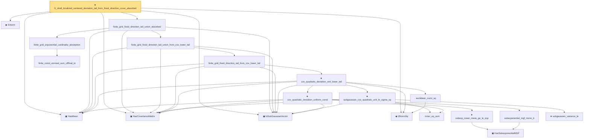

# Proof narrative — l1_shell_localized_centered_deviation_tail_from_fixed_direction_cover_absorbed

Root: **l1_shell_localized_centered_deviation_tail_from_fixed_direction_cover_absorbed** (theorem) `Statlib/HighDim/CovarianceMatrix/L1QuadraticProcess.lean:3635` · topic `HighDim`
Closure: 20 declarations across 9 files. Generated from `proof_graph.json` — no files were moved.

Reading order (foundations first, headline last):

  ▣ `HasMean` — structure · `Statlib/HighDim/Vocabulary/RandomVector.lean:83`  _(also used by 119: frobenius_norm_sq_subgaussian_concentration, gaussian_quadratic_form_concentration, coord_mul_integral_eq_zero_of_indep, …)_
  ▣ `HasCovarianceMatrix` — structure · `Statlib/HighDim/Vocabulary/RandomVector.lean:101`  _(also used by 111: cov_diagonal_concentration, cov_quadratic_deviation, cov_quadratic_deviation_unit_shifted_lower_tail, …)_
  ▣ `IsSubGaussianVector` — structure · `Statlib/HighDim/Vocabulary/RandomVector.lean:52`  _(also used by 169: frobenius_norm_sq_subgaussian_concentration, gaussian_quadratic_form_concentration, decoupledOffDiagQuadForm_const_right_subgaussian, …)_
  ◆ `l1Norm` — noncomputable def · `Statlib/HighDim/Vocabulary/Norms.lean:17`  _(also used by 204: l1_linear_rademacher_complexity_bound, finite_l1_quadratic_rademacher_coord_bound, finite_l1_quadratic_rademacher_coord_energy_bound, …)_
  ◆ `l2NormSq` — noncomputable def · `Statlib/HighDim/Vocabulary/Norms.lean:13`  _(also used by 219: matrixRowVec_norm_sq, offDiagCoeffVec_norm_sq_le_frobenius, offDiagCoeffVec_norm_sq_integral_le_frobenius, …)_
            · `inner_eq_sum` — lemma · `Statlib/HighDim/Vocabulary/Norms.lean:100`  _(also used by 19: decoupledOffDiagQuadForm_eq_inner_coeff, offDiagCoeffVec_apply_eq_inner_row_zeroDiag, subgaussian_vector_coord, …)_
            ▣ `HasSubexponentialMGF` — structure · `Statlib/StatFoundation/Vocabulary/RandomVariable.lean:74`  _(also used by 31: coord_mul_subexponential_exists_of_indep, subexponential_mgf_const_mul_relaxed, coord_mul_scaled_subexponential_exists_of_indep, …)_
            · `subexponential_mgf_mono_b` — lemma · `Statlib/HighDim/Concentration/HansonWright.lean:1916`  _(also used by 1: cov_quadratic_deviation)_
            ★ `subexp_mean_meas_ge_le_exp` — theorem · `Statlib/StatFoundation/Concentration/ExponentialType/subexp_mean_meas_ge_le_exp.lean:11`  _(also used by 1: cov_quadratic_deviation)_
          ★ `cov_quadratic_deviation_uniform_const` — theorem · `Statlib/HighDim/CovarianceMatrix/CovQuadraticDeviation.lean:459`  _(also used by 2: cov_quadratic_deviation_unit_shifted_lower_tail, coordinate_product_tail_from_fixed_direction_quadratic_deviation)_
          · `euclidean_norm_sq` — lemma · `Statlib/HighDim/Vocabulary/Norms.lean:89`  _(also used by 31: matrixRowVec_norm_sq, offDiagCoeffVec_norm_sq_le_frobenius, offDiagCoeffVec_norm_sq_integral_le_frobenius, …)_
            ★ `subgaussian_variance_le` — theorem · `Statlib/StatFoundation/RandomVariable/SubGaussian/subgaussian_variance_le.lean:8`  _(also used by 2: subgaussian_projection_second_moment_le, subgaussian_rip_tail)_
          ★ `subgaussian_cov_quadratic_unit_le_sigma_sq` — theorem · `Statlib/HighDim/CovarianceMatrix/Properties.lean:354`  _(also used by 3: cov_quadratic_deviation_unit_shifted_lower_tail, l1_shell_bad_event_implies_large_l2NormSq_of_subgaussian_covariance, kappa_le_sigma_sq_from_subgaussian_rows)_
        ★ `cov_quadratic_deviation_unit_lower_tail` — theorem · `Statlib/HighDim/CovarianceMatrix/CovQuadraticDeviation.lean:1021`  _(also used by 1: sampleSecondMoment_unit_direction_lower_tail_double_sum)_
      · `finite_grid_fixed_direction_tail_from_cov_lower_tail` — lemma · `Statlib/HighDim/CovarianceMatrix/L1QuadraticProcess.lean:1595`
    · `finite_grid_fixed_direction_tail_union_from_cov_lower_tail` — lemma · `Statlib/HighDim/CovarianceMatrix/L1QuadraticProcess.lean:1798`
      · `finite_const_ennreal_sum_ofReal_le` — lemma · `Statlib/HighDim/CovarianceMatrix/L1QuadraticProcess.lean:752`  _(also used by 1: l1_shell_scale_bad_measure_le_exp_card_tail_of_radius_fluctuation_cover)_
    · `finite_grid_exponential_cardinality_absorption` — lemma · `Statlib/HighDim/CovarianceMatrix/L1QuadraticProcess.lean:880`  _(also used by 1: finite_grid_fixed_direction_shifted_tail_union_absorbed)_
  · `finite_grid_fixed_direction_tail_union_absorbed` — lemma · `Statlib/HighDim/CovarianceMatrix/L1QuadraticProcess.lean:1873`  _(also used by 3: l1_shell_localized_centered_deviation_tail_from_scaled_good_cover, l1_shell_localized_centered_deviation_tail_from_good_cover_absorbed, l1_shell_localized_centered_deviation_tail_from_approximate_fixed_direction_cover_absorbed)_
★ `l1_shell_localized_centered_deviation_tail_from_fixed_direction_cover_absorbed` — theorem · `Statlib/HighDim/CovarianceMatrix/L1QuadraticProcess.lean:3635` **← headline**

## Dependency diagram

