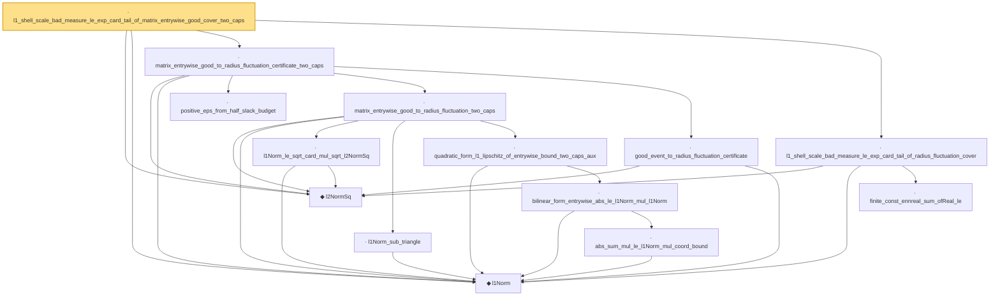

# Proof narrative — l1_shell_scale_bad_measure_le_exp_card_tail_of_matrix_entrywise_good_cover_two_caps

Root: **l1_shell_scale_bad_measure_le_exp_card_tail_of_matrix_entrywise_good_cover_two_caps** (lemma) `Statlib/HighDim/CovarianceMatrix/L1QuadraticProcess/RadiusFluctuation.lean:1145` · topic `HighDim`
Closure: 14 declarations across 4 files. Generated from `proof_graph.json` — no files were moved.

Reading order (foundations first, headline last):

  ◆ `l2NormSq` — noncomputable def · `Statlib/HighDim/Vocabulary/Norms.lean:13`  _(also used by 216: matrixRowVec_norm_sq, offDiagCoeffVec_norm_sq_le_frobenius, offDiagCoeffVec_norm_sq_integral_le_frobenius, …)_
  ◆ `l1Norm` — noncomputable def · `Statlib/HighDim/Vocabulary/Norms.lean:17`  _(also used by 195: l1_linear_rademacher_complexity_bound, finite_l1_quadratic_rademacher_coord_bound, finite_l1_quadratic_rademacher_coord_energy_bound, …)_
    · `positive_eps_from_half_slack_budget` — lemma · `Statlib/HighDim/CovarianceMatrix/L1QuadraticProcess/RadiusFluctuation.lean:690`
      · `l1Norm_le_sqrt_card_mul_sqrt_l2NormSq` — lemma · `Statlib/HighDim/CovarianceMatrix/L1QuadraticProcess.lean:6215`  _(also used by 4: bilinear_form_entrywise_abs_le_card_mul_sqrt_l2NormSq, l2_radius_to_l1_radius, matrix_entrywise_good_to_radius_fluctuation, …)_
      · `l1Norm_sub_triangle` — lemma · `Statlib/HighDim/Geometry/CoveringNumbers.lean:1315`  _(also used by 3: cover_center_l1_bound_from_l2_radius, normalized_l1_distance_le_two_mul, normalized_sparse_euclidean_cover_to_unit_l1_cover)_
          · `abs_sum_mul_le_l1Norm_mul_coord_bound` — lemma · `Statlib/HighDim/Vocabulary/Norms.lean:38`  _(also used by 6: l1_linear_rademacher_complexity_bound, finite_l1_quadratic_rademacher_coord_bound, finite_l1_quadratic_rademacher_sample_envelope_entrywise_good_bound, …)_
        · `bilinear_form_entrywise_abs_le_l1Norm_mul_l1Norm` — lemma · `Statlib/HighDim/CovarianceMatrix/L1QuadraticProcess.lean:1117`  _(also used by 5: quadratic_form_l1_lipschitz_of_entrywise_bound, bilinear_form_entrywise_abs_le_card_mul_sqrt_l2NormSq, quadratic_form_l1_lipschitz_of_entrywise_bound_cap, …)_
      · `quadratic_form_l1_lipschitz_of_entrywise_bound_two_caps_aux` — private lemma · `Statlib/HighDim/CovarianceMatrix/L1QuadraticProcess/RadiusFluctuation.lean:873`
    · `matrix_entrywise_good_to_radius_fluctuation_two_caps` — lemma · `Statlib/HighDim/CovarianceMatrix/L1QuadraticProcess/RadiusFluctuation.lean:969`
    · `good_event_to_radius_fluctuation_certificate` — lemma · `Statlib/HighDim/CovarianceMatrix/L1QuadraticProcess/RadiusFluctuation.lean:712`
  · `matrix_entrywise_good_to_radius_fluctuation_certificate_two_caps` — lemma · `Statlib/HighDim/CovarianceMatrix/L1QuadraticProcess/RadiusFluctuation.lean:1064`  _(also used by 1: l1_shell_cover_good_from_matrix_entrywise_good_cover_two_caps)_
    · `finite_const_ennreal_sum_ofReal_le` — lemma · `Statlib/HighDim/CovarianceMatrix/L1QuadraticProcess.lean:752`  _(also used by 1: finite_grid_exponential_cardinality_absorption)_
  · `l1_shell_scale_bad_measure_le_exp_card_tail_of_radius_fluctuation_cover` — lemma · `Statlib/HighDim/CovarianceMatrix/L1QuadraticProcess/RadiusFluctuation.lean:311`  _(also used by 1: l1_shell_scale_measure_bound_from_cover_good_matrix_certificate)_
· `l1_shell_scale_bad_measure_le_exp_card_tail_of_matrix_entrywise_good_cover_two_caps` — lemma · `Statlib/HighDim/CovarianceMatrix/L1QuadraticProcess/RadiusFluctuation.lean:1145` **← headline**

## Dependency diagram

