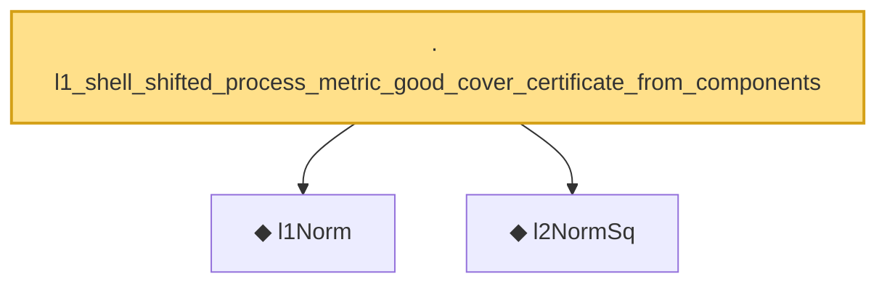

# Proof narrative — l1_shell_shifted_process_metric_good_cover_certificate_from_components

Root: **l1_shell_shifted_process_metric_good_cover_certificate_from_components** (lemma) `Statlib/HighDim/CovarianceMatrix/L1QuadraticProcess/RadiusFluctuation.lean:1677` · topic `HighDim`
Closure: 3 declarations across 2 files. Generated from `proof_graph.json` — no files were moved.

Reading order (foundations first, headline last):

  ◆ `l1Norm` — noncomputable def · `Statlib/HighDim/Vocabulary/Norms.lean:17`  _(also used by 204: l1_linear_rademacher_complexity_bound, finite_l1_quadratic_rademacher_coord_bound, finite_l1_quadratic_rademacher_coord_energy_bound, …)_
  ◆ `l2NormSq` — noncomputable def · `Statlib/HighDim/Vocabulary/Norms.lean:13`  _(also used by 221: matrixRowVec_norm_sq, offDiagCoeffVec_norm_sq_le_frobenius, offDiagCoeffVec_norm_sq_integral_le_frobenius, …)_
· `l1_shell_shifted_process_metric_good_cover_certificate_from_components` — lemma · `Statlib/HighDim/CovarianceMatrix/L1QuadraticProcess/RadiusFluctuation.lean:1677` **← headline**

## Dependency diagram

