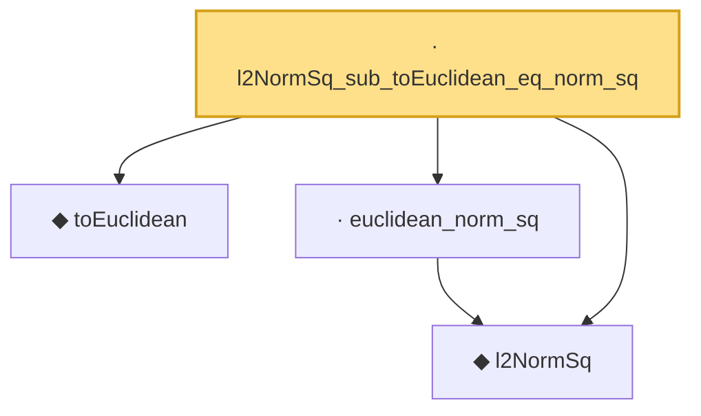

# Proof narrative — l2NormSq_sub_toEuclidean_eq_norm_sq

Root: **l2NormSq_sub_toEuclidean_eq_norm_sq** (lemma) `Statlib/HighDim/Geometry/CoveringNumbers.lean:898` · topic `HighDim`
Closure: 4 declarations across 2 files. Generated from `proof_graph.json` — no files were moved.

Reading order (foundations first, headline last):

  ◆ `l2NormSq` — noncomputable def · `Statlib/HighDim/Vocabulary/Norms.lean:13`  _(also used by 220: matrixRowVec_norm_sq, offDiagCoeffVec_norm_sq_le_frobenius, offDiagCoeffVec_norm_sq_integral_le_frobenius, …)_
  ◆ `toEuclidean` — noncomputable def · `Statlib/HighDim/Vocabulary/Norms.lean:109`  _(also used by 19: sampleSecondMoment_quadratic_eq_l2NormSq_div, sampleSecondMoment_unit_direction_lower_tail_double_sum, hermitian_norm_le_two_net_sup, …)_
  · `euclidean_norm_sq` — lemma · `Statlib/HighDim/Vocabulary/Norms.lean:89`  _(also used by 31: matrixRowVec_norm_sq, offDiagCoeffVec_norm_sq_le_frobenius, offDiagCoeffVec_norm_sq_integral_le_frobenius, …)_
· `l2NormSq_sub_toEuclidean_eq_norm_sq` — lemma · `Statlib/HighDim/Geometry/CoveringNumbers.lean:898` **← headline**

## Dependency diagram

