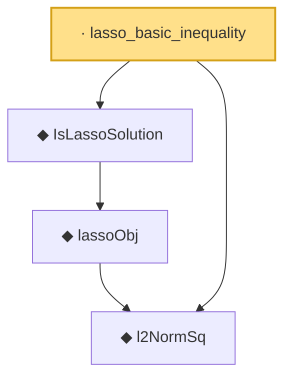

# Proof narrative — lasso_basic_inequality

Root: **lasso_basic_inequality** (lemma) `Statlib/HighDim/LassoOracle.lean:62` · topic `HighDim`
Closure: 4 declarations across 2 files. Generated from `proof_graph.json` — no files were moved.

Reading order (foundations first, headline last):

  ◆ `l2NormSq` — noncomputable def · `Statlib/HighDim/Basic.lean:41`  _(also used by 4: euclidean_norm_sq, euclidean_norm_eq, lasso_oracle_prediction, …)_
    ◆ `lassoObj` — noncomputable def · `Statlib/HighDim/LassoOracle.lean:45`
  ◆ `IsLassoSolution` — def · `Statlib/HighDim/LassoOracle.lean:50`  _(also used by 4: lasso_cone_condition, lasso_oracle_prediction, lasso_oracle_l1, …)_
· `lasso_basic_inequality` — lemma · `Statlib/HighDim/LassoOracle.lean:62` **← headline**

## Dependency diagram

