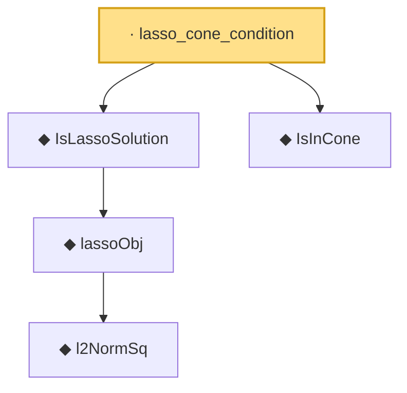

# Proof narrative — lasso_cone_condition

Root: **lasso_cone_condition** (lemma) `Statlib/HighDim/LassoOracle.lean:75` · topic `HighDim`
Closure: 5 declarations across 3 files. Generated from `proof_graph.json` — no files were moved.

Reading order (foundations first, headline last):

      ◆ `l2NormSq` — noncomputable def · `Statlib/HighDim/Basic.lean:41`  _(also used by 5: euclidean_norm_sq, euclidean_norm_eq, lasso_basic_inequality, …)_
    ◆ `lassoObj` — noncomputable def · `Statlib/HighDim/LassoOracle.lean:45`
  ◆ `IsLassoSolution` — def · `Statlib/HighDim/LassoOracle.lean:50`  _(also used by 4: lasso_basic_inequality, lasso_oracle_prediction, lasso_oracle_l1, …)_
  ◆ `IsInCone` — def · `Statlib/Vocabulary/Sparse.lean:49`  _(also used by 1: SatisfiesRE)_
· `lasso_cone_condition` — lemma · `Statlib/HighDim/LassoOracle.lean:75` **← headline**

## Dependency diagram

