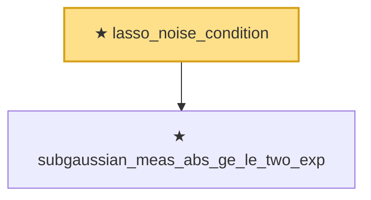

# Proof narrative — lasso_noise_condition

Root: **lasso_noise_condition** (theorem) `Statlib/HighDim/Concentration/SubGaussianMax.lean:637` · topic `HighDim`
Closure: 2 declarations across 2 files. Generated from `proof_graph.json` — no files were moved.

Reading order (foundations first, headline last):

  ★ `subgaussian_meas_abs_ge_le_two_exp` — theorem · `Statlib/StatFoundation/RandomVariable/SubGaussian/subgaussian_meas_abs_ge_le_two_exp.lean:9`  _(also used by 4: subgaussian_linf_tail, subgaussian_even_moment_le, subgaussian_exp_sq_le_at_one_third, …)_
★ `lasso_noise_condition` — theorem · `Statlib/HighDim/Concentration/SubGaussianMax.lean:637` **← headline**

## Dependency diagram

