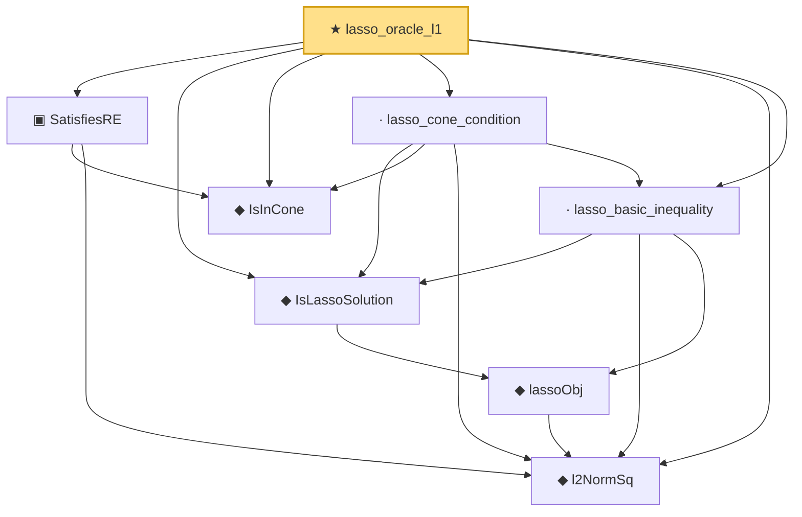

# Proof narrative — lasso_oracle_l1

Root: **lasso_oracle_l1** (theorem) `Statlib/HighDim/Regression/LassoOracle.lean:523` · topic `HighDim`
Closure: 8 declarations across 4 files. Generated from `proof_graph.json` — no files were moved.

Reading order (foundations first, headline last):

  ◆ `IsInCone` — def · `Statlib/HighDim/Vocabulary/Sparse.lean:49`  _(also used by 3: rip_implies_re, lasso_oracle_prediction, lasso_oracle_l2)_
  ◆ `l2NormSq` — noncomputable def · `Statlib/HighDim/Vocabulary/Norms.lean:13`  _(also used by 29: matrixRowVec_norm_sq, offDiagCoeffVec_norm_sq_le_frobenius, offDiagCoeffVec_norm_sq_integral_le_frobenius, …)_
  ▣ `SatisfiesRE` — structure · `Statlib/HighDim/Vocabulary/DesignMatrix.lean:42`  _(also used by 3: rip_implies_re, lasso_oracle_prediction, lasso_oracle_l2)_
    ◆ `lassoObj` — noncomputable def · `Statlib/HighDim/Regression/LassoOracle.lean:45`
  ◆ `IsLassoSolution` — def · `Statlib/HighDim/Regression/LassoOracle.lean:50`  _(also used by 2: lasso_oracle_prediction, lasso_oracle_l2)_
  · `lasso_basic_inequality` — lemma · `Statlib/HighDim/Regression/LassoOracle.lean:62`  _(also used by 1: lasso_oracle_prediction)_
  · `lasso_cone_condition` — lemma · `Statlib/HighDim/Regression/LassoOracle.lean:220`  _(also used by 2: lasso_oracle_prediction, lasso_oracle_l2)_
★ `lasso_oracle_l1` — theorem · `Statlib/HighDim/Regression/LassoOracle.lean:523` **← headline**

## Dependency diagram

