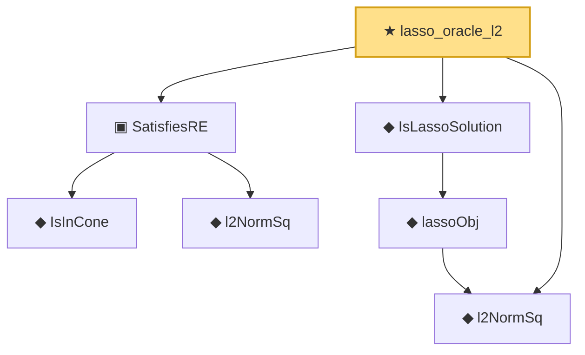

# Proof narrative — lasso_oracle_l2

Root: **lasso_oracle_l2** (theorem) `Statlib/HighDim/LassoOracle.lean:128` · topic `HighDim`
Closure: 7 declarations across 5 files. Generated from `proof_graph.json` — no files were moved.

Reading order (foundations first, headline last):

    ◆ `IsInCone` — def · `Statlib/Vocabulary/Sparse.lean:49`  _(also used by 1: lasso_cone_condition)_
    ◆ `l2NormSq` — def · `Statlib/Regression/l2NormSq.lean:14`  _(also used by 8: IsRidgeEstimator.shrinkage_bound, elasticNetLoss, elasticNetLoss_nonneg, …)_
  ▣ `SatisfiesRE` — structure · `Statlib/Vocabulary/DesignMatrix.lean:43`  _(also used by 3: lasso_oracle_prediction, lasso_oracle_l1, rip_implies_re)_
  ◆ `l2NormSq` — noncomputable def · `Statlib/HighDim/Basic.lean:41`  _(also used by 4: euclidean_norm_sq, euclidean_norm_eq, lasso_basic_inequality, …)_
    ◆ `lassoObj` — noncomputable def · `Statlib/HighDim/LassoOracle.lean:45`
  ◆ `IsLassoSolution` — def · `Statlib/HighDim/LassoOracle.lean:50`  _(also used by 4: lasso_basic_inequality, lasso_cone_condition, lasso_oracle_prediction, …)_
★ `lasso_oracle_l2` — theorem · `Statlib/HighDim/LassoOracle.lean:128` **← headline**

## Dependency diagram

