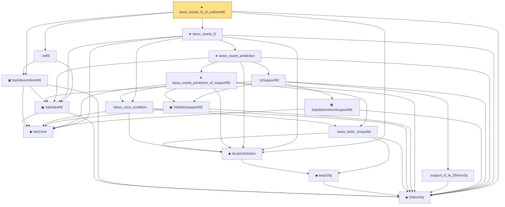

# Proof narrative — lasso_oracle_l2_of_uniformRE

Root: **lasso_oracle_l2_of_uniformRE** (theorem) `Statlib/HighDim/Regression/LassoOracle.lean:1028` · topic `HighDim`
Closure: 17 declarations across 4 files. Generated from `proof_graph.json` — no files were moved.

Reading order (foundations first, headline last):

    ◆ `IsInCone` — def · `Statlib/HighDim/Vocabulary/Sparse.lean:49`  _(also used by 7: rip_implies_uniformRE, lasso_oracle_l1_of_supportRE, lasso_oracle_support_l2_of_supportRE, …)_
  ◆ `l2NormSq` — noncomputable def · `Statlib/HighDim/Vocabulary/Norms.lean:13`  _(also used by 44: matrixRowVec_norm_sq, offDiagCoeffVec_norm_sq_le_frobenius, offDiagCoeffVec_norm_sq_integral_le_frobenius, …)_
    ▣ `SatisfiesRE` — structure · `Statlib/HighDim/Vocabulary/DesignMatrix.lean:65`  _(also used by 4: lasso_oracle_l1, lasso_oracle_support_l2, fixed_design_lasso_oracle_of_l1RSE, …)_
  ▣ `SatisfiesUniformRE` — structure · `Statlib/HighDim/Vocabulary/DesignMatrix.lean:99`  _(also used by 9: rip_implies_uniformRE, lasso_oracle_prediction_of_uniformRE, lasso_oracle_l1_of_uniformRE, …)_
    ◆ `lassoObj` — noncomputable def · `Statlib/HighDim/Regression/LassoOracle.lean:48`
  ◆ `IsLassoSolution` — def · `Statlib/HighDim/Regression/LassoOracle.lean:53`  _(also used by 11: lasso_oracle_prediction_of_uniformSupportRE, lasso_oracle_prediction_of_uniformRE, lasso_oracle_l1_of_supportRE, …)_
      · `lasso_basic_inequality` — lemma · `Statlib/HighDim/Regression/LassoOracle.lean:65`  _(also used by 1: lasso_oracle_l1_of_supportRE)_
    · `lasso_cone_condition` — lemma · `Statlib/HighDim/Regression/LassoOracle.lean:257`  _(also used by 2: lasso_oracle_l1_of_supportRE, lasso_oracle_support_l2_of_supportRE)_
        ▣ `SatisfiesSupportRE` — structure · `Statlib/HighDim/Vocabulary/DesignMatrix.lean:50`  _(also used by 4: lasso_oracle_l1_of_supportRE, lasso_oracle_support_l2_of_supportRE, sampleSecondMoment_cone_lower_to_SatisfiesSupportRE, …)_
      ★ `lasso_oracle_prediction_of_supportRE` — theorem · `Statlib/HighDim/Regression/LassoOracle.lean:416`  _(also used by 2: lasso_oracle_prediction_of_uniformSupportRE, lasso_oracle_support_l2_of_supportRE)_
        · `support_l2_le_l2NormSq` — lemma · `Statlib/HighDim/Vocabulary/Sparse.lean:54`  _(also used by 2: toUniformSupportRE, l1RSE_to_uniformRE)_
        ▣ `SatisfiesUniformSupportRE` — structure · `Statlib/HighDim/Vocabulary/DesignMatrix.lean:82`  _(also used by 6: lasso_oracle_prediction_of_uniformSupportRE, lasso_oracle_l1_of_uniformSupportRE, lasso_oracle_support_l2_of_uniformSupportRE, …)_
      · `toSupportRE` — lemma · `Statlib/HighDim/Vocabulary/DesignMatrix.lean:110`  _(also used by 7: lasso_oracle_prediction_of_uniformSupportRE, lasso_oracle_l1_of_uniformSupportRE, lasso_oracle_l1, …)_
    ★ `lasso_oracle_prediction` — theorem · `Statlib/HighDim/Regression/LassoOracle.lean:629`  _(also used by 2: lasso_oracle_prediction_of_uniformRE, fixed_design_lasso_oracle_of_l1RSE)_
  ★ `lasso_oracle_l2` — theorem · `Statlib/HighDim/Regression/LassoOracle.lean:980`  _(also used by 1: fixed_design_lasso_oracle_of_l1RSE)_
  · `toRE` — lemma · `Statlib/HighDim/Vocabulary/DesignMatrix.lean:151`  _(also used by 4: lasso_oracle_prediction_of_uniformRE, lasso_oracle_l1_of_uniformRE, lasso_oracle_support_l2_of_uniformRE, …)_
★ `lasso_oracle_l2_of_uniformRE` — theorem · `Statlib/HighDim/Regression/LassoOracle.lean:1028` **← headline**

## Dependency diagram

