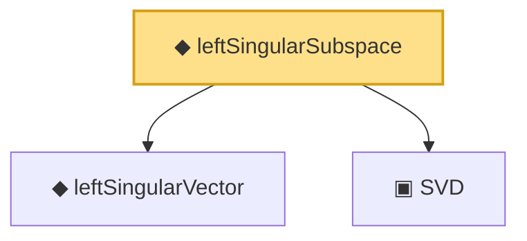

# Proof narrative — leftSingularSubspace

Root: **leftSingularSubspace** (def) `Statlib/HighDim/Vocabulary/SVD.lean:87` · topic `HighDim`
Closure: 3 declarations across 1 files. Generated from `proof_graph.json` — no files were moved.

Reading order (foundations first, headline last):

  ◆ `leftSingularVector` — noncomputable def · `Statlib/HighDim/Vocabulary/SVD.lean:75`
  ▣ `SVD` — structure · `Statlib/HighDim/Vocabulary/SVD.lean:37`  _(also used by 36: sorted_svd_exists, sv_diag_singularValues, low_rank_frobenius_error_decomposition, …)_
◆ `leftSingularSubspace` — def · `Statlib/HighDim/Vocabulary/SVD.lean:87` **← headline**

## Dependency diagram

