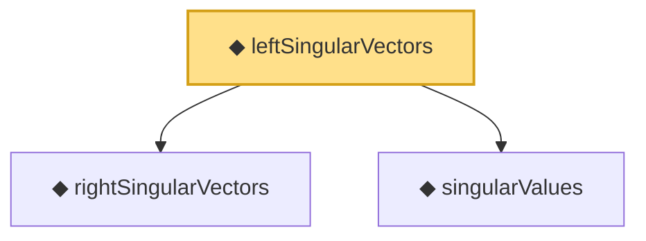

# Proof narrative — leftSingularVectors

Root: **leftSingularVectors** (noncomputable def) `Statlib/HighDim/Vocabulary/SVD.lean:134` · topic `HighDim`
Closure: 3 declarations across 1 files. Generated from `proof_graph.json` — no files were moved.

Reading order (foundations first, headline last):

  ◆ `rightSingularVectors` — noncomputable def · `Statlib/HighDim/Vocabulary/SVD.lean:122`
  ◆ `singularValues` — noncomputable def · `Statlib/HighDim/Vocabulary/SVD.lean:108`  _(also used by 2: svd_sorted_exists, nuclearNorm)_
◆ `leftSingularVectors` — noncomputable def · `Statlib/HighDim/Vocabulary/SVD.lean:134` **← headline**

## Dependency diagram

