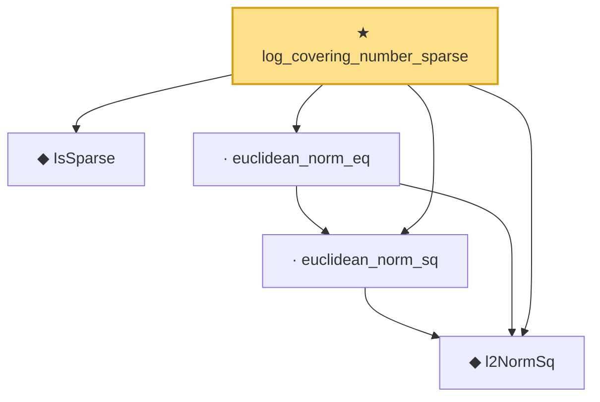

# Proof narrative — log_covering_number_sparse

Root: **log_covering_number_sparse** (theorem) `Statlib/HighDim/Geometry/CoveringNumbers.lean:727` · topic `HighDim`
Closure: 5 declarations across 3 files. Generated from `proof_graph.json` — no files were moved.

Reading order (foundations first, headline last):

  ◆ `IsSparse` — def · `Statlib/HighDim/Vocabulary/Sparse.lean:36`  _(also used by 13: covering_number_sparse_ball, isSparse_mono, isSparse_neg, …)_
  ◆ `l2NormSq` — noncomputable def · `Statlib/HighDim/Vocabulary/Norms.lean:13`  _(also used by 31: matrixRowVec_norm_sq, offDiagCoeffVec_norm_sq_le_frobenius, offDiagCoeffVec_norm_sq_integral_le_frobenius, …)_
  · `euclidean_norm_sq` — lemma · `Statlib/HighDim/Vocabulary/Norms.lean:21`  _(also used by 10: matrixRowVec_norm_sq, offDiagCoeffVec_norm_sq_le_frobenius, offDiagCoeffVec_norm_sq_integral_le_frobenius, …)_
  · `euclidean_norm_eq` — lemma · `Statlib/HighDim/Vocabulary/Norms.lean:27`  _(also used by 2: covering_number_sparse_ball, extendByEquiv_norm)_
★ `log_covering_number_sparse` — theorem · `Statlib/HighDim/Geometry/CoveringNumbers.lean:727` **← headline**

## Dependency diagram

