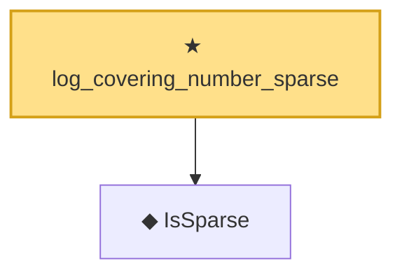

# Proof narrative — log_covering_number_sparse

Root: **log_covering_number_sparse** (theorem) `Statlib/HighDim/CoveringNumbers.lean:84` · topic `HighDim`
Closure: 2 declarations across 2 files. Generated from `proof_graph.json` — no files were moved.

Reading order (foundations first, headline last):

  ◆ `IsSparse` — def · `Statlib/Vocabulary/Sparse.lean:36`  _(also used by 2: covering_number_sparse_ball, SatisfiesRIP)_
★ `log_covering_number_sparse` — theorem · `Statlib/HighDim/CoveringNumbers.lean:84` **← headline**

## Dependency diagram

